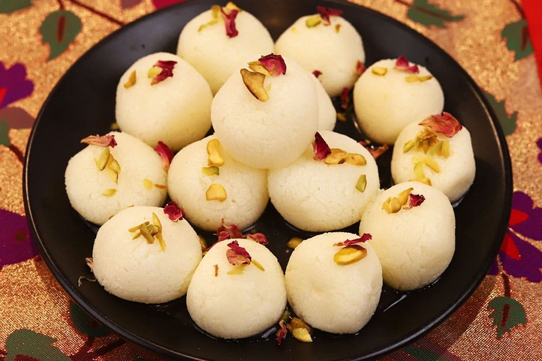

# Rasgulla

*Bengal's queen of sweets: white spheres of fresh chhena doubled in size by long simmering in light cardamom-scented sugar syrup. Spongy and sweet.*

**Serves:** 6 (makes 12 rasgulla)

**Prep Time:** 40 minutes (plus optional chilling)

**Cook Time:** 25 minutes

## Overview
Rasgulla is one of the great technical sweets of South Asia, and there is no shortcut. Everything depends on the chhena, the fresh, soft curd cheese made by curdling whole milk with an acid (lemon juice or whey from a previous batch), straining off the liquid and gently kneading the curds until they are smooth, supple and just slightly oily. Get the chhena right and the rasgulla will be light, spongy, white, and will double in size when boiled in syrup. Get it wrong and you have dense rubbery balls that sit in sugar water without absorbing it. The rules are unforgiving: use full-fat whole milk (never reduced fat, never UHT), curdle gently with the heat off so the curds stay tender, drain only until the chhena holds together (not bone dry), and knead the chhena thoroughly with the heel of your hand on a clean surface for 8-10 minutes until it transforms from crumbly to silky. The syrup must be light, around the consistency of water with sugar dissolved in it, not a heavy syrup, because the rasgulla needs to drink up syrup as it expands. A wide pan with a lid is essential: the balls need room to puff to twice their size, and the lid traps steam that helps them rise. The result, served chilled with a few strands of saffron or a pinch of cardamom, is the defining Bengali sweet. Origin claims are intensely disputed: Odisha argues the sweet was offered at the Jagannath Temple in Puri for centuries; West Bengal credits Nobin Chandra Das of Bagbazar with inventing the modern spongy form in 1868. Both received Geographical Indication status. Either way, the sweet belongs to the Bengali-speaking world.

## Ingredients

### Chhena
- 2 litres whole milk (full fat, fresh, not UHT)
- 3 tbsp lemon juice (or 3 tbsp white vinegar)
- Ice cubes (a small handful)

### Dough
- 1 tsp fine semolina (sooji), optional but helpful
- 1 tsp plain flour, optional

### Syrup
- 400 g sugar
- 1 ½ litres water
- 4 green cardamom pods (lightly crushed)
- A few strands saffron (optional)
- 1 tsp rose water (optional, added at the end)

## Method

### Stage 1 - Make the chhena
1. Bring the milk to a gentle boil in a heavy-bottomed pan, stirring occasionally so it doesn't catch.
1. As soon as it reaches a rolling boil, turn off the heat. Wait 1 minute.
1. Add the lemon juice 1 tbsp at a time, stirring gently, until the milk fully splits into white curds and pale yellow whey. If the milk doesn't split fully, add a little more acid.
1. Once split, drop in a small handful of ice cubes to stop the cooking immediately. This is the secret to soft chhena.
1. Pour through a muslin-lined sieve.
1. Gather the muslin and rinse the chhena gently under cold running water for 30 seconds to wash off the lemon flavour.
1. Twist and squeeze gently to remove most of the whey, but stop while the chhena still feels moist (not bone dry). Hang the bundle for 30-40 minutes to drip.

### Stage 2 - Knead the chhena
1. Tip the chhena out onto a clean dry surface.
1. Optional but reliable: sprinkle over the semolina and flour.
1. Knead with the heel of your hand, pushing and folding, for 8-10 minutes. The chhena will progress through crumbly, then doughy, then smooth, then slightly oily on the palm. Stop when it forms a soft, supple, slightly tacky dough that can be rolled into a crack-free ball.

### Stage 3 - Shape
1. Divide the chhena into 12 equal pieces (around 25 g each).
1. Roll each piece between the palms into a smooth, crack-free ball. Cracks now will become splits during cooking, so be patient. Set aside under a damp cloth.

### Stage 4 - Syrup and boil
1. In a wide, deep pan (at least 26 cm) combine the sugar, water and crushed cardamom. The pan must be wide enough that the balls can double in size without crowding.
1. Bring to a gentle boil and stir until the sugar fully dissolves. The syrup should be thin like water; do not reduce.
1. Drop the chhena balls in one by one, leaving plenty of space. Cover with a tight-fitting lid.
1. Boil on medium-high heat for 15 minutes, gently rotating the pan every 3-4 minutes (do not stir or you will damage the balls). The rasgulla will visibly double in size.
1. Remove from heat. If using, stir in the saffron and rose water.
1. Leave covered for another 15 minutes so the rasgulla cool slowly in the syrup and absorb it fully.

### Stage 5 - Serve
1. Transfer rasgulla and syrup to a serving bowl.
1. Chill for at least 2 hours before serving (overnight is ideal). Serve cold, 2 per person, with a little of the syrup ladled over.

## Notes
- **Milk matters most:** the single biggest variable. Use the freshest full-fat whole milk you can buy. UHT, low-fat or skimmed milk will not produce proper chhena.
- **Ice cubes after curdling:** the trick to keeping the chhena tender is stopping the cooking immediately with ice. Hot acid continues to toughen the curds.
- **Knead until oily:** the chhena is ready when you see a slight sheen of fat on your palm and the dough no longer has cracks. Under-kneaded chhena makes hard, dense rasgulla.
- **Wide pan, tight lid:** the balls expand to twice their size. A narrow pan means they fuse together. A loose lid means they don't puff properly.
- **Thin syrup:** Indian sweet shops boil rasgulla in syrup just past sugar-water consistency. Heavy syrup glazes the outside and prevents absorption.
- **Do not stir:** rotate the pan instead. Stirring deforms or splits the soft balls.

## Storage
- Keep in their syrup, refrigerated, for up to 4 days. They become softer and more deeply soaked over time.
- Do not freeze; the chhena texture collapses on thaw.
