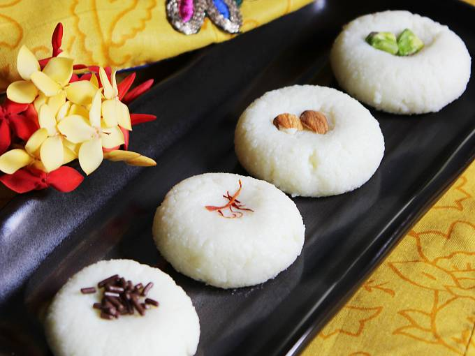

# Sandesh

*Bengal's most-elegant sweet: fresh chhena cooked gently with sugar (or winter nolen gur) and pressed into carved wooden moulds shaped like fish or flowers.*

**Serves:** 6 (makes 12 pieces)

**Prep Time:** 35 minutes

**Cook Time:** 15 minutes

## Overview
Sandesh is the most refined sweet in the Bengali misti repertoire: where rasgulla is showy and mishti doi is humble, sandesh is poised. The most ancient of the chhena sweets, predating rasgulla by centuries and appearing in Bengali household recipes as far back as the early 1700s. Three ingredients only: fresh chhena (curd cheese), sugar (or jaggery in winter), gentle heat. Two main schools: norom paak ("soft cooking") gives a tender, slightly moist sandesh that melts on the tongue; karaa paak ("hard cooking") cooks longer and yields a firmer, denser sandesh that holds its shape in elaborate moulds. The winter version made with nolen gur (first-tap date palm jaggery) is one of the seasonal jewels of Bengal: the jaggery's smoky-toffee notes turn the chhena a pale honey colour. Traditionally pressed into small carved wooden moulds called sandesh chhaanch, shaped like fish (a Bengali symbol of fortune), conches, lotuses or hearts. Served at room temperature or just slightly chilled, never iced.

## Ingredients

### Chhena
- 1 ½ litres whole milk (full fat, fresh, not UHT)
- 2 tbsp lemon juice (or 2 tbsp white vinegar)
- Ice cubes (a small handful)

### To finish
- 100 g caster sugar, or 110 g jaggery (gur), preferably nolen gur for winter sandesh
- 4 green cardamom pods (seeds ground to a fine powder)
- A few strands saffron (optional)
- 8-10 pistachios (slivered, to decorate)

## Method

### Stage 1 - Make the chhena
1. Bring the milk to a gentle boil in a heavy-bottomed pan, stirring occasionally.
1. As soon as it boils, turn off the heat and wait 1 minute.
1. Add the lemon juice 1 tbsp at a time, stirring gently, until the milk fully splits into white curds and pale whey.
1. Drop in a small handful of ice cubes to stop the cooking and keep the chhena tender.
1. Pour into a muslin-lined sieve.
1. Gather the muslin and rinse the chhena gently under cold running water for 30 seconds.
1. Twist and squeeze gently to expel most of the whey, but leave the chhena moist (not bone dry). Hang the bundle for 25-30 minutes to drip.

### Stage 2 - Knead
1. Tip the chhena onto a clean dry worktop.
1. Knead with the heel of your hand for 8-10 minutes, pushing and folding, until the chhena transforms from crumbly to silky-smooth and a faint sheen of fat appears on your palm. This is the foundation; do not rush.

### Stage 3 - Cook the sandesh
1. If using jaggery, grate or finely chop it first.
1. Transfer the kneaded chhena to a heavy non-stick pan over low heat.
1. Add the sugar (or jaggery).
1. Cook gently, stirring and folding continuously with a spatula, for 5-8 minutes. The sugar will melt and the chhena will loosen and become creamy; keep stirring as it gradually tightens. The mixture is ready when it pulls away from the sides of the pan in a soft mass and leaves a faint film on the base. For norom paak (soft) stop here; for karaa paak (firm) cook another 2 minutes.
1. Stir in the cardamom powder (and saffron if using).
1. Turn out onto a plate and let cool for 5 minutes until just warm.

### Stage 4 - Shape
1. While still warm and pliable, knead briefly on the plate to smooth out any lumps.
1. Divide into 12 equal pieces (around 30 g each).
1. Roll each between the palms into a smooth ball.
1. Flatten gently to a thick disc and press a thumbprint into the centre, or press into a buttered carved mould and tap out. Place a sliver of pistachio in each thumbprint.

### Stage 5 - Set
1. Arrange on a plate and let cool to room temperature so the sandesh firm up.
1. Serve at room temperature, or chill briefly. Sandesh should not be served ice-cold.

## Notes
- **The chhena makes the sweet:** as with rasgulla, everything depends on tender, well-kneaded chhena. Old milk, UHT milk or over-pressed chhena will give grainy, dry sandesh.
- **Low heat throughout:** sandesh is cooked at the lowest steady heat you can manage. High heat scorches the milk solids and toughens the texture.
- **Know when to stop:** the cooked mass should still feel soft and slightly tacky when you turn it out. If it has gone stiff in the pan, you have overcooked it, it will be crumbly. A few seconds before "looks done" is the right moment.
- **Nolen gur if you can:** the winter version with date palm jaggery (sometimes sold solid as patali gur) is exceptional. Use the same weight in place of sugar.
- **Moulds:** traditional Bengali sandesh moulds are small carved wooden blocks, often fish-shaped. Lightly butter the cavity, press in a piece of warm sandesh, level the back, then tap out. Silicone chocolate moulds work as a modern substitute.
- **Norom vs karaa:** for gifting and elaborate moulded shapes, cook a little longer (karaa paak). For eating fresh at home, stop early (norom paak) for a softer, melting texture.

## Storage
- Best on the day they are made. Will keep 2 days in a sealed container in the fridge; bring back to room temperature before eating.
- Do not freeze.
