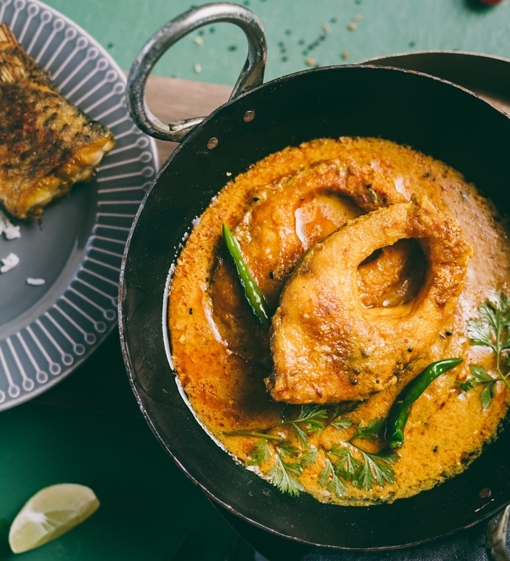

# Doi Maach

*A classic Bengali fish curry in a delicately spiced yoghurt gravy: rohu or katla fillets simmered with whole bay, cardamom and a whisper of mustard oil. Pale, tangy and silky rather than fiery.*

**Serves:** 4

**Prep Time:** 15 minutes

**Cook Time:** 25 minutes

## Overview
The celebration-day Bengali fish curry, the one you cook for a Saraswati Puja lunch or a weekend when family are visiting. "Doi" means yoghurt, "maach" means fish, and that's the dish in two words: pieces of firm-fleshed freshwater fish (traditionally rohu, katla or sometimes bhetki) first lightly fried in mustard oil until the skin is taut and gold, then poached gently in a thickened yoghurt sauce. The gravy is pale ivory rather than yellow or red, with the warming whole spices (cardamom, cinnamon, bay) doing the work that chilli powder does in northern curries. The critical move is timing: you whisk the yoghurt smooth and add it off the heat so it doesn't split, then the fish goes back in to finish poaching gently in the silky gravy. A touch more refined than a workaday machher jhol, eaten with steamed gobindobhog rice and a small spoon of ghee melted over the top.

## Ingredients

### Fish
- 600 g rohu, katla or bhetki (or sea bream / pollock; cut into 4-5 cm thick steaks or fillets)
- 1 teaspoon turmeric
- 1 teaspoon salt
- 4 tablespoons mustard oil (for frying)

### Yoghurt base
- 400 g plain full-fat yoghurt (whisked smooth)
- 1 tablespoon ground cumin
- 1 teaspoon ground coriander
- ½ teaspoon turmeric
- ½ teaspoon Kashmiri chilli powder

### Whole spices and aromatics
- 3 tablespoons mustard oil (for the gravy)
- 2 Indian bay leaves (tej patta)
- 5 cm piece cinnamon (cassia bark)
- 4 green cardamom pods (bashed)
- 4 cloves
- 2 dried red chillies (optional, broken)
- 1 onion (medium, finely chopped, optional - some traditions skip this)
- 1 tablespoon garlic and ginger paste
- 2 green chillies (slit lengthways)

### To finish
- 1 teaspoon sugar
- Salt (to taste)
- ½ teaspoon [Garam Masala](../indian/Spice-Mixes/garam-masala.md)
- A small handful of fresh coriander (chopped, optional - Bengali tradition is sparing with coriander)

## Method

### Stage 1 - Rub and fry the fish
1. Pat the fish pieces dry with kitchen paper.
2. Rub with the first teaspoon of turmeric and the salt.
3. Heat the first 4 tablespoons of mustard oil in a heavy-based pan over medium-high heat until it just smokes, then reduce the heat slightly.
4. Slide the fish into the oil and fry for 2 to 3 minutes per side, until lightly golden - just sealed, not cooked through.
5. Lift the fish out with a slotted spoon onto a plate.

### Stage 2 - Whisk the yoghurt mix
1. In a bowl, whisk the yoghurt until perfectly smooth.
2. Stir in the ground cumin, ground coriander, second portion of turmeric and Kashmiri chilli powder.
3. Set aside (this is added off the heat later so it doesn't split).

### Stage 3 - Bloom the whole spices
1. Add another tablespoon of mustard oil to the pan if needed.
2. Drop in the bay leaves, cinnamon, cardamom, cloves and dried red chillies.
3. Sizzle for 30 seconds until fragrant.

### Stage 4 - Build the base
1. Add the chopped onion (if using) with a pinch of salt; cook for 6 to 8 minutes until soft and pale gold (don't brown it dark - this dish wants the gravy to stay pale).
2. Stir in the garlic and ginger paste; cook for 1 minute.
3. Add the slit green chillies.

### Stage 5 - Add the yoghurt
1. Take the pan off the heat for a moment.
2. Pour in the whisked yoghurt-and-spice mixture, stirring constantly.
3. Return to a very low heat and bring up slowly, stirring all the time, for 4 to 5 minutes until the gravy starts to thicken.
4. Add 200 ml hot water if the sauce is too thick.

### Stage 6 - Poach the fish
1. Slide the fried fish back into the gravy in a single layer.
2. Add the sugar and salt.
3. Cover and simmer over very low heat for 6 to 8 minutes until the fish is just cooked through (don't stir; tilt the pan to baste).
4. Taste and adjust salt.

### Stage 7 - Finish
1. Sprinkle the garam masala over the curry.
2. Cover and rest off the heat for 5 minutes.
3. Scatter fresh coriander, if using.

## Notes
- **Yoghurt at room temperature only.** Cold yoghurt straight from the fridge is the most common cause of splitting. Take it out 30 minutes ahead.
- **Off the heat before pouring.** The single most important step. The pan stays cooler, the yoghurt eases in, and the sauce comes together silky rather than curdled.
- **Light hand on the onion.** Bengalis disagree about whether doi maach should have onion at all. If you use it, keep it pale - heavy browning makes the gravy muddy and steals from the yoghurt's clean tang.
- **Mustard oil is the dish.** As with most Bengali cooking, mustard oil heated to smoking before anything else is the signature. Don't substitute unless you have to.

## Serving
Serve with plain steamed basmati or short-grain Indian rice, a wedge of lemon, and either a dal or a quick fried okra (bhindi bhaja) on the side. Doi maach is a Sunday-lunch dish in Bengal; it likes good company on the plate.

## Storage
- Refrigerate up to 2 days. The flavour improves overnight but the fish texture softens.
- Don't freeze; yoghurt-based gravies separate badly on thawing and the fish goes rubbery.
- Reheat gently over very low heat with a splash of water; never boil, or the yoghurt will split.
