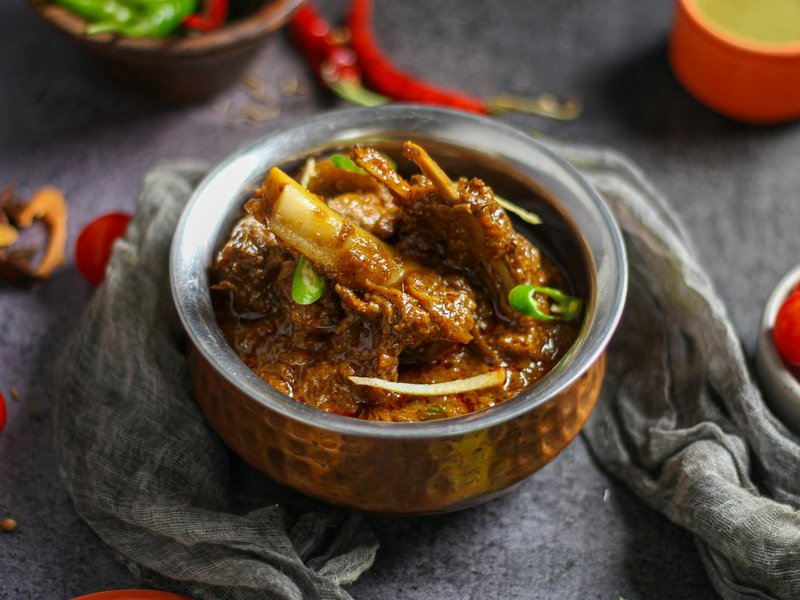

# Kosha Mangsho

*Mahogany-dark mutton clings to its bones in a glossy reduction of caramelised onion, ginger, garlic and mustard oil. Cardamom, cinnamon and clove rise from the pot; the meat falls apart at the press of a spoon. This is the Sunday lunch and wedding feast of Bengal, the dish that earns a cook their reputation.*

**Serves:** 6

**Prep Time:** 25 minutes (plus 1 hour marinating)

**Cook Time:** 2 hours

## Overview
Kosha mangsho takes its name from the verb kosha, which in Bengali means to slow-cook a meat down, stirring patiently as the spices and onions caramelise and the gravy reduces until the oil floats free. There is no water in the early stages, only the meat's own juices, yoghurt and onion paste working under a closed lid. The result is intense, almost jammy, with a deep brown colour that comes not from food colouring but from honest bhuna technique and good mustard oil. In Hindu Bengali homes the dish is made with goat (khashi) on festive Sundays and at pujas; the Bangladeshi version is broadly similar but often uses a touch more garlic and sometimes finishes with a spoon of ghee instead of mustard oil. The cut matters: bone-in shoulder and leg pieces with marrow bones give the gravy its body. Mustard oil heated to smoke point, a whole garam masala tempering, slow-fried onions reduced to a near-paste, and yoghurt added in stages to prevent splitting are the technical demands. It is not difficult for a patient home cook, only long: rushing kosha mangsho is the surest way to ruin it. Serve with luchi (puffed flour breads), basanti pulao (sweet yellow rice with cashews and raisins) or simply steamed gobindobhog rice. A side of kasundi mustard and sliced onion makes it a feast.

## Ingredients

### Marinade
- 1 kg bone-in mutton (goat), cut into 4 cm pieces
- 200 g full-fat plain yoghurt
- 1 tbsp ginger paste
- 1 tbsp garlic paste
- 1 ½ tsp turmeric
- 1 tsp Kashmiri chilli powder
- 1 tsp salt
- 1 tbsp mustard oil

### Curry
- 6 tbsp mustard oil
- 2 bay leaves
- 4 green cardamom pods, lightly crushed
- 2 black cardamom pods
- 1 cinnamon stick (5 cm)
- 4 cloves
- 1 tsp cumin seeds
- 3 onions (large, about 500 g), finely sliced
- 1 tbsp ginger paste
- 1 tbsp garlic paste
- 1 tsp Kashmiri chilli powder
- 1 ½ tsp cumin powder
- 1 ½ tsp coriander powder
- 2 potatoes (medium), peeled and halved (optional but traditional)
- 1 tsp sugar
- 500 ml warm water
- 1 tsp garam masala
- Salt to taste
- 1 tsp ghee, to finish

## Method

### Stage 1 - Marinate
1. Whisk the yoghurt, ginger, garlic, turmeric, Kashmiri chilli, salt and mustard oil in a large bowl.
1. Add the mutton and rub thoroughly. Cover and rest at room temperature for 1 hour, or refrigerate overnight.

### Stage 2 - Caramelise the onions
1. Heat the mustard oil in a heavy-bottomed pot (a kadai or Dutch oven) until smoking, then lower the heat.
1. If using, fry the potatoes with a pinch of turmeric until golden on all sides; remove and set aside.
1. Drop the bay leaves, both cardamoms, cinnamon, cloves and cumin seeds into the oil and let them perfume for 20 seconds.
1. Add the sliced onions with the sugar and a pinch of salt. Fry steadily over medium heat for 18 to 22 minutes, stirring often, until the onions are deep brown and almost melting.

### Stage 3 - Bhuna the meat
1. Add the ginger and garlic pastes; cook for 2 minutes until raw smell lifts.
1. Add the Kashmiri chilli, cumin powder and coriander powder; stir for 1 minute.
1. Tip in the marinated mutton with all of its yoghurt. Stir to coat.
1. Now begins the kosha: cook uncovered over medium-low heat for 30 to 35 minutes, stirring every 2 to 3 minutes. The yoghurt will release liquid, then reduce; the meat will slowly turn from pink to deep brown and the oil will begin to separate at the edges. Do not add water.

### Stage 4 - Slow-cook and finish
1. Once the masala is mahogany-coloured and clings to the meat, add the warm water and the fried potatoes.
1. Bring to a simmer, cover tightly and cook over very low heat for 50 to 60 minutes until the mutton is fork-tender and the gravy has reduced to a thick, glossy coating.
1. Uncover, raise the heat and reduce for 3 to 4 minutes if the gravy is still loose.
1. Sprinkle the garam masala, drizzle the ghee, cover and rest off the heat for 10 minutes before serving with luchi or basanti pulao.

## Notes
- **Cut of meat:** Use bone-in goat shoulder and leg with at least one piece of marrow bone. Boneless mutton will not give the same depth.
- **The onion stage is critical:** Resist the urge to rush. Properly caramelised onions are what give kosha mangsho its colour. If they catch, lower the heat and add a splash of water.
- **Yoghurt:** Always full-fat and at room temperature. Add it with the meat, not directly into hot oil, and stir continuously for the first few minutes.
- **Pressure cooker shortcut:** After Stage 3, transfer to a pressure cooker with the water and cook for 5 to 6 whistles, then reduce uncovered in a pan to finish.

## Storage
- Improves overnight. Refrigerate in a sealed container for up to 3 days.
- Freezes well for 2 months. Thaw in the fridge and reheat gently with a splash of water.
