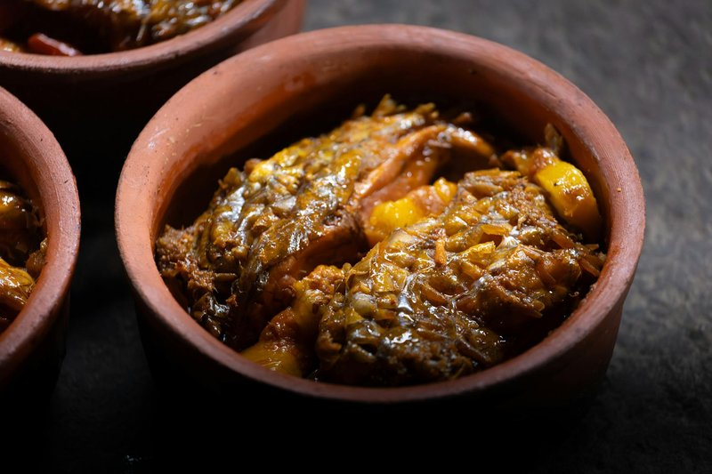

# Machher Jhol

*A glistening amber broth pungent with mustard oil, cumin and green chilli, cradling golden-fried fish steaks and soft potatoes. The aroma of nigella seeds tempering in hot oil is the unmistakable opening note of a Bengali household kitchen, from Kolkata to Khulna.*

**Serves:** 4

**Prep Time:** 20 minutes (plus 15 minutes salting the fish)

**Cook Time:** 30 minutes

## Overview
Machher jhol is the everyday fish curry of Bengal, eaten with steamed rice almost daily in households on both sides of the border. Unlike the richer, mustard-heavy shorshe ilish or the coconut-based malai curry, jhol is deliberately light: a thin, fragrant broth carrying potato wedges, sometimes ridge gourd or aubergine, and pieces of freshwater fish such as rohu, katla or pabda. The flavour rests on three pillars, mustard oil heated to its smoke point then cooled to mellow its bite, a quick tempering of kalo jeere (nigella seeds) and slit green chillies, and a freshly ground paste of cumin, ginger and a little turmeric. There is no onion-tomato masala bhuna here in the Punjabi sense; the broth stays clear and the fish remains the hero. Hindu Bengali kitchens often skip onion and garlic for everyday jhol, while Bangladeshi versions lean a touch heavier on ginger and sometimes add a spoon of mustard paste. The dish is forgiving for home cooks once the fish is fried correctly: the steaks must be salted, turmericked and shallow-fried in very hot mustard oil until the skin is taut and golden, otherwise they will disintegrate in the gravy. Served at room temperature over a mound of gobindobhog rice with a wedge of lime, machher jhol is the taste of Bengali home.

## Ingredients

### Fish and marinade
- 600 g rohu (or katla), cut into 4 thick steaks (darnes)
- 1 tsp turmeric
- 1 tsp salt

### Curry
- 5 tbsp mustard oil
- 1 tsp nigella seeds (kalo jeere)
- 2 dried red chillies
- 2 bay leaves
- 3 potatoes (medium), peeled and cut into thick wedges
- 2 green chillies, slit lengthways
- 1 ½ tsp turmeric
- 1 tsp Kashmiri chilli powder
- 1 tbsp cumin powder
- 1 tbsp ginger paste
- 1 tomato (small), finely chopped (optional)
- 750 ml warm water
- 1 tsp salt, or to taste
- 1 tsp ghee, to finish
- 1 tsp fresh coriander, chopped

## Method

### Stage 1 - Prepare and fry the fish
1. Rinse the fish steaks and pat completely dry.
1. Rub with the turmeric and salt and rest for 15 minutes.
1. Heat 4 tbsp mustard oil in a kadai until it smokes lightly, then lower the heat.
1. Slide in the fish steaks and fry for 2 to 3 minutes a side until the skin is taut and pale gold, not brown.
1. Lift out and set aside. Keep the oil in the pan.

### Stage 2 - Build the broth
1. Add the remaining 1 tbsp mustard oil to the pan.
1. Drop in the nigella seeds, dried chillies and bay leaves; let them sizzle for 10 seconds.
1. Add the potato wedges and slit green chillies; fry for 4 minutes until lightly coloured.
1. Whisk together the turmeric, Kashmiri chilli, cumin powder and ginger paste with 3 tbsp water to make a slurry.
1. Pour the slurry into the pan and stir for 1 minute until the raw smell lifts and the oil separates at the edges.
1. Add the chopped tomato if using and cook for 1 minute more.

### Stage 3 - Simmer and finish
1. Pour in the warm water and add the salt.
1. Bring to a gentle boil, cover and simmer for 10 minutes until the potatoes are almost tender.
1. Slide the fried fish steaks into the broth and simmer uncovered for a further 6 to 8 minutes.
1. Taste and adjust salt. The broth should taste clean and lightly spiced, not thick.
1. Drizzle the ghee on top, scatter the coriander and rest off the heat for 5 minutes before serving with steamed rice.

## Notes
- **Mustard oil:** Always heat it to smoking point first, then lower the heat. This removes the harsh raw note and is non-negotiable for an authentic flavour.
- **Fish choice:** Rohu, katla and pabda are traditional. Sea bass steaks or pomfret work as a substitute. Avoid oily fish like mackerel.
- **Onion-free version:** This recipe follows the niramish (no onion, no garlic) Bengali Hindu style. For a Bangladeshi-style jhol, add 1 finely sliced onion after the tempering and fry until golden.
- **Vegetables:** A few wedges of ridge gourd, pointed gourd (potol) or aubergine can be added with the potatoes.

## Storage
- Keep refrigerated in a sealed container for up to 2 days. Reheat gently, never boil hard, or the fish will break apart.
- Not suitable for freezing.
