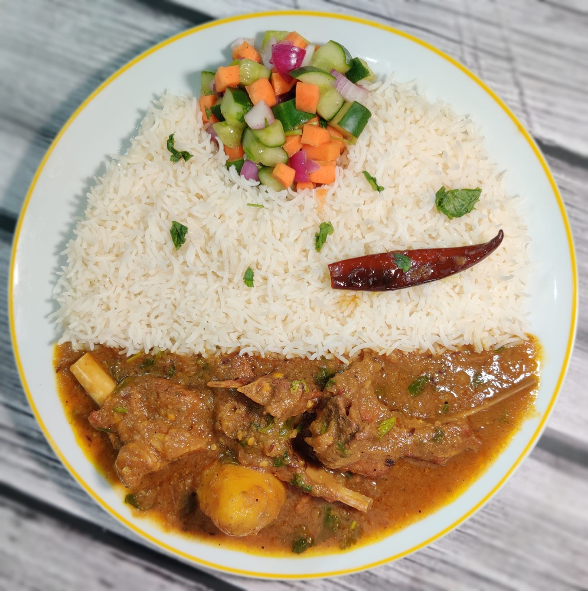

# Mangshor Jhol

*A classic Bengali mutton curry: bone-in goat or mutton and pale gold potatoes simmered in a thin spiced gravy built on mustard oil, browned onions and whole warming spices.*

**Serves:** 4

**Prep Time:** 20 minutes

**Cook Time:** 90 minutes

## Overview
The wet-style mutton counterpart to the drier, slow-bhuna kosha mangsho - and the more everyday of the two. "Jhol" means a thin, soupy gravy and mangshor jhol is exactly that: bone-in goat or mutton cooked low and slow with potatoes in a light, aromatic broth that you ladle generously over rice. You heat mustard oil to smoking to take the raw edge off, temper whole bay and cinnamon in the hot fat, then brown the onions deeply and add a measured hand of turmeric to give the gravy its colour and weight. The bones contribute marrow to the broth as the meat tenderises over an hour or so, and the potatoes go in late enough that they soften without disintegrating. Eaten with a mound of plain steamed rice, a wedge of lime, and a thin slick of mustard oil scattered with raw onion on the side. A Sunday lunch dish for a Bengali household, served from the same pot it was cooked in.

## Ingredients

### Marinade and meat
- 1 kg goat or mutton (on the bone, cut into 4-5 cm curry pieces)
- 100 g plain yoghurt
- 1 tablespoon garlic and ginger paste
- 1 teaspoon turmeric
- 1 teaspoon salt
- 1 teaspoon ground coriander

### Potatoes and whole spices
- 3 medium potatoes (peeled, halved or quartered)
- 5 tablespoons mustard oil
- 3 Indian bay leaves (tej patta)
- 5 cm piece cinnamon (cassia bark)
- 5 green cardamom pods (bashed)
- 5 cloves
- 1 dried red chilli (optional, broken)

### Masala
- 2 onions (large, finely sliced)
- 1 tablespoon garlic and ginger paste
- 1 tomato (medium, finely chopped)
- 1 teaspoon turmeric
- 1 tablespoon ground coriander
- 1 teaspoon ground cumin
- 1 ½ teaspoons Kashmiri chilli powder
- 2 green chillies (slit lengthways)
- 1 teaspoon sugar
- Salt (to taste)

### Liquid and finish
- 1 litre water (or light meat stock)
- 1 teaspoon [Garam Masala](../indian/Spice-Mixes/garam-masala.md)
- 1 teaspoon ghee (optional, to finish)
- A handful of fresh coriander (chopped)

## Method

### Stage 1 - Marinate the mutton
1. Combine the meat with the yoghurt, garlic and ginger paste, turmeric, salt and ground coriander in a large bowl.
2. Mix to coat every piece.
3. Cover and refrigerate for at least 2 hours, ideally overnight.

### Stage 2 - Par-fry the potatoes
1. Heat the mustard oil in a large heavy-based pan over medium-high heat until it just starts to smoke, then reduce the heat slightly.
2. Add the potato quarters and fry for 5 to 6 minutes, turning, until lightly golden at the edges.
3. Lift the potatoes out with a slotted spoon and set aside.

### Stage 3 - Bloom the whole spices
1. Drop the bay leaves, cinnamon, cardamom, cloves and (optional) dried red chilli into the same oil.
2. Sizzle for 30 seconds until fragrant.

### Stage 4 - Brown the onions
1. Add the sliced onions and a pinch of salt.
2. Cook over medium heat for 12 to 15 minutes, stirring often, until deep golden brown.
3. Stir in the second tablespoon of garlic and ginger paste; cook for 1 minute.

### Stage 5 - Build the masala
1. Add the chopped tomato; cook for 4 to 5 minutes, mashing it down with the back of the spoon.
2. Sprinkle in the turmeric, ground coriander, ground cumin and Kashmiri chilli powder.
3. Stir for 30 seconds, splashing in a little water if the spices threaten to catch.

### Stage 6 - Bhuna the mutton
1. Add the marinated mutton (and all the marinade) to the pan.
2. Cook over medium-high heat, stirring often, for 8 to 10 minutes - the meat will release liquid which then evaporates, and the masala will tighten around the pieces and the oil will start to separate at the edges.
3. This bhuna step builds the gravy's depth, so don't rush it.

### Stage 7 - The jhol
1. Return the par-fried potatoes to the pan along with the slit green chillies and sugar.
2. Pour in the water (or stock) - the level should be loose, more broth than sauce.
3. Bring to a gentle simmer, cover and lower the heat.
4. Cook for 60 to 75 minutes, stirring occasionally, until the mutton is fall-off-the-bone tender and the potatoes are soft.
5. Top up with hot water if it reduces too far before the meat is ready.

### Stage 8 - Finish
1. Uncover and let the gravy reduce for 5 minutes if it's thinner than you'd like (Bengali jhol stays loose - this isn't a thick masala).
2. Taste and adjust salt.
3. Sprinkle over the garam masala and dot in the ghee, if using.
4. Cover and rest off the heat for 10 minutes.
5. Top with chopped coriander.

## Notes
- **Slow is non-negotiable.** Mutton on the bone needs at least an hour of gentle simmering for the connective tissue to break down. A pressure cooker can shave the time to 30 to 35 minutes after Stage 6 if you're in a hurry.
- **Marinate the night before.** Yoghurt tenderises mutton in a way that no other marinade does. Six to twelve hours is the sweet spot.
- **The bones are the dish.** Bone marrow and gelatin give the thin jhol its silky mouthfeel. Boneless mutton works but the gravy ends up flatter.
- **Heat level.** The slit green chillies infuse without overwhelming. For a hotter dish, double them or leave one whole in the bowl as a marker.

## Serving
Serve with steamed long-grain rice, a wedge of lime, and either a dal or a simple cucumber salad on the side. Many Bengali households eat this with a single plain roti to mop up the last of the gravy.

## Storage
- Refrigerate up to 3 days. The flavour improves overnight - many cooks consider day-two jhol better than the day it was made.
- Freeze up to 2 months; thaw overnight in the fridge before reheating.
- Reheat gently with a splash of water to loosen the gravy back to its loose, brothy consistency.
