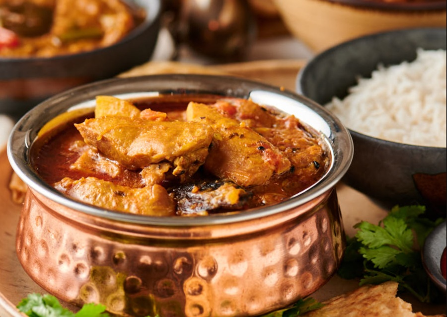

# Murgir Jhol

*A classic Bengali chicken and potato curry: bone-in chicken and pale gold potatoes simmered in a light mustard-oil gravy fragranced with whole spices and ginger.*

**Serves:** 4

**Prep Time:** 15 minutes

**Cook Time:** 40 minutes

## Overview
"Jhol" means a thin, soupy gravy, and that's exactly what this dish is - the antithesis of the heavy, cream-rich curry-house style. The base is mustard oil heated to smoking point, then knocked back with whole bay, cinnamon, cardamom and clove. Browned onions, ginger and a measured hand of turmeric give the gravy its colour; tomato is used sparingly, just enough to round the edges. Bone-in chicken and chunky potatoes cook together in a thin broth that you eat with rice, mopping up every drop.

## Ingredients

### Chicken and potatoes
- 1 kg chicken (on the bone, skinless, cut into curry pieces)
- 3 medium potatoes (peeled, quartered)
- 1 teaspoon turmeric (for rubbing the chicken)
- 1 teaspoon salt (for rubbing the chicken)

### Whole spices
- 4 tablespoons mustard oil
- 2 Indian bay leaves (tej patta)
- 5 cm piece cinnamon (cassia bark)
- 4 green cardamom pods (bashed)
- 4 cloves
- 1 dried red chilli (optional, broken)

### Masala
- 2 onions (medium, finely sliced)
- 2 tablespoons garlic and ginger paste
- 1 tomato (large, finely chopped)
- 1 teaspoon turmeric
- 1 tablespoon ground coriander
- 1 teaspoon ground cumin
- 1 teaspoon Kashmiri chilli powder
- 2 green chillies (slit lengthways)
- 1 teaspoon sugar
- Salt (to taste)

### Liquid and finish
- 600 ml water (or light chicken stock)
- 1 teaspoon [Garam Masala](../indian/Spice-Mixes/garam-masala.md)
- 1 teaspoon ghee (optional, to finish)
- A handful of fresh coriander (chopped)

## Method

### Stage 1 - Rub the chicken
1. Pat the chicken dry with kitchen paper.
2. Rub with the first teaspoon of turmeric and the salt.
3. Set aside for 10 minutes while you prep the rest.

### Stage 2 - Par-fry the potatoes
1. Heat the mustard oil in a large heavy-based pan over medium-high heat until it just starts to smoke, then reduce the heat slightly (this drives off the raw bite and is the Bengali starting point).
2. Slide the potato quarters into the oil and fry for 5 to 6 minutes, turning, until lightly golden on the edges.
3. Lift the potatoes out with a slotted spoon and set aside.

### Stage 3 - Bloom the whole spices
1. Drop the bay leaves, cinnamon, cardamom, cloves and (optional) dried red chilli into the same oil.
2. Sizzle for 30 seconds until fragrant - keep them moving so they don't catch.

### Stage 4 - Build the masala
1. Add the sliced onions and a pinch of salt.
2. Cook over medium heat for 10 to 12 minutes, stirring often, until deep golden brown - this is where the gravy's depth comes from, so don't rush it.
3. Stir in the garlic and ginger paste; cook for 1 minute until the raw edge is gone.
4. Add the chopped tomato; cook for 4 to 5 minutes, mashing it down with the back of the spoon until it breaks into the oil.
5. Sprinkle in the turmeric, ground coriander, ground cumin and Kashmiri chilli powder.
6. Stir for 30 seconds, adding a splash of water if the spices threaten to catch.

### Stage 5 - Seal the chicken
1. Add the rubbed chicken pieces.
2. Stir well to coat every piece in the masala.
3. Fry over medium heat for 5 minutes, turning, until the surface of the chicken is sealed and the oil starts to separate at the edges of the pan.

### Stage 6 - Simmer the jhol
1. Return the par-fried potatoes to the pan along with the slit green chillies and the sugar.
2. Pour in the water (or stock) - the gravy should be loose, more broth than sauce.
3. Bring to a gentle simmer, then lower the heat, cover, and cook for 25 to 30 minutes until the chicken is tender and the potatoes are completely soft.
4. Stir occasionally to stop anything catching on the base.
5. Taste and adjust salt.

### Stage 7 - Finish
1. Uncover and let the gravy reduce for 2 to 3 minutes if it's still thinner than you'd like (it should stay loose - this isn't a thick masala).
2. Sprinkle over the garam masala and dot in the ghee, if using.
3. Cover and rest off the heat for 5 minutes.
4. Top with chopped coriander.

## Notes
- **Mustard oil is the dish.** Bengali cooking is built on the warmth and pungency of mustard oil; vegetable oil works as a substitute but flattens the flavour noticeably. Always heat it to smoking before anything else goes in - that step turns the raw bite into something gentler and nutty.
- **Don't skimp on the onion browning.** Deep, dark onions are what give the jhol its colour and savoury backbone. Pale onions = pale, weak gravy.
- **Bone-in matters.** The bones release gelatin and marrow into the thin gravy as it simmers, giving it the unctuous mouthfeel that's the whole point of a jhol.
- **Heat level.** The slit green chillies infuse without making the dish very hot. For more punch, leave them whole and bite around them at the table - the Bengali way.

## Serving
Serve with steamed long-grain rice (chelo / plain basmati), a wedge of lemon, and a side of dal. Some salted slices of cucumber or a quick onion-and-green-chilli salad on the side cut through the richness.

## Storage
- Refrigerate up to 2 days in an airtight container. The flavour deepens overnight and many cooks consider day-two jhol better than day-one.
- Freeze up to 2 months; thaw overnight in the fridge before reheating.
- Reheat gently with a splash of water to loosen the gravy back to its loose, brothy consistency.
