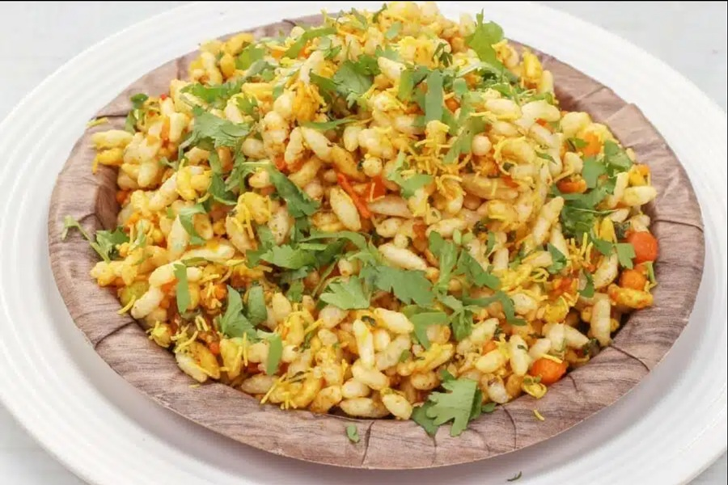

# Jhal Muri

*Kolkata's street-corner snack: puffed rice tossed with mustard oil, chopped onion, green chilli, tomato, peanuts and a squeeze of lime.*

**Serves:** 2

**Prep Time:** 10 minutes

**Cook Time:** 0 minutes

## Overview
Jhal muri (literally "spicy puffed rice") is the most democratic snack in Bengal: assembled in seconds from a tin trunk by a muriwala, tipped into a rolled-newspaper cone, and eaten standing on a pavement for the price of a few rupees. The base is muri (puffed rice), and everything else is built around the principle of contrast. Raw mustard oil is the soul of the dish, sharp and nasal and slightly bitter; without it you have a salad, not jhal muri. The vegetables stay raw and crunchy, onion, green chilli, cucumber, tomato, chopped into tiny dice so each spoonful gets one of each. Peanuts and chana chur (or sev) add fat and crunch; black salt and chaat masala add the funky-tangy depth that makes Indian street snacks addictive. The lime goes in last so the puffs don't soften. This is a dish where technique matters less than ingredient quality: muri must be crisp (refresh in a dry pan if it's gone soft), mustard oil must be the proper pungent kind, and the lime must be fresh. It is everywhere in Bengal, tea-time at home, train platforms, the Maidan on a winter afternoon, and there is no recipe in any cookbook that quite captures the feel of it being mixed in front of you in a paper cone.

## Ingredients

### Base
- 80 g muri (puffed rice)
- 30 g roasted peanuts
- 30 g chana chur (or bhujia sev)
- 2 tbsp mustard oil (raw, pungent, not refined)

### Fresh mix-ins
- ½ red onion (finely diced)
- 1 tomato (small, deseeded, finely diced)
- ¼ cucumber (finely diced)
- 1-2 green chillies (finely chopped, to taste)
- 1 green mango (small, or boiled potato), diced (optional but classic)
- 10 g fresh coriander (chopped)
- 8 g fresh mint (chopped, optional)

### Seasoning
- ½ tsp black salt (kala namak)
- ½ tsp [Chaat Masala](../../indian/Spice-Mixes/chaat-masala.md)
- ¼ tsp roasted cumin powder
- ½ lime (juiced, plus extra wedges to serve)

## Method

### Stage 1 - Refresh the muri
1. If the puffed rice feels at all soft, toast it dry in a wide pan over medium heat for 2-3 minutes, shaking constantly, until crisp. Cool fully before mixing.

### Stage 2 - Mix
1. In a wide bowl combine the muri, peanuts and chana chur.
1. Add the onion, tomato, cucumber, green chilli, optional mango or potato, coriander and mint.
1. Sprinkle over the black salt, chaat masala and roasted cumin.
1. Drizzle the raw mustard oil all over.
1. Squeeze in the lime juice.
1. Toss thoroughly with clean hands for 20-30 seconds so every puff gets dressed.

### Stage 3 - Serve
1. Tip immediately into paper cones or small bowls.
1. Eat within 5 minutes, before the moisture softens the muri. Offer extra lime wedges on the side.

## Notes
- **Mustard oil is non-negotiable:** the raw, pungent kind sold for cooking in Indian groceries. Refined oils have no character and will give you a flat, savoury snack instead of jhal muri.
- **Cut everything tiny:** the vegetables should be the size of the peanuts so the texture stays uniform.
- **Eat fast:** jhal muri waits for nobody. As soon as the lime hits, the clock is running. Mix only what you will eat in the next 5 minutes.
- **Variations:** street vendors often add boiled chickpeas, fried lentil noodles, coconut slivers or a sprinkle of dry roasted gram. Use what you have, but keep the mustard oil and the lime.

## Storage
- Does not keep. Mix to order.
- The dry components (muri, peanuts, sev, spice mix) can be portioned into bags in advance for picnic-style assembly.
