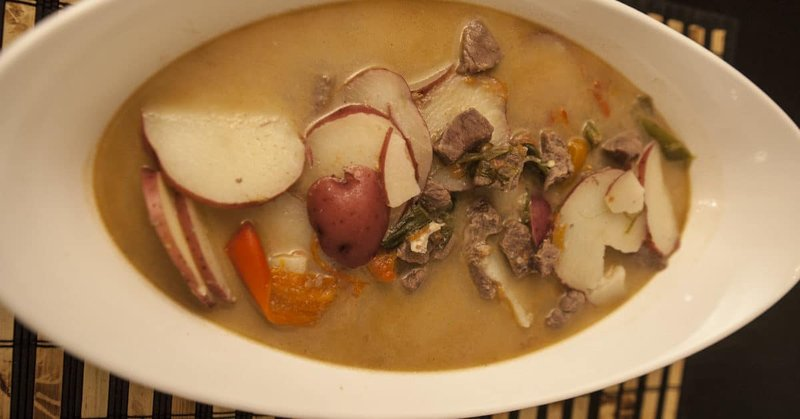

# Ema Datshi

*Bhutan's national dish: whole green chillies stewed with blue cheese, potato and tomato until the cheese melts into a fierce, creamy sauce.*

**Serves:** 6

**Prep Time:** 15 minutes

**Cook Time:** 35 minutes

## Overview
Bhutan's national dish, built on an honest two-ingredient premise: chillies and cheese, in roughly equal volume. The flavour is two things held in tension. The fierce burn of green chillies (jalapeños standing in for the hotter, more floral local Bhutanese varieties) on one side, the funky salty richness of blue cheese (Stilton or Gorgonzola standing in for the traditional yak cheese) on the other. The dairy fat tempers the burn just enough that you can actually eat it, but only just. The burn is the point. You build the dish out with beef, potato and tomato into a proper stew, and everything goes into the pot together to simmer until the cheese melts down into a fierce, creamy, chilli-flecked sauce. Eat with red Bhutanese rice at most meals in Bhutan. Halve the chilli count the first time you cook it; the locals will laugh, but you'll be able to taste your next meal.

## Ingredients

### Main
- 150 g blue cheese (Stilton or Gorgonzola)
- 6 red potatoes (medium, sliced into thin rounds)
- 1.1 kg beef top round (cut into bite-sized pieces)
- 10 jalapeños (or similar spicy green chillies, halved lengthways, stems removed; reduce to 4-5 for milder palates)
- 8 garlic cloves (smashed)
- 3 Roma tomatoes (sliced lengthways)
- 10 green onions (green parts only, cut into 4 cm lengths)
- 2-3 tablespoons salt (to taste)
- Water to cover

### Optional traditional finish
- 1 teaspoon ground Sichuan pepper (emma)
- 4 slices cheddar cheese (for the yellow tinge)
- 30 g butter (for richness)

## Method

### Stage 1 - Prep
1. Wash and slice the potatoes thinly; set aside.
1. Slice the chillies lengthways, removing the stems. Leave the seeds in for full heat or shake them out for less.
1. Smash the garlic cloves with the flat of a knife.
1. Crumble the blue cheese into the pot.
1. Cut the green onion greens into 4 cm pieces.

### Stage 2 - Build the pot
1. Combine in a wide heavy pot: chillies, tomatoes, garlic, beef, green onions, blue cheese and Sichuan pepper (if using).
1. Pour in enough water to cover everything by 1-2 cm.

### Stage 3 - Simmer
1. Bring to a vigorous boil over high heat, stirring occasionally.
1. After 20 minutes, reduce to medium-low.
1. Add the sliced potatoes.
1. Continue simmering 10-15 minutes more, until the potatoes are tender and the cheese has melted into a thick broth.

### Stage 4 - Finish
1. Optionally add the coloured cheese slices in the last 2-3 minutes for the traditional yellow colour.
1. Stir in the butter (if using) just before serving.
1. Taste; adjust salt.

### Stage 5 - Serve
1. Ladle the stew over plain rice in deep bowls.
1. Tibetans traditionally serve the broth in a separate bowl alongside dry rice; either way works.

## Notes
- **Blue cheese is the traditional choice:** Bhutanese yak cheese is unavailable in most of the world. Stilton and Gorgonzola are the standard substitutes. The funky-strong blue is part of the dish, mild cheese makes a flat dish.
- **Chillies are the dish:** ema means "chilli". 10 jalapeños is on the moderate end of authentic; in Bhutan the dish is often hotter. Don't go below 4 jalapeños or the dish stops being ema datshi.
- **Beef is the most common protein:** pork is also traditional in some regions; the vegetarian version replaces meat with mushrooms and adds Asian crystal noodles.
- **Visible oil:** older Tibetans expect to see oil glistening on the soup surface ("soup without oil looks like water"). The butter at the end achieves this.

## Storage
- Keeps 3 days refrigerated; reheats well. The heat softens slightly overnight.
- Don't freeze, the potatoes go grainy.
