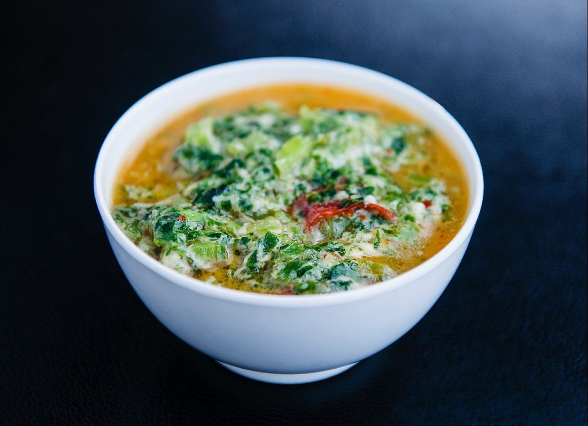

# Jaju

*Bhutan's mushroom-and-greens soup: foraged wild mushrooms (or any mushroom mix) simmered with spinach, butter, garlic and dried chillies in a clear broth that's lightly thickened with a teaspoon of flour. The everyday Bhutanese soup that turns up at every Himalayan home in autumn when the wild mushrooms come down.*

**Serves:** 4

**Prep Time:** 15 minutes

**Cook Time:** 30 minutes

## Overview
Jaju is Bhutan's everyday mushroom-and-greens soup, the gentle clear-broth dish that turns up at home tables across the Himalayan kingdom in autumn and winter when wild mushrooms are plentiful: a clear butter-and-garlic broth with mushrooms (wild morels, matsutake or shiitake in season; cultivated mushrooms outside Bhutan), fresh leafy greens (typically spinach or mustard saag), sliced ginger and a handful of dried red chillies that infuse warmth without overwhelming the gentle profile. The milder side of Bhutanese cooking; the soup that complements the fiery ema datshi and shakam paa on the table rather than competing with them. Wild mushrooms if you can find them; outside Bhutan, fresh shiitake or chestnut for body plus dried porcini or shiitake for depth give the right effect. A teaspoon of flour stirred into the butter at the start gives a slightly silky body without turning the soup into a stew. The dried chillies stay whole, releasing flavour as they soften; some diners eat them, others leave them in the bowl.

## Ingredients

### Mushrooms
- 300 g fresh mushrooms (a mix is best: 150 g shiitake or oyster, 150 g chestnut or button; or use whatever is available)
- 30 g dried mushrooms (porcini or shiitake; soaked in 300 ml hot water for 20 minutes, then drained, with the soaking liquid reserved)

### Greens
- 200 g fresh spinach (or mustard greens, kale, or any leafy green; washed and roughly chopped)

### Base
- 50 g butter (or yak butter; or ghee)
- 1 teaspoon plain flour (for light thickening)
- 1 large onion (finely sliced)
- 4 garlic cloves (finely chopped)
- 2 cm fresh ginger (peeled and finely sliced)
- 2-3 whole dried red chillies (left whole, unbroken)

### Liquid
- 600 ml hot vegetable stock (or chicken stock)
- The reserved mushroom-soaking liquid (about 250 ml; filtered through a fine sieve to remove any grit)

### Seasoning
- 1 teaspoon fine sea salt (or to taste)
- ½ teaspoon ground black pepper
- 1 fresh green chilli (deseeded and finely sliced, optional)

### To finish
- 2 tablespoons fresh coriander (chopped)
- 1 tablespoon spring onion (finely sliced)

## Method

### Stage 1 - Prepare the mushrooms
1. Drain the soaked dried mushrooms, reserving the soaking liquid.
2. Slice the rehydrated dried mushrooms into thin strips.
3. Clean the fresh mushrooms with a damp cloth (don't soak them in water; they absorb moisture and go waterlogged).
4. Slice the fresh mushrooms into 5 mm thick slices.

### Stage 2 - Make the light roux
1. Heat the butter in a wide heavy saucepan over medium heat till melted and just starting to foam.
2. Sprinkle in the teaspoon of plain flour.
3. Stir constantly with a wooden spoon for 1-2 minutes till the flour and butter combine into a pale roux. Don't let it brown; you want a white roux, not a brown one.

### Stage 3 - Build the aromatic base
1. Add the sliced onion to the roux.
2. Cook for 5-6 minutes till soft and pale gold.
3. Add the chopped garlic and sliced ginger; cook 30 seconds till fragrant.
4. Add the dried red chillies (whole, unbroken).

### Stage 4 - Add the mushrooms
1. Add the sliced fresh mushrooms; cook for 5-6 minutes, stirring occasionally, till they release their water and the water evaporates, leaving the mushrooms slightly caramelised at the edges.
2. Add the rehydrated dried mushroom strips.

### Stage 5 - Build the soup
1. Pour in the hot vegetable stock and the filtered mushroom soaking liquid.
2. Add the salt, pepper and fresh green chilli (if using).
3. Stir well; the small amount of flour from earlier will dissolve into the soup and give it a slightly silky body.
4. Bring to a gentle simmer; cook uncovered for 12-15 minutes for the flavours to develop and the soup to thicken slightly.

### Stage 6 - Add the greens
1. Stir in the chopped spinach (or other greens).
2. Cook 3-4 minutes till the greens wilt fully but stay bright green.
3. Taste; adjust salt and pepper.

### Stage 7 - Serve
1. Ladle into warm bowls; each bowl should have plenty of mushrooms, greens and broth, with one or two of the whole dried chillies floating in it.
2. Scatter the chopped coriander and sliced spring onion over the top.
3. Serve immediately as the gentle counter to fierier dishes on the Bhutanese table.

## Notes
- **A mix of fresh and dried mushrooms:** the depth of flavour comes from combining mushroom types. Dried porcini or shiitake add concentrated umami; fresh mushrooms add bulk and texture. Using only fresh gives a thin-tasting soup; using only dried gives a chewy unbalanced one.
- **Don't wash fresh mushrooms in water:** they absorb moisture and go soggy. Wipe with a damp cloth instead; the small amount of moisture is fine, immersing them is not.
- **The flour roux is essential:** the small amount of flour bound with butter at the start is what gives jaju its proper silky body. Skipping it gives a watery broth. The thickening should be subtle; the soup shouldn't be gravy-thick, just slightly silky.
- **Strain the mushroom soaking liquid:** the soaking water from dried mushrooms often has grit at the bottom. Filter through a fine sieve or muslin before adding to the soup.
- **The dried chillies are optional eating:** they infuse the soup with warmth as they sit in the broth. Some Bhutanese diners eat them; others leave them in the bowl. Provide a small dish at the table for those who want extra spice; remove from the soup if cooking for diners who can't handle heat.

## Variations
**Jaju with cheese (jaju datshi):** add 100 g of crumbled feta or fresh local cheese in the last 5 minutes; turns the gentle soup into a richer creamy bowl. Brings it into the datshi family.
**Jaju with rice noodles:** add 100 g of pre-cooked thin rice noodles to the soup in the last 2 minutes; turns the dish into a proper noodle soup that can be a main course.
**Jaju with chicken:** add 300 g of diced chicken thigh to the pan at the start of cooking the mushrooms; brown briefly, then proceed with the recipe. Makes a more substantial main-course soup.
**Wild mushroom only (if you can forage):** use 400 g of mixed wild mushrooms (chanterelles, morels, ceps) instead of cultivated; gives the proper Bhutanese forest soup. Skip the dried mushrooms if your fresh ones are properly flavourful.

## Serving
As one of the bowls on a multi-dish Bhutanese table alongside ema datshi (the chilli-cheese stew), shakam paa (dried beef stew), and red rice; the gentle clear broth provides relief from the heavier chilli-forward dishes. Eat with a spoon, mopping the broth with extra rice or bread.

## Storage
- Keeps refrigerated 3 days; the flavour deepens overnight. Reheat gently over low heat (don't boil; the greens will go drab).
- The greens go drab after a day but the soup still tastes good.
- Freezes 2 months without the fresh greens (which go off-texture); add fresh greens when reheating after defrosting.
- Don't microwave; the texture suffers.
