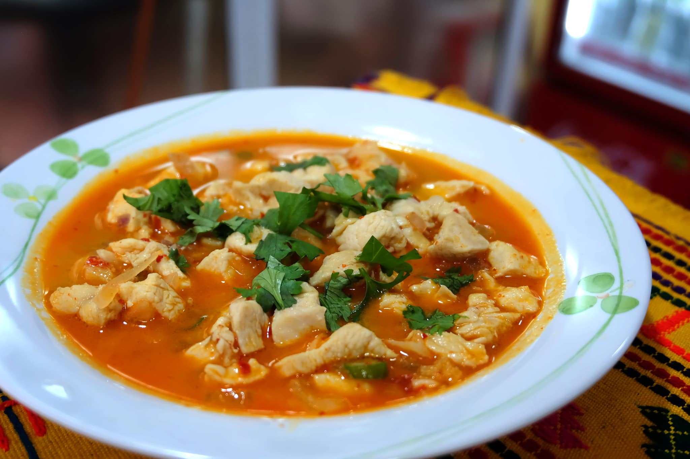

# Jasha Maru

*Bhutan's weeknight chicken stew, the dish a cook turns to after work. Bone-in chicken with ginger, garlic, tomato and chillies.*

**Serves:** 4

**Prep Time:** 15 minutes

**Cook Time:** 35 minutes

## Overview
A whole bone-in chicken is jointed and stewed with onion, tomato, plenty of fresh garlic and ginger, three or four green chillies, butter or vegetable oil and water. The cook is fast: a brief sear, a simmer with tomato until the chicken is cooked through, and a finish with chopped coriander and spring onion. The result is a brothy, fresh, gently spicy chicken dish that sits somewhere between Indian and East Asian cookery, which is exactly where Bhutan sits geographically.

## Ingredients

### Chicken
- 1 chicken (~1.2 kg), jointed into 8 pieces (or 1 kg bone-in chicken thighs)
- 1 teaspoon salt
- ½ teaspoon ground turmeric

### Stew
- 2 tablespoons butter (or vegetable oil)
- 2 brown onions (medium, finely sliced)
- 6 garlic cloves (crushed)
- 6 cm fresh ginger (peeled and julienned)
- 4 green chillies (slit lengthways; reduce to 2 for less heat)
- 3 tomatoes (medium, chopped)
- 1 teaspoon Sichuan pepper (lightly crushed, optional but traditional)
- 500 ml water (or light chicken stock)

### To finish
- 1 small bunch fresh coriander (chopped, leaves and stems)
- 4 spring onions (sliced)
- ½ teaspoon freshly ground black pepper

### To serve
- Red rice (or plain steamed rice)
- Ezay (Bhutanese chilli relish), optional

## Method

### Stage 1 - Prep
1. Joint the chicken into 8 pieces, or buy bone-in thighs.
1. Rub the chicken with the salt and turmeric. Set aside 10 minutes.
1. Slice the onions, crush the garlic, julienne the ginger, slit the chillies, chop the tomatoes.

### Stage 2 - Brown the chicken
1. Heat the butter in a wide heavy pan over medium-high heat.
1. Add the chicken in a single layer, skin-side down. Brown 4-5 minutes per side until golden.
1. Lift the chicken onto a plate. Pour off all but 1 tablespoon of fat.

### Stage 3 - Build the aromatics
1. Reduce heat to medium. Add the onions and a pinch of salt; cook 6-8 minutes until softened and lightly golden.
1. Add the garlic, ginger and Sichuan pepper; stir 1 minute.
1. Add the green chillies; stir 30 seconds.
1. Add the tomatoes; cook 4-5 minutes until they collapse into a rough sauce.

### Stage 4 - Stew
1. Return the chicken and any resting juices to the pan.
1. Pour in the water or stock to come halfway up the chicken pieces.
1. Bring to a simmer; cover loosely and cook 18-20 minutes, turning the chicken once, until cooked through (75°C / 165°F internal).
1. Uncover for the last 5 minutes if the gravy is too watery; the finished sauce should be loose but not soupy.

### Stage 5 - Finish
1. Scatter the chopped coriander and spring onion over the pan.
1. Grind over the black pepper.
1. Taste; adjust salt.
1. Stir once and turn off the heat. Let it sit covered for 5 minutes before serving.

### Stage 6 - Serve
1. Ladle into bowls over red rice; spoon broth over the rice.
1. Serve with a small dish of ezay on the side.

## Notes
- **Bone-in chicken is essential:** the bones give the broth its body. Boneless chicken thigh works in a pinch but the dish loses its broth-like character.
- **Fresh chillies, not dried:** unlike phaksha paa, jasha maru is built on fresh green chillies (in Bhutan, often the small fiery sha ema). Use serranos or hot green finger chillies; jalapeños are milder and you may need an extra one or two.
- **Sichuan pepper makes it Bhutanese:** without yer ma (Sichuan pepper) the dish reads as a generic chicken curry. The floral tingle is what locates it geographically.
- **Coriander is finished in, not cooked:** the green stuff goes in at the end so the coriander keeps its bright herbal note.
- **No tomato puree:** the dish uses fresh tomato only. Tomato puree thickens too much and overshadows the fresh aromatics.

## Variations
**Jasha Tshoem:** a thicker, drier variant with less liquid and a finish of butter and cheese stirred in - lavish for special occasions.
**With datshi:** a generous handful of crumbled blue cheese or feta stirred in at the very end pulls the dish toward ema datshi territory. Not traditional in every region but common in Thimphu home cooking.

## Serving
Serve with: red rice or plain steamed white rice (a heap, to soak up the broth), a side of greens stir-fried with garlic, and a small dish of ezay for those who want more heat. A glass of cold buttermilk or salted butter tea on the side.

## Storage
- Keeps 3 days refrigerated; the broth deepens overnight. Reheat gently in a covered pan with a splash of water if it tightens too much.
- Freezes 2 months. Thaw overnight in the fridge; reheat slowly.
