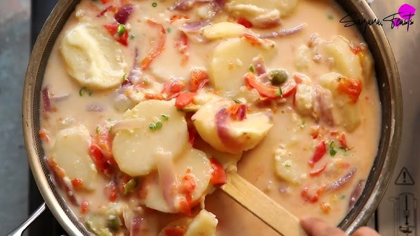

# Kewa Datshi

*A Bhutanese family supper: sliced potatoes simmered with green chillies and melted cheese into a rich, lively sauce.*

**Serves:** 4

**Prep Time:** 10 minutes

**Cook Time:** 25 minutes

## Overview
The gentler, more domestic cousin of ema datshi: a Bhutanese family supper of potatoes simmered with chilli and cheese into a creamy, lively sauce. You slice waxy potatoes into thin rounds and drop them into a single pot with green chillies, onion, garlic, butter and the cheese mixture, then cover with water and simmer for about twenty-five minutes until the potatoes are tender and the cheese has melted into a thick, pale-yellow chilli-flecked sauce. The technique is the simplest in Bhutanese cooking: everything goes in together and cooks down without ceremony. The art is in the chilli-to-cheese ratio. More chilli and the dish reads as fiery; more cheese and it reads as rich. Either way it's eaten with red Bhutanese rice, the potatoes half-melting into the rice as you spoon.

## Ingredients

### Main
- 700 g waxy potatoes (Charlotte, new potatoes or Yukon Gold; peeled and sliced 5 mm thick)
- 6 green chillies (slit lengthways, stems removed; reduce to 3-4 for less heat)
- 1 onion (medium, sliced into half-moons)
- 4 garlic cloves (smashed)
- 2 tomatoes (small, cut into wedges)
- 30 g butter
- 300 ml water
- 1 teaspoon salt

### Cheese mix (yak churpi substitute)
- 100 g Edam cheese (grated; or mild gouda)
- 80 g processed cheese slices (chopped; e.g. supermarket American slices or Dairylea singles)
- 40 g crumbled feta (or a small handful of mild blue cheese, for the funky note - optional but recommended)
- 50 ml whole milk

### To finish
- 3 spring onions (sliced)
- Pinch of ground Sichuan pepper (optional)

### To serve
- Bhutanese red rice (or plain steamed rice)

## Method

### Stage 1 - Prep
1. Peel and slice the potatoes 5 mm thick. Keep them in water until ready to cook so they do not brown.
1. Slit the chillies lengthways; for less heat, scrape out the seeds.
1. Slice the onion, smash the garlic, wedge the tomatoes.
1. Grate or chop the cheeses; mix together in a bowl with the milk.

### Stage 2 - Start the pot
1. Combine in a wide heavy pot: drained potatoes, chillies, onion, garlic, tomatoes, butter, salt and water.
1. Bring to a vigorous boil over high heat, lid on.
1. Once boiling, reduce to medium and cook 12-15 minutes, stirring once or twice, until the potatoes are just tender (a knife slides in with light resistance).

### Stage 3 - Add the cheese
1. Reduce heat to low.
1. Scatter the cheese mix over the surface of the pot; do not stir immediately - let it begin melting from above.
1. After 2 minutes, stir gently to fold the melting cheese into the broth.
1. Continue on low heat 4-5 minutes more, stirring occasionally, until the cheese has fully melted and clings to the potatoes in a thick sauce. If the sauce tightens too much, splash in a tablespoon or two of milk.

### Stage 4 - Finish
1. Stir in the spring onions and Sichuan pepper.
1. Taste; adjust salt. The cheese is salty, so taste before adding more.
1. Turn off the heat and let it sit covered for 3 minutes; the sauce settles and thickens.

### Stage 5 - Serve
1. Spoon over red rice in deep bowls. The dish is intentionally saucy - the rice soaks up the chilli-cheese broth.

## Notes
- **Yak cheese is unavailable abroad:** churpi made from yak milk is the authentic cheese and is fresh, salty, slightly funky and melts into ropy strands. The Edam-and-processed-cheese mix is the standard expat substitute: Edam gives the meltability and mildness, the processed slices give the salty plastic-y elasticity that approximates churpi. A small amount of feta or blue cheese adds the funky note. Stilton or Gorgonzola can replace the feta if you want a more pronounced flavour.
- **Waxy potatoes hold their shape:** floury potatoes (Maris Piper, King Edward) break down into mash and ruin the texture. Charlotte, Anya, Yukon Gold or any small waxy variety is what you want.
- **Chillies are the spice:** as with ema datshi, the chillies are integral, not garnish. In Bhutan the dish is often fierce; 6 green chillies is moderate by Bhutanese standards but probably plenty for a Western palate first time. Slitting (not chopping) the chillies lets diners pick out or eat them as they choose.
- **Sichuan pepper is optional but traditional:** a small pinch added at the end gives the floral tingle that anchors the dish in the Himalayas.
- **Salt last:** processed cheese and feta are both salty. Always taste before adding more salt.

## Variations
**Shamu Datshi:** the mushroom version - same method, with 400 g sliced mushrooms (button, chestnut or oyster) replacing the potatoes. Cooks faster, around 12 minutes total.
**Kewa Phagsha Datshi:** a hybrid with sliced pork added to the pot at the start - heartier, richer, less of a side dish and more a one-pot meal.
**Sosem datshi:** sliced asparagus replacing the potatoes in season.

## Serving
Serve with: Bhutanese red rice or plain rice as the staple, ema datshi (if you can handle two chilli-cheese dishes), a simple green vegetable stir-fry, and a small dish of ezay for those who want more heat. Salt butter tea (suja) traditionally accompanies the meal.

## Storage
- Keeps 2 days refrigerated but the texture is best on day one - the potatoes absorb the sauce and the dish loses its loose, cheesy character. Reheat very gently with a splash of milk to loosen.
- Do not freeze - both the cheese and the potatoes go grainy on thawing.
