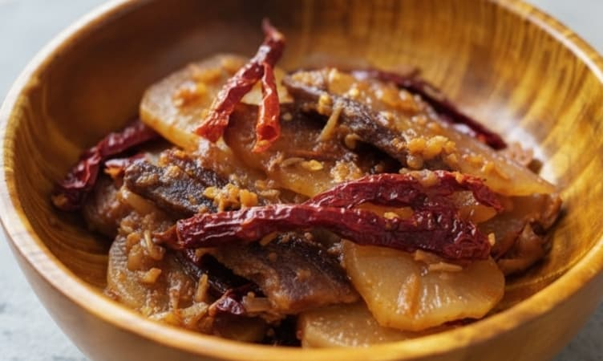

# Phaksha Paa

*Bhutanese pork with dried red chillies and white radish - one of the country's signature meat dishes. "Phaksha" is pork; "paa" is the term for a dish of meat stir-stewed with chilli. Strips of pork belly are slow-cooked with whole dried red chillies, sliced daikon radish, ginger, garlic and Bhutanese mountain pepper (Sichuan pepper) until the pork is meltingly tender and the radish has absorbed the fierce chilli broth. The dish is hot but not overwhelming; the radish tempers the heat the way potato does in ema datshi. Eaten with red rice across western and central Bhutan; in the eastern districts and Tibetan border regions the dish is sometimes made with dried pork (sikam phaksha).*

**Serves:** 4

**Prep Time:** 15 minutes

**Cook Time:** 1 hour

## Overview
Pork belly is cut into thumb-length strips and simmered with whole dried red chillies, daikon, ginger, garlic, soy and a generous spoon of Sichuan pepper. The dish cooks in two stages: first the pork on its own to render the fat and brown the meat, then the chillies, aromatics and radish go in to braise in the rendered juices. The finished dish has thick chunks of soft radish in a glossy red-brown sauce with whole chillies you can choose to eat or leave on the plate.

## Ingredients

### Pork
- 600 g pork belly (skin on, cut into strips 5 cm long, 1 cm thick)
- 1 teaspoon salt

### Chilli braise
- 15 whole dried red chillies (Kashmiri or arbol; reduce to 8 for less heat)
- 1 large daikon / mooli (~500 g, peeled and cut into 4 cm batons)
- 4 garlic cloves (sliced)
- 4 cm fresh ginger (peeled, julienned)
- 2 teaspoons Sichuan pepper (lightly crushed)
- 1 tablespoon dark soy sauce
- 1 teaspoon caster sugar
- 4 spring onions (cut into 4 cm lengths)
- 400 ml water
- 1 tablespoon vegetable oil (only if the pork is very lean)

### To serve
- Bhutanese red rice (or plain steamed long-grain rice)
- A small bowl of ezay (chilli sauce) on the side, optional

## Method

### Stage 1 - Prep
1. Cut the pork belly into 5 cm by 1 cm strips, leaving the skin on.
1. Peel and cut the daikon into 4 cm batons.
1. Snap or cut the dried chillies open at one end; shake out some of the seeds for less heat if you like.
1. Crush the Sichuan pepper lightly in a mortar.

### Stage 2 - Render the pork
1. Heat a heavy wok or shallow pan over medium heat. Add the pork strips dry (no oil needed unless very lean).
1. Cook 10-12 minutes, stirring occasionally, until the fat has rendered and the pork edges are golden. The pan will fill with melted pork fat - this is the cooking medium.
1. Sprinkle in the salt.

### Stage 3 - Build the braise
1. Push the pork to one side of the pan. Add the garlic, ginger and Sichuan pepper to the rendered fat.
1. Stir 30 seconds until fragrant.
1. Add the dried chillies; stir 30 seconds (do not burn them).
1. Add the daikon, soy sauce and sugar; stir to coat.
1. Pour in the water; bring to a simmer.

### Stage 4 - Slow braise
1. Cover loosely and simmer on medium-low for 35-40 minutes, stirring once or twice.
1. The daikon should turn translucent and absorb the colour of the broth; the pork should be soft enough to bite easily.
1. If the sauce is too watery, uncover for the last 5-10 minutes; the finished dish should be glossy, not soupy.

### Stage 5 - Finish
1. Stir in the spring onions; cook 1 minute more.
1. Taste; adjust salt or soy.

### Stage 6 - Serve
1. Spoon over red rice. Warn diners about the whole chillies - they are eaters' choice.

## Notes
- **Dried chillies, not fresh:** the dish is built on dried red chilli, which gives a smoky, earthy heat. Fresh chillies belong in ema datshi, not paa. Kashmiri chillies are mild and a good entry point; chillies de árbol are hotter and closer to Bhutanese intensity.
- **Pork belly with skin:** the skin softens during braising and contributes body to the sauce. Boneless skin-on belly is ideal. Skinless belly works but the dish is leaner.
- **Sichuan pepper is the secret aromatic:** called "yer ma" in Dzongkha, Sichuan pepper is widely used in Bhutanese cooking and gives the floral, lemony, tongue-buzzing note that distinguishes the dish from a generic spicy pork.
- **Daikon is the canonical vegetable:** white radish is the traditional partner; potato or turnip can substitute but radish gives the right slightly bitter, slightly sweet counterpoint to the pork fat.
- **Bhutanese red rice:** the short-grain red rice from Paro and Bumthang is the proper accompaniment. Brown basmati or even ordinary white rice work fine if you cannot find it.

## Variations
**Sikam Phaksha Paa:** the eastern Bhutanese version made with sikam, dried pork that is rehydrated and braised. Smokier and more intense; needs an extra 20 minutes of cooking.
**Phaksha Phing:** a related dish made with mungbean glass noodles in the same chilli sauce, finished with cabbage instead of radish.

## Serving
Serve with: red rice (or any plain rice), a side of plain steamed greens or ema datshi for the full Bhutanese plate, and a small dish of ezay (raw chilli relish with tomato and onion) for those who want even more heat.

## Storage
- Keeps 3 days refrigerated; the flavour deepens and the radish becomes even softer overnight.
- Freezes 2 months but the radish texture suffers. Better to eat fresh or refrigerated.
