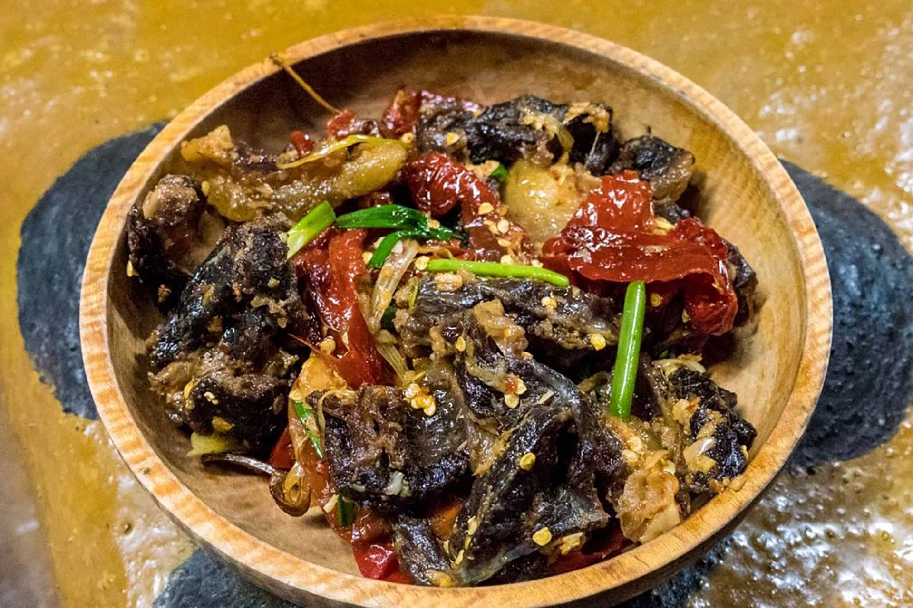

# Shakam Paa

*Bhutan's dried beef stew: shakam (air-dried beef strips) rehydrated and simmered with onion, garlic, dried red chillies and a generous dose of fresh green chillies till the dried meat softens and the broth turns fiery and rich. The high-Himalayan winter dish, eaten with red rice across central and eastern Bhutan.*

**Serves:** 4

**Prep Time:** 25 minutes (plus 2-4 hours soaking for the dried beef)

**Cook Time:** 1 hour

## Overview
Shakam paa is one of Bhutan's most distinctive dishes, born of the Himalayan necessity of preserving meat through long cold winters: strips of beef air-dried on rooftops till they go leather-hard and slightly fermented, then rehydrated through the winter and turned into stews. The dried beef (shakam) is soaked warm to soften, then simmered with onion, garlic, dried red chillies, plenty of fresh green chillies and a little butter till the meat softens and the broth goes properly fiery. Bhutan is the only country where chillies are considered a vegetable in their own right; a proper shakam paa contains more chilli than most outsiders consider sane. The dried beef has a slightly fermented, deeply savoury quality fresh beef can't replicate. Biltong or carne seca substitute outside Bhutan. Soaking water becomes part of the stock. Served over red rice with ezay on the side.

## Ingredients

### Dried beef
- 250 g air-dried beef strips (shakam; or biltong, or carne seca; or homemade dried beef strips)
- 700 ml warm water (for rehydrating)

### Base
- 3 tablespoons butter (or yak butter; or vegetable oil + 1 tablespoon butter)
- 2 large onions (finely sliced)
- 6 garlic cloves (crushed)
- 1 thumb (3 cm) fresh ginger (finely grated)
- 6 whole dried red chillies (Bhutanese sun-dried chillies if you can find them; or any whole dried red chilli like cayenne or Sichuan)

### Stock
- 400 ml beef stock (in addition to the reserved soaking water)
- 1 teaspoon fine sea salt (taste before adding; the dried beef is already salty)

### The fresh chilli stage
- 6-8 fresh green chillies (jalapeño or serrano, sliced lengthwise into halves; or Bhutanese green chillies if you have access to them, in which case use 10-12 because they're milder)

### To finish
- 2 tablespoons fresh coriander (chopped)
- Salt to taste

### To serve
- Bhutanese red rice (or any short-grain red rice; or use plain basmati)
- [Ezay](side-dishes/ezay.md) (the Bhutanese chilli relish)

## Method

### Stage 1 - Rehydrate the dried beef
1. Place the dried beef strips in a wide bowl.
2. Pour the warm water over; the beef should be fully submerged.
3. Soak for 2-4 hours till the beef has softened from rock-hard leather to merely firm and chewy. The beef won't fully soften till it cooks in the stew; the soak just starts the rehydration.
4. Drain the beef, reserving the soaking water (it's full of flavour and goes into the stew).
5. Slice the rehydrated beef strips into roughly 4 cm pieces.

### Stage 2 - Sauté the base
1. Heat the butter in a wide heavy casserole over medium heat.
2. Add the sliced onions and cook 8-10 minutes till soft and starting to colour at the edges.
3. Stir in the crushed garlic and grated ginger; cook 1 minute till fragrant.

### Stage 3 - Add the dried chillies
1. Add the whole dried red chillies (broken in half if you want more heat).
2. Stir for 30 seconds; the chillies darken slightly in the hot fat.

### Stage 4 - Add the beef
1. Tip the sliced rehydrated beef into the pan.
2. Stir to coat in the spiced onion-and-chilli base.
3. Cook 3-4 minutes so the beef takes up the flavour.

### Stage 5 - Add liquid and simmer
1. Pour in the reserved beef soaking water and the additional beef stock.
2. Stir well.
3. Bring to a simmer; cover the pan with the lid slightly ajar.
4. Cook 35-40 minutes on low heat till the beef has softened to a tender chew (not falling apart, but no longer leather-hard).
5. The broth will reduce by about a third and concentrate in flavour.

### Stage 6 - Add the fresh green chillies
1. Add the halved fresh green chillies to the pan.
2. Stir to distribute through the stew.
3. Cook uncovered for another 10 minutes till the green chillies soften slightly but still hold their shape and bright colour. The fresh chillies are a vegetable here, not a seasoning; expect to eat them.

### Stage 7 - Finish
1. Taste the broth; adjust salt (carefully; the dried beef is salty already).
2. Stir in most of the chopped coriander, reserving a small amount for garnish.
3. The shakam paa should be a chunky stew of chewy beef strips and softened green chillies in a fiery rust-coloured broth with the dried red chillies still floating in it.

### Stage 8 - Serve
1. Spoon a generous portion of Bhutanese red rice (or substitute) into wide bowls.
2. Ladle the shakam paa over, with plenty of the broth.
3. Scatter the reserved chopped coriander over.
4. Place a small dish of ezay alongside for diners who want extra heat (yes, more heat).
5. Eat with a spoon; the broth-soaked rice is the best bit.

## Notes
- **Air-dried beef is essential to the dish:** the slightly fermented, deeply savoury character of properly air-dried beef can't be replicated with fresh beef. Biltong is the closest widely-available substitute; carne seca works too. Homemade is possible: cut beef into thin strips, salt heavily, air-dry on a wire rack in front of a fan for 24-48 hours till leather-hard. Fresh beef in this recipe gives you a bland generic beef stew, not shakam paa.
- **Soak for 2-4 hours:** the dried beef needs proper rehydration before cooking. 2 hours minimum; 4 hours better. Don't try to skip this with hot water; gentler warm-water soaking gives better results.
- **Reserve the soaking water:** the soaking liquid is full of beef flavour and salt; use it as part of the stock for the stew. Throwing it away loses half the depth.
- **Chillies are a vegetable here:** Bhutan treats chillies as a vegetable rather than a seasoning. The 6-8 fresh green chillies aren't a flavouring; they're a structural part of the dish that you eat. Approach accordingly. If you're sensitive to chilli, reduce; if you want the proper Bhutanese experience, hold the line.
- **Bhutanese chillies if you can find them:** the local Bhutanese chillies (small green, very hot but with a distinctive flavour) are the traditional choice. Outside Bhutan, jalapeño or serrano are the closest substitutes; bird's eye chillies if you want even more heat.
- **Butter or yak butter:** traditional shakam paa uses yak butter, which has a faintly fermented funky character. Hard to find outside Tibet and Bhutan; regular butter is the standard substitute. Ghee also works.

## Variations
**Yaksha paa:** the same dish made with dried yak meat instead of dried beef; the proper high-altitude version, available in some Bhutanese and Tibetan restaurants outside Bhutan. The yak meat is slightly gamier than beef.
**Shakam ema datshi:** add 100 g of crumbled feta or fresh local cheese in the last 5 minutes; turns the stew into a creamy variation that bridges shakam paa and ema datshi (the chilli-cheese national dish).
**Shakam paa with potato:** add 2 medium potatoes (cubed) to the stew when you add the stock; turns the dish into a one-pot meal. Common Bhutanese household variant.
**Vegetarian shakam paa (jaju paa):** swap the dried beef for dried mushrooms (200 g, soaked the same way); use vegetable stock. Less traditional but works for fasting days or vegetarian guests.

## Serving
Over Bhutanese red rice (the staple short-grain reddish-brown rice of the country; substitute with any short-grain red rice like Camargue red), with the broth soaking into the rice. Ezay (the Bhutanese chilli relish) on the side for those who want extra heat. A small bowl of plain yogurt to cool the palate, if needed.

## Storage
- Keeps refrigerated 4 days; the flavour deepens noticeably overnight.
- Freezes 3 months. Defrost in the fridge and reheat gently in a covered pan.
- The fresh green chillies lose their bright colour after a day but the flavour is still good.
- Don't microwave; the broth splits and the chillies go off-colour.
