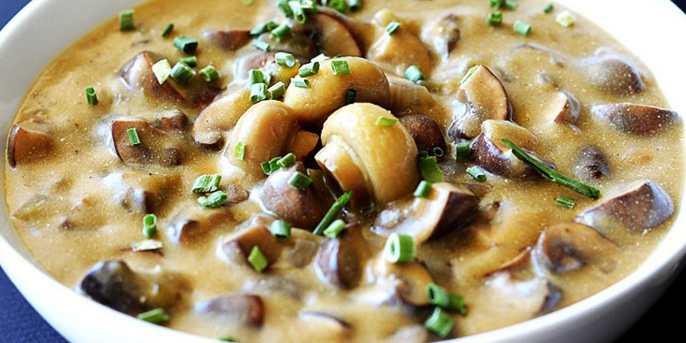

# Shamu Datshi

*Bhutan's mushroom-and-cheese stew: sliced mushrooms simmered with onion, garlic, fresh green chillies and butter, then finished with crumbled local cheese melted into the sauce. The mushroom variant of the famous ema-datshi family, eaten with red rice.*

**Serves:** 4

**Prep Time:** 15 minutes

**Cook Time:** 25 minutes

## Overview
Shamu datshi is the mushroom version of Bhutan's beloved datshi (cheese-stew) family, sitting alongside the more famous ema datshi (chilli-cheese), kewa datshi (potato-cheese) and gondo datshi (egg-cheese): sliced mushrooms cooked with onion, garlic, fresh green chillies and butter, then finished by stirring in crumbled fresh Bhutanese cheese that melts into the sauce to give a creamy spicy mushroom-and-cheese coating spooned over red rice. The cheese is the defining ingredient. Real Bhutanese cheese (chhurpi, the soft yak-milk version; or saykam, the slightly fermented harder one) has a tangy slightly funky character that's hard to replicate. Fresh feta crumbled in at the end is the standard substitute outside Bhutan; cottage cheese or fresh ricotta also work but lack the tang. Three to five minutes of simmering after the cheese goes in is enough; longer breaks down the dairy and the cheese splits.

## Ingredients

### Mushrooms
- 600 g fresh mushrooms (a mix is best: 300 g chestnut or button, 300 g shiitake or oyster; or any mushrooms you like)

### Base
- 50 g butter (or yak butter)
- 1 large onion (finely sliced)
- 4 garlic cloves (crushed)
- 1 thumb (3 cm) fresh ginger (finely grated)
- 4-6 fresh green chillies (jalapeño or serrano; halved lengthwise, deseeded for milder, seeds in for fierce)

### Liquid
- 150 ml water (or vegetable stock)
- 1 teaspoon fine sea salt

### Cheese (the defining ingredient)
- 200 g feta cheese (or fresh Bhutanese chhurpi if available; or fresh ricotta as a less-tangy substitute)

### To finish
- 2 tablespoons fresh coriander (chopped)
- Salt and black pepper to taste

### To serve
- Bhutanese red rice (or any short-grain red rice; or plain basmati)

## Method

### Stage 1 - Prepare the mushrooms
1. Wipe the mushrooms clean with a damp cloth (don't wash in water; they absorb moisture and go waterlogged).
2. Slice each mushroom into 1 cm thick slices. Cut larger mushrooms into halves first if needed to make uniform slices.
3. Keep different mushroom types together; they'll all go into the pan at once.

### Stage 2 - Build the aromatic base
1. Heat the butter in a wide heavy saucepan over medium heat till melted and just starting to foam.
2. Add the sliced onion; sweat 6-7 minutes till soft and pale gold.
3. Stir in the crushed garlic and grated ginger; cook 30 seconds.
4. Add the halved fresh green chillies; cook 1 minute. The kitchen will smell properly spiced at this point.

### Stage 3 - Add the mushrooms
1. Tip in all the sliced mushrooms.
2. Cook for 8-10 minutes, stirring occasionally, till the mushrooms release their water (which initially makes the pan look wet), then the water evaporates and the mushrooms start to caramelise at the edges.
3. This is the proper texture base for shamu datshi: mushrooms reduced in volume, lightly caramelised, with no remaining liquid in the pan.

### Stage 4 - Add water and simmer briefly
1. Pour in the 150 ml of water (or vegetable stock).
2. Stir in the teaspoon of salt.
3. Bring to a gentle simmer; cook 3-4 minutes for the mushrooms to absorb the liquid and the sauce to come together. The pan should look like a glossy mushroom sauté with just a small amount of liquid pooling around the mushrooms.

### Stage 5 - Add the cheese
1. Crumble the feta (or chhurpi, or ricotta) into the pan in 1 cm chunks.
2. Stir gently to combine.
3. Cook 3-5 minutes more on low heat; the cheese will soften and partially melt into the sauce, leaving some pieces visible. The sauce will turn creamy from the dairy fat.
4. Don't cook longer than 5 minutes; longer breaks down the cheese further and the sauce can split or go grainy.

### Stage 6 - Finish
1. Take off the heat.
2. Taste; adjust salt (carefully; feta is salty). Add pepper if desired.
3. Stir in most of the chopped coriander, reserving a small amount for garnish.

### Stage 7 - Serve
1. Spoon a portion of warm red rice into wide bowls.
2. Ladle the shamu datshi over, with plenty of the creamy mushroom-cheese sauce.
3. Scatter the reserved chopped coriander over.
4. Eat immediately; the cheese sauce thickens and goes claggy as it cools.

## Notes
- **Mushroom mix for the best flavour:** a single type of mushroom (especially button) gives a one-note dish. Mixing two or three types (shiitake for depth, chestnut for body, oyster for texture) gives the proper multi-layered shamu datshi.
- **Cook off the mushroom water before adding liquid:** the most common error is adding water while the mushrooms are still releasing their own moisture. Let the mushrooms reduce till the pan is dry-ish (no liquid pooling) before adding the water-and-salt for the sauce.
- **Feta is the standard substitute:** real Bhutanese chhurpi cheese is hard to find outside Bhutan and Tibet. Feta gives the right tangy character with a similar texture. Ricotta is creamier but less tangy; cottage cheese works for texture but lacks the flavour.
- **Don't overcook the cheese:** 3-5 minutes after the cheese goes in is enough. Longer cooking breaks down the dairy and the sauce can split or go grainy. The proper shamu datshi has visible pieces of cheese in a creamy sauce, not a uniform melted-cheese soup.
- **Bhutanese chilli levels:** the traditional Bhutanese version uses way more chillies than this recipe (often 6-8 hot Bhutanese green chillies whole). I've moderated for non-Bhutanese palates; scale up if you want the proper experience.

## Variations
- **Shamu datshi with potato:** add 1 medium potato (peeled, cubed) along with the mushrooms; the potato softens during the cook and gives extra body. Bridges shamu datshi and kewa datshi.
- **Vegan shamu datshi:** swap the cheese for 200 g of firm tofu (crumbled) and add 2 tablespoons of nutritional yeast for the cheesy flavour. Less authentic but works for vegans.
- **Shamu datshi with bacon:** add 80 g of diced bacon to the pan at the start (render the fat, then add the onion); gives a smoky depth. Non-traditional but lovely.
- **With dried mushrooms only:** for a deeper more concentrated flavour, use 60 g of mixed dried mushrooms (porcini, shiitake) soaked in 300 ml water; use both the rehydrated mushrooms and the soaking liquid (in place of the 150 ml water). Gives a more rustic Bhutanese flavour.

## Serving
- On a bed of warm red rice, with the creamy mushroom-cheese sauce ladled over generously. Often part of a multi-dish Bhutanese table alongside ema datshi (chilli-cheese), shakam paa (dried beef stew), [jaju](jaju.md) (mushroom soup), and various ezay (chilli relishes). Drink: butter tea (suja), or Bhutanese ara (rice wine), or just water.

## Storage
- Keeps refrigerated 2 days; the cheese sauce goes slightly grainy on reheating but the flavour holds.
- Reheat in a covered pan with a splash of water over low heat. Don't microwave; the cheese can split.
- Doesn't freeze well; the cheese sauce splits and the mushrooms go off-texture.
