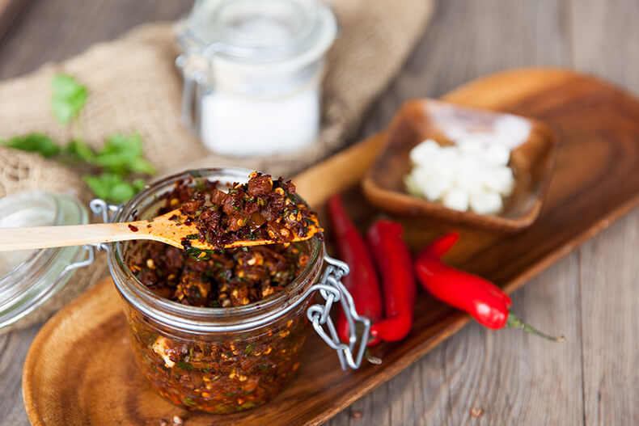

# Ezay

*Bhutan's chilli relish: fresh green chillies, tomato, garlic, coriander and a small amount of cheese pounded into a fiery green-orange relish. The condiment that appears at every Bhutanese meal, providing the extra layer of heat that even Bhutan's spice-tolerant diners want on top of their already-fiery food.*

**Serves:** Makes about 200 ml (8-12 servings as a condiment)

**Prep Time:** 15 minutes

**Cook Time:** 0 minutes

## Overview
Ezay is Bhutan's signature chilli condiment: the small bowl of fierce green relish that turns up at every meal as the extra-heat element diners apply on top of their already-fiery food. Fresh green chillies pounded in a stone mortar with garlic, tomato, fresh coriander and a small amount of crumbled fresh Bhutanese cheese, lightly salted, finished with a splash of water or lime to give a sloppy spoonable consistency. The cheese is the surprise. Most chilli relishes in the world are simply chilli-and-aromatic; Bhutanese ezay almost always includes a small amount of fresh cheese (chhurpi, or feta outside Bhutan) that softens the chilli heat just enough to make it sustained rather than punishing. Hand-pound, never blitz; the mortar work releases the chilli oils properly. Make small batches; past its best after 48 hours.

## Ingredients

- 6-10 fresh green chillies (Bhutanese green chillies if possible; otherwise jalapeño or serrano; deseed for milder, seeds in for fierce)
- 4 garlic cloves (peeled)
- 2 medium tomatoes (chopped; ripe firm tomatoes; not overripe and watery)
- 1 small bunch fresh coriander (about 20 g, stems and leaves)
- 1 small spring onion (white and pale green parts; finely sliced)
- 100 g feta cheese (crumbled; or fresh Bhutanese chhurpi cheese if available; or fresh ricotta)
- ½ teaspoon fine sea salt (taste before adding; feta is salty)
- 1 tablespoon fresh lime juice (or rice vinegar)
- 2 tablespoons water (to loosen if needed)

## Method

### Stage 1 - Prepare the chillies
1. Remove the stems from the chillies.
2. For mild ezay: slit each chilli in half lengthwise and scrape out the seeds and white pith.
3. For fierce ezay: leave the chillies whole with all seeds.
4. Roughly chop the chillies.
5. Wear gloves if you're handling lots of chillies; the oils sting.

### Stage 2 - Pound in a mortar
1. Tip the chopped chillies and peeled garlic cloves into a large mortar.
2. Pound with the pestle for 1-2 minutes till the chillies break down into a coarse paste with visible pieces. The garlic should be crushed but not fully smooth.
3. The work releases the chilli oils; you'll see oil pooling in the bottom of the mortar.

### Stage 3 - Add the tomatoes and herbs
1. Add the chopped tomato to the mortar; pound briefly with the pestle to crush the tomato into the chilli paste. Don't go too long; you want pieces of tomato visible.
2. Add the chopped coriander (stems and leaves) and the sliced spring onion. Pound briefly to combine.

### Stage 4 - Add the cheese
1. Crumble the feta (or chhurpi) into the mortar.
2. Stir gently with the pestle; don't pound the cheese. The cheese should remain in small pieces, partially integrated into the relish but visibly distinct.

### Stage 5 - Season
1. Add the salt, lime juice and water.
2. Stir together. The relish should be sloppy but not soupy; a spoonable consistency.
3. Taste; adjust salt or lime juice. The flavour should be properly fiery (chilli front and centre), with the cheese giving creamy notes, the tomato providing tangy juicy body and the coriander cutting through with green freshness.

### Stage 6 - Rest briefly and serve
1. Transfer the ezay to a small serving bowl.
2. Cover loosely and let stand 15 minutes for the flavours to marry; the chilli heat actually softens slightly as it sits.
3. Place at the centre of the Bhutanese table alongside the main dishes.

## Method (Alternative: Food Processor)
If you don't have a mortar, you can use a small food processor: pulse the chillies and garlic briefly (3-4 pulses), then add the tomato and herbs and pulse 2-3 more times till just combined. Tip into a bowl and stir in the cheese, salt, lime juice and water by hand. The texture is less controlled than mortar-pounded ezay, but workable.

## Notes
- **Bhutanese green chillies if possible:** the small green Bhutanese chillies have a specific flavour profile that's hard to replicate. Outside Bhutan, jalapeño or serrano are the closest substitutes; for fiercer heat, use Thai bird's eye chillies. Adjust quantity based on the chilli heat; the recipe assumes moderately hot.
- **Mortar-pounded for proper depth:** a mortar releases chilli oils in a way blender blades don't. The resulting relish has more layered flavour. A food processor works in a pinch but the texture and depth are less.
- **Cheese is non-negotiable:** Bhutanese ezay almost always includes a small amount of cheese; this is what makes it distinct from a generic chilli salsa. Feta substitutes well for the proper Bhutanese chhurpi; fresh ricotta is creamier; cottage cheese works but adds less character.
- **Eat fresh:** ezay is meant to be made fresh and eaten within 2-3 days. The flavour changes as it sits (chillies grow hotter, tomato breaks down, herbs go drab). Make small batches.
- **Adjust for diners' heat tolerance:** the traditional Bhutanese ezay is properly fierce. Cook for non-Bhutanese diners by deseeding the chillies and reducing the number. Cook for Bhutanese diners by leaving the seeds in and using more chillies.

## Variations
**Eggplant ezay (zomei ezay):** roast 1 medium aubergine over an open flame till the skin blackens; peel and chop the flesh; pound into the relish along with the tomato. Adds smoky depth.
**Cheese-heavy ezay (datshi ezay):** double the cheese for a creamier richer relish that bridges ezay and a cheese-cream sauce. Common variation.
**Dried chilli ezay:** swap fresh green chillies for 4-5 whole dried red chillies (soaked in hot water 15 minutes to rehydrate, then drained and chopped). Gives a deeper, smokier relish with a different chilli profile.
**Lime-and-coriander ezay (lighter, brighter):** double the lime juice and the coriander, halve the cheese. Cooler, fresher version for summer.

## Serving
A small spoonful added to whatever you're eating: dropped onto ema datshi for extra heat; spooned over plain red rice as a simple snack; stirred into shakam paa for a chilli boost; mixed into momos as a dipping sauce; smeared inside flatbread. Even Bhutanese diners who insist they don't need extra spice on their already-fiery food usually have ezay on the side; it's part of the table architecture.

## Storage
- Best eaten within 24 hours of making.
- Keeps refrigerated 2-3 days in a sealed container; the chilli heat actually intensifies during the first 24 hours, then the relish starts to break down (tomato goes mushy, herbs drabber).
- Don't freeze; the cheese splits and the texture suffers.
- For longer storage, make a fermented version: leave the relish (without cheese) at room temperature in a clean jar with a loose lid for 48 hours; transfer to the fridge. Add cheese only at serving time. Keeps 2 weeks; the flavour develops a tangy fermented note.
