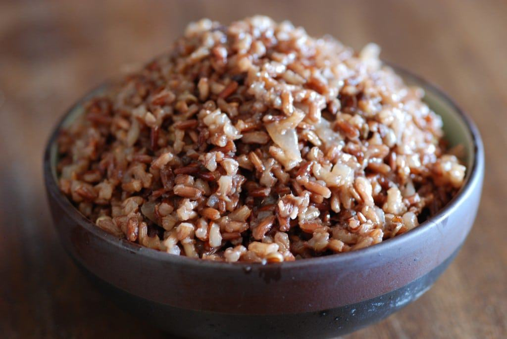

# Bhutanese Red Rice

*Bhutan's national staple: short-grain red rice grown in the high-altitude paddies of the Paro and Punakha valleys, with a deep russet colour and faintly nutty earthy flavour. The carb foundation of every Bhutanese meal, eaten with ema datshi and the country's other fiery stews.*

**Serves:** 4

**Prep Time:** 5 minutes (plus 30 minutes rinsing and resting)

**Cook Time:** 35 minutes

## Overview
Bhutanese red rice is the country's national starch and the carbohydrate foundation of every Bhutanese meal: a short-to-medium-grain red rice grown in the high-altitude paddies of the Paro and Punakha valleys, with the bran left intact so the rice retains its deep russet-red colour, faintly nutty earthy flavour and slightly chewy texture. Every Bhutanese fiery datshi or paa is meant to be spooned over it. Get actual Bhutanese red rice if you can (increasingly available at speciality grocers and Asian markets). Camargue red rice or Wehani are the closest substitutes; any short-grain whole-grain brown rice works at a push, but long-grain (basmati, jasmine) is wrong because the grains stay too separate. Rinse thoroughly, three or four times, till the water runs mostly clear; the surface starch makes for sticky rice otherwise. Cooked by the absorption method at a 1:2 grain-to-water ratio (less water than white rice; the bran-on grain absorbs less).

## Ingredients

- 400 g Bhutanese red rice (or Camargue red rice; or any short-grain red rice)
- 800 ml cold water
- 1 teaspoon fine sea salt (optional)

## Method

### Stage 1 - Rinse the rice
1. Tip the rice into a wide bowl.
2. Cover with cold water and swirl with your hand; the water turns reddish-pink with surface starch.
3. Drain through a sieve, keeping the rice.
4. Repeat the rinse-and-drain 3-4 times till the water runs mostly clear (it'll always be slightly tinged red because of the bran; that's fine).
5. Drain thoroughly.

### Stage 2 - Optional soak
1. If you want the rice slightly more tender and quicker to cook, soak the rinsed rice in fresh cold water for 30 minutes; drain.
2. This step is optional but traditional in Bhutanese households.

### Stage 3 - Cook
1. Place the rinsed (and optionally soaked) rice in a heavy-bottomed saucepan with a tight-fitting lid.
2. Pour in the 800 ml of cold water.
3. Add the salt if using.
4. Place the pan over high heat; bring to a rolling boil.
5. Once boiling, reduce to the lowest heat.
6. Cover with the lid tightly.
7. Cook 25 minutes without lifting the lid.

### Stage 4 - Steam-finish
1. After 25 minutes, take the pan off the heat (still covered).
2. Let rest for 10 minutes; the rice continues to steam and the grains finish cooking through.
3. Lift the lid. The rice should look properly cooked: deep red-brown, the water absorbed, the grains slightly separate but with a soft chewy texture.

### Stage 5 - Fluff and serve
1. Fluff the rice with a fork, lifting from the bottom to release any compressed grains.
2. Spoon into wide bowls or onto plates as the base for the main dish.
3. Ladle ema datshi, shakam paa, or any Bhutanese stew generously over the top; the rice should soak up the sauce.
4. Serve immediately while hot.

## Notes
- **Get actual Bhutanese red rice if possible:** the flavour profile is distinct. Camargue red rice (from southern France) is the closest commonly-available substitute; it has the same short-grain shape and similar bran-on character. Any short-grain whole-grain rice (brown or red) substitutes; just adjust the water ratio if needed.
- **Rinse thoroughly:** the surface starch on red rice gives sticky cooked rice if you don't rinse. 3-4 rinses till the water runs mostly clear is the right approach. The water won't go fully clear because of the bran pigment; that's fine.
- **1:2 grain-to-water ratio:** less water than white rice because the bran-intact grain doesn't absorb as much. Going to 1:2.5 (more water) gives mushy rice; going to 1:1.5 (less water) gives undercooked grains.
- **Don't lift the lid during cooking:** the rice cooks by absorption-and-steam under the lid. Every glance lets steam escape and gives uneven cooking. 25 minutes covered, then 10 minutes resting off-heat with the lid still on, is the proper timing.
- **Fluff but don't stir vigorously:** once cooked, the rice wants a gentle fluffing with a fork rather than aggressive stirring; aggressive stirring breaks the grains and makes the rice gummy.
- **Adjust water if your rice is different:** the 1:2 ratio is right for Bhutanese red rice; Camargue red sometimes wants 1:2.25; some American Wehani wants 1:2; experiment with the brand you have and find the ratio that gives the texture you like.

## Variations
- **Red rice with butter and dill:** stir 25 g of butter and 2 tablespoons of chopped fresh dill through the cooked rice for a richer side. Adapted from Northern European style; works well with milder stews.
- **Red rice with toasted sesame:** stir 2 tablespoons of toasted sesame seeds through the cooked rice; adds a nutty note. Modern Himalayan-restaurant style.
- **Red rice with kasha:** cook a 50/50 mix of red rice and buckwheat groats with 1:2 grain-to-water ratio; gives a more complex grain base. Non-traditional but lovely.
- **Red rice porridge (juma-style):** use a 1:4 ratio (more water) and cook 50 minutes; finish with butter and salt for a savoury breakfast porridge. A Bhutanese variation.

## Serving
- **The proper Bhutanese way:** spoon a generous portion into a wide bowl as the base, then ladle ema datshi (chilli-cheese), shakam paa (dried beef), kewa datshi (potato-cheese) or any other fiery stew over the top so the rice soaks the sauce. Eat with the right hand (Bhutanese tradition) by forming small balls of rice and stew between thumb and fingers.

## Storage
- Best eaten warm and fresh.
- Keeps refrigerated 3 days; reheat in a covered pan with a splash of water (or microwave with a splash of water and a damp cloth over the bowl).
- Freezes 2 months portioned in containers; defrost in the fridge and reheat in a covered pan or microwave.
- Day-old red rice fries beautifully into a fried-rice variation; toss with butter, soy sauce, an egg and any leftover vegetables for a Bhutanese take on fried rice.
