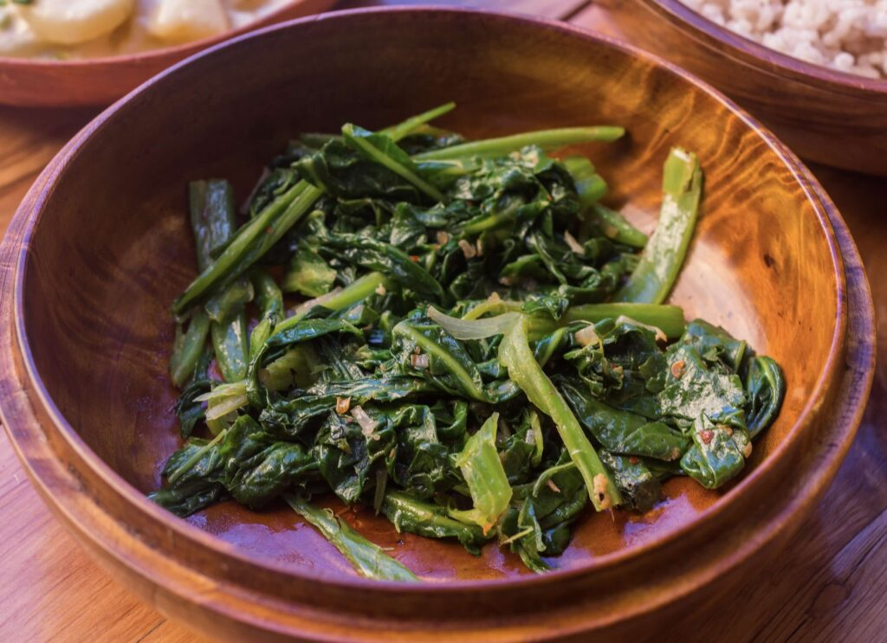

# Bhutanese Saag

*Bhutan's mustard-greens side: tender mustard greens (or any sturdy leafy greens) slow-cooked with butter, garlic, fresh green chillies and a small splash of water till the greens go silky and the chilli oil pools through the dish. The simple bright green dish that sits alongside the heavier datshi stews on a Bhutanese table.*

**Serves:** 4

**Prep Time:** 15 minutes

**Cook Time:** 25 minutes

## Overview
Saag is Bhutan's everyday greens side: a bowl of slow-cooked tender mustard greens that turns up alongside ema datshi, shakam paa and red rice as the green-vegetable contribution to a Bhutanese meal. Fresh mustard greens washed and shredded, then cooked slowly in butter with garlic, fresh green chillies and a small splash of water till the leaves collapse into a silky tender stew, the chilli oil pooling through and giving the dish a bright orange-green colour. Mustard greens are canonical; the slightly bitter peppery character holds up well against the cooking. Kale, collards, spinach, or a mix all substitute (spinach cooks faster, so cut the time in half). Bhutanese saag is properly tender, almost stew-like, rather than crisp-tender or wilted; gentle slow cooking, not a quick stir-fry. The greens should reduce to about a third of their starting volume by the end.

## Ingredients

- 800 g mustard greens (or kale, or collard greens, or a mix; washed and roughly chopped into 4 cm pieces, including tender stems)
- 50 g butter (or yak butter; or ghee)
- 6 garlic cloves (crushed)
- 1 thumb (3 cm) fresh ginger (finely grated)
- 4 fresh green chillies (jalapeño or serrano; halved lengthwise, deseeded for milder, seeds in for fierce)
- 100 ml water (or vegetable stock)
- 1 teaspoon fine sea salt
- ½ teaspoon ground black pepper
- 1 tablespoon fresh lemon juice (optional, to brighten at the end)

## Method

### Stage 1 - Prepare the greens
1. Wash the mustard greens thoroughly under cold water; mustard greens often hold grit at the base of the stems. Rinse in a wide bowl of cold water, lift out (so the grit stays at the bottom), and repeat with fresh water till the water runs clear.
2. Trim any tough stem ends.
3. Roughly chop the leaves and tender stems into 4 cm pieces.
4. Don't dry the greens; the residual water helps with the steaming.

### Stage 2 - Build the aromatic base
1. Heat the butter in a wide heavy saucepan (with a lid) over medium heat till melted and just foaming.
2. Add the crushed garlic and grated ginger; cook 30 seconds till fragrant. Don't brown the garlic; you want it pale and sweet.
3. Add the halved fresh green chillies; cook 30 seconds. The butter will turn a faint green from the chillies.

### Stage 3 - Add the greens
1. Tip in all the chopped mustard greens (the pan will look very full; the greens collapse in cooking).
2. Use a wooden spoon or tongs to turn the greens through the butter-garlic-chilli base. Initially it'll seem like there's not enough fat to coat the greens; as they wilt, the volume reduces and the coating spreads.

### Stage 4 - Add water and cover
1. Pour in the 100 ml of water (or stock).
2. Stir in the salt and pepper.
3. Cover the pan with a tight-fitting lid.
4. Reduce the heat to low.

### Stage 5 - Slow-cook
1. Cook covered for 15-20 minutes, lifting the lid every 5 minutes to stir the greens up from the bottom (so they don't catch).
2. The greens will go from full and crisp to collapsed and silky over the cook time.
3. The cooking liquid will reduce; by the end of cooking, the pan should have a small amount of glossy liquid pooling around the greens rather than a lot of broth.

### Stage 6 - Finish
1. Lift the lid; the greens should be properly tender (easy to break with a wooden spoon) and the colour should be a deep army-green from the long cook.
2. Taste; adjust salt and pepper.
3. Stir in the lemon juice if using; it brightens the flavour and lifts the dish.

### Stage 7 - Serve
1. Transfer to a warm serving bowl.
2. Place on the Bhutanese table alongside red rice, ema datshi, shakam paa and any other dishes.
3. The saag is the cooling counter-vegetable to the fiery stews; it provides green bulk and a gentler chilli profile.

## Notes
- **Mustard greens are the canonical choice:** the peppery bitter character of mustard greens is what gives Bhutanese saag its distinctive flavour. Kale or collards work but lack the pepperiness; if using kale, add ½ teaspoon of black mustard seeds (toasted in the butter at the start) to compensate.
- **Slow-cooked, not stir-fried:** Bhutanese saag is properly tender rather than crisp-tender. The 15-20 minute slow cook with the lid on is what gives the proper silky texture. If you've never let greens cook that long, this is the right way for this dish.
- **Don't dry the washed greens fully:** the residual water on the leaves helps with the steaming under the lid. Wet greens go into the pan; the water is what builds the steam.
- **Stir from the bottom every 5 minutes:** the greens at the bottom can catch if you don't lift them up. A quick stir from the bottom every 5 minutes keeps the cook even.
- **Adjust the chilli for the table:** the canonical Bhutanese saag has more chillies than this recipe; scale up if you want the proper experience. Conversely, if cooking for non-spice-tolerant diners, halve the chillies or deseed all of them.

## Variations
**Saag with cheese (saag datshi):** crumble 100 g of feta (or fresh local cheese) into the pan in the last 5 minutes of cooking; stir gently and let it soften into the greens. Turns the side into a creamy datshi-style variation.
**Saag with onion:** sweat 1 finely sliced onion in the butter for 5 minutes before adding the garlic and chillies; gives more body. Common Bhutanese household variant.
**Saag with potato:** add 1 medium potato (peeled, cubed small) along with the greens; the potato softens during the cook and gives extra body. Makes the side into a more substantial dish.
**Saag with mushrooms:** add 200 g of sliced mushrooms (any type) along with the garlic and chillies; sauté for 5 minutes till they release their water before adding the greens. Adds umami and substance.

## Serving
On a Bhutanese table alongside red rice, ema datshi (the chilli-cheese national dish), shakam paa (dried beef stew), [ezay](ezay.md) (chilli relish), and possibly [jaju](../jaju.md) (mushroom soup); the saag is the green vegetable contribution that provides relief from the chilli-forward dishes. Eat with the right hand by forming small balls of rice and saag between thumb and fingers; or use a fork.

## Storage
- Keeps refrigerated 3 days; the flavour deepens overnight.
- Reheat in a covered pan with a splash of water over low heat. Don't microwave; the greens go off-texture.
- Freezes 2 months in portioned containers; defrost in the fridge and reheat gently in a covered pan.
- Day-old saag fries beautifully into a fried-rice variation; toss with cold cooked red rice in a hot pan with a knob of butter for a quick lunch.
