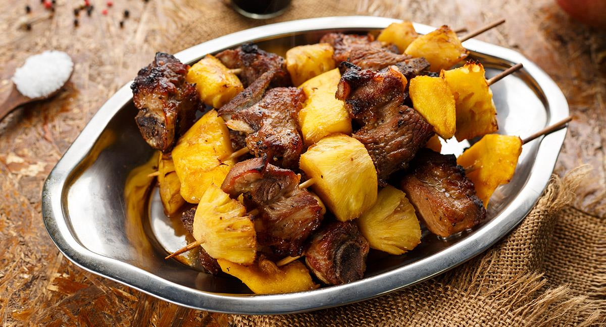

# Anticuchos Bolivianos

*La Paz street food at its best: skewers of marinated beef heart grilled hard over charcoal, brushed with peanut sauce and served with a boiled potato and a heap of llajwa.*

**Serves:** 4 (2 skewers each)

**Prep Time:** 30 minutes plus 4 hours marinating

**Cook Time:** 15 minutes

## Overview
After 9pm in La Paz the side streets fill with women working charcoal grills, the smoke rising past the streetlights and the smell of grilling heart hanging in the air. Anticuchos are the night-time snack: cubes of beef heart marinated in vinegar, garlic, cumin and aji panca chilli, threaded onto bamboo sticks and grilled hard so the outside chars and the inside stays pink. They come with a boiled potato on the same stick and a brushed-on peanut sauce. Beef heart sounds confronting but eats like the cleanest, leanest steak you have ever had, with no offal flavour at all. Half a kilo feeds four people generously. The marinade does the work; the grill is fast.

## Ingredients

For the anticuchos:
- 600 g beef heart, trimmed of fat and silver skin, cut into 3 cm cubes
- 8 small waxy potatoes
- 8 wooden or metal skewers

For the marinade:
- 4 tbsp red wine vinegar
- 4 cloves garlic, crushed
- 2 tbsp aji panca paste (or 1 tbsp smoked paprika plus 1 tsp cayenne)
- 1 tbsp ground cumin
- 1 tbsp dried oregano
- 1 tsp salt
- 1 tsp black pepper
- 3 tbsp vegetable oil

For the peanut sauce:
- 100 g roasted peanuts
- 1 tbsp aji panca paste
- 1 clove garlic
- 1 tbsp white wine vinegar
- 200 ml water
- 1 tbsp vegetable oil
- Salt

To serve:
- Llajwa (see the side dishes recipe)

## Method

### Stage 1 - Marinate
1. Whisk the marinade ingredients together in a bowl.
2. Add the beef heart cubes; turn to coat thoroughly.
3. Cover and refrigerate at least 4 hours, ideally overnight.

### Stage 2 - Boil the potatoes
1. Boil the whole baby potatoes in salted water 18 minutes until tender.
2. Drain and cool slightly.

### Stage 3 - Make the peanut sauce
1. Blend the peanuts, aji panca, garlic, vinegar and water until smooth.
2. Heat the oil in a small pan; pour in the peanut blend.
3. Simmer 5 minutes, stirring, until the sauce thickens to a brushable coat. Season.

### Stage 4 - Build the skewers
1. Thread 3 cubes of marinated heart per skewer.
2. Push a boiled potato onto the end of each.

### Stage 5 - Grill
1. Heat a charcoal grill or heavy griddle to high.
2. Grill the skewers 3 minutes per side, turning, until the outsides char and the inside is still pink.
3. Brush with peanut sauce in the last minute.
4. Rest 2 minutes; serve at once with more peanut sauce and llajwa.

## Notes
- **Trim the heart well:** Pull off the white connective bands and silver skin. What you want is the dark red muscle, which cooks like steak.
- **Marinate overnight if you can:** Four hours is the minimum; overnight is better. The vinegar tenderises and the spices penetrate.
- **High heat, fast cook:** Heart toughens if overcooked. Aim for pink in the middle, charred outside, 3 minutes a side maximum.
- **Soak wooden skewers:** 30 minutes in water stops them burning through.

## Variations
- Some street vendors include a piece of grilled tripe per skewer
- Beef sirloin or skirt is an easier substitute if heart is unavailable
- Aji amarillo paste can replace aji panca for a brighter yellow heat
- Add a charred spring onion to each skewer between the meat cubes

## Serving
- Serve hot off the grill · two skewers per person · peanut sauce drizzled across · llajwa heaped beside · cold beer or a hot api in the cold night

## Storage
- Marinated raw heart keeps 2 days refrigerated; freeze 1 month
- Peanut sauce keeps 5 days refrigerated; loosen with water before serving
- Cooked anticuchos eat best off the grill; reheat under a hot grill 2 minutes
