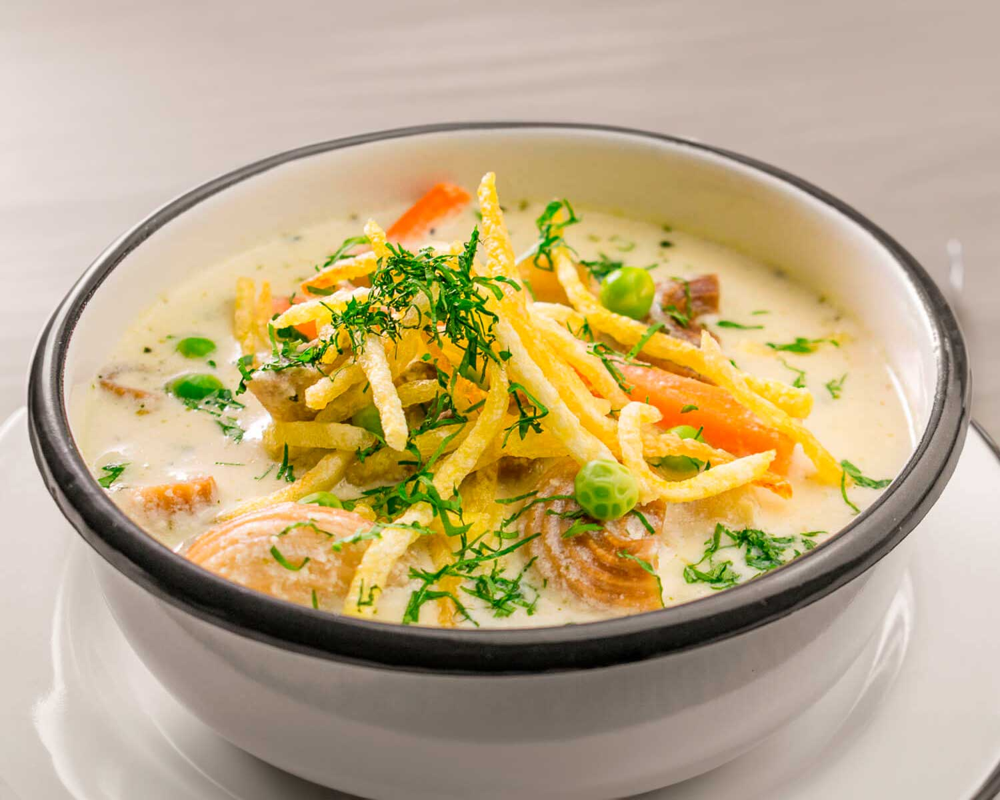

# Sopa de Maní

*The Bolivian peanut soup: a creamy yellow broth thickened with ground raw peanuts, with beef, pasta or rice, peas and potato, finished with crisp chips and a scatter of fresh oregano.*

**Serves:** 6

**Prep Time:** 20 minutes

**Cook Time:** 1 hour 30 minutes

## Overview
Sopa de maní is one of the Andes' great soups, a daily soup across the Bolivian highlands and valleys. The thickening comes from raw peanuts (not roasted) blended to a smooth milk and stirred in slowly, where they cook out to a creamy yellow body without ever clumping. The base is beef shin or short rib simmered long with onion, aji amarillo and oregano; the additions are diced potato, peas and a handful of vermicelli or rice. The signature finish is a heap of crisp salted chips dropped on top just before eating, plus a scatter of fresh oregano leaves. The chips soften halfway through the bowl and add a second texture; the oregano lifts everything. A real bowl of Bolivian household cooking.

## Ingredients

- 600 g beef shin or short rib on the bone, cut into pieces
- 200 g raw peanuts, skins removed
- 2 large onions, finely chopped
- 3 cloves garlic, crushed
- 2 tbsp ground aji amarillo paste (Peruvian yellow chilli, fruity and medium-hot; or 1 tsp paprika plus 1 tsp cayenne)
- 1 tbsp dried oregano
- 1 tsp ground cumin
- 2 medium carrots, diced
- 3 medium waxy potatoes, diced 2 cm
- 150 g frozen peas
- 100 g vermicelli pasta (or white rice)
- 3 litres water
- 3 tbsp vegetable oil
- Salt and pepper

To finish:
- 400 g floury potatoes for chips
- Oil for frying
- Fresh oregano or parsley
- Salt

## Method

### Stage 1 - Brown the beef
1. Heat 3 tbsp oil in a heavy pot.
2. Brown the beef pieces all over for 6 minutes.
3. Add the onion and garlic; sweat 8 minutes.
4. Stir in the aji paste, oregano and cumin; cook 2 minutes.

### Stage 2 - Build the broth
1. Pour in the water; bring to a simmer.
2. Skim any foam; cook gently 1 hour until the beef is tender.
3. Add the diced carrot and potato; simmer 12 minutes.

### Stage 3 - Add the peanut milk
1. Blend the raw peanuts with 500 ml of warm broth from the pot until perfectly smooth.
2. Pour the peanut milk back into the pot through a sieve.
3. Stir constantly for 5 minutes to prevent any catching.
4. Add the peas and vermicelli; simmer 8 minutes until the pasta is cooked.
5. Season well with salt and pepper.

### Stage 4 - Fry the chips
1. Cut the floury potatoes into thin matchstick chips.
2. Fry in 180C oil for 3-4 minutes until crisp and golden.
3. Drain and salt.

### Stage 5 - Serve
1. Ladle the hot soup into deep bowls.
2. Top each bowl with a tall heap of crisp chips.
3. Scatter with fresh oregano leaves.
4. Eat at once before the chips soften completely.

## Notes
- **Raw peanuts, not roasted:** Roasted peanuts give the soup a burnt, oily flavour. Raw peanuts (often sold blanched) cook out sweet and creamy. Skins must come off or the broth turns grey.
- **Blend with hot broth:** Cold liquid gives a grainy mill. Warm broth gives a silk-smooth peanut milk.
- **Stir constantly after adding:** Peanut milk catches on the bottom if you walk away. Five minutes of stirring is the rule.
- **The chips:** Fresh and crisp, dropped on at the last moment. Stale chips ruin the contrast.

## Variations
- Some cooks use chicken instead of beef
- A meatless version skips the meat and doubles the peanut and potato
- Sopa de maní con conejo (with rabbit) is traditional in some valley towns
- The pasta can be replaced with rice, fideos or noodles

## Serving
- Serve hot in deep bowls · chips piled high · fresh oregano scattered · llajwa on the side · with a bread roll to mop the bottom

## Storage
- The soup keeps 3 days refrigerated; the peanut body thickens further on chilling
- Loosen with broth or water when reheating
- Fry chips fresh each time; chips stored with the soup become soggy
