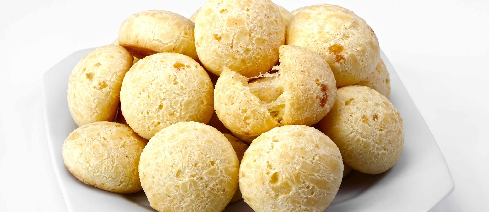

# Cuñapé

*Santa Cruz baked rolls of cassava starch and fresh white cheese: crisp golden outside, stretchy and tender inside, eaten warm with coffee any time of day.*

**Serves:** 16 small rolls

**Prep Time:** 15 minutes

**Cook Time:** 25 minutes

## Overview
Cuñapé is the signature snack of Santa Cruz and the eastern Bolivian lowlands, sold from market stalls and bakery counters from morning to night. The dough is built on yuca starch (cassava starch, sometimes labelled tapioca starch) and a generous quantity of crumbled fresh white cheese. There is no wheat flour in the traditional recipe. Egg and milk bind it; baking turns the outside crisp and golden while the inside stays chewy and stretchy in the way only cassava-starch breads do (Brazilian pão de queijo is a close cousin). They are small, two-bite rolls. Eat them warm from the oven with a black coffee. The cheese makes them: use a soft fresh white cheese with some salt and some moisture, not aged hard cheese.

## Ingredients

- 400 g cassava starch (tapioca starch, sometimes labelled yuca starch or polvilho doce)
- 300 g fresh white cheese (queso fresco, queso blanco or feta), crumbled fine
- 100 g butter, softened
- 2 large eggs
- 150 ml whole milk
- 1 tsp salt (less if your cheese is salty)
- 1 tsp baking powder

## Method

### Stage 1 - Mix the dough
1. Heat the oven to 200C; line a baking tray with paper.
2. In a large bowl combine the cassava starch, baking powder and salt.
3. Add the softened butter; rub through with your fingers until evenly distributed.
4. Add the crumbled cheese; mix well.
5. Beat in the eggs.
6. Add the milk gradually, working with your hands until the mixture comes together into a soft slightly tacky dough. You may not need all the milk.

### Stage 2 - Shape
1. Wet your hands lightly.
2. Roll walnut-sized balls of dough (about 40 g each).
3. Place on the lined tray with 3 cm between rolls.

### Stage 3 - Bake
1. Bake 22-25 minutes until deep golden on top with a slightly cracked surface.
2. The bottoms should be crisp and golden; the insides will still feel slightly soft.
3. Cool 5 minutes on the tray (they firm up as they cool); serve warm.

## Notes
- **Cassava starch only:** Wheat flour ruins the texture. The cassava starch is what gives the stretchy chew. Polvilho doce (sweet) is the standard; polvilho azedo (sour) gives a tangier version.
- **The cheese choice:** A young salty white cheese is right. Mature cheddar will not work; mozzarella melts away. Feta is the easiest supermarket substitute.
- **Slightly tacky dough:** Drier than bread dough but not crumbly. If it cracks while rolling add a touch more milk; if it sticks to your palms it is too wet.
- **Eat warm:** Cuñapé hardens noticeably on cooling. They reheat well at 160C for 4 minutes.

## Variations
- Sonso: the same dough wrapped around a wooden skewer and grilled
- Cuñapé relleno: a small cube of extra cheese pressed into the centre of each ball before baking
- Add 1 tbsp grated parmesan for a sharper savoury note
- Pão de queijo (Brazilian cousin) uses similar dough with less cheese and rounder shape

## Serving
Serve warm in a basket · with black coffee at breakfast · with cocoa in the afternoon · alongside a soup

## Storage
- Eats best the day they are baked
- Keep 2 days in an airtight container; reheat at 160C for 5 minutes to crisp
- Freeze unbaked balls 1 month; bake from frozen at 200C for 28 minutes
