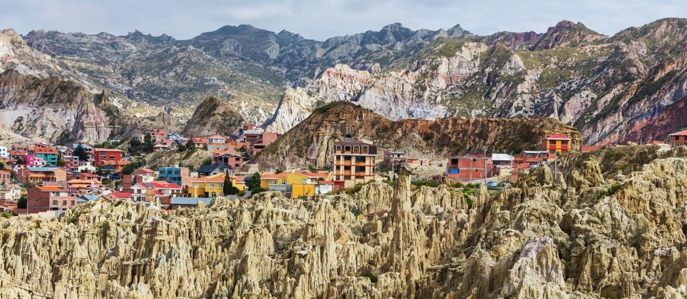

# Bolivian Food

Bolivian food is really two cuisines bolted together. The Andean highland kitchen of La Paz, Oruro and Potosí runs on quinoa, freeze-dried chuño potatoes, llajwa salsa, peanut soup and the great Cochabamba plates of pounded breaded beef on rice (silpancho) and meat-mountain pique macho. The eastern Santa Cruz lowland is a different country at the stove, built around yuca, fresh white cheese, beef and the baked cassava-cheese rolls called cuñapé. Stitching the two together is the daily 10am salteña break, when offices, markets and street carts pause for a juicy baked pastry filled with chicken or beef stew, eaten standing up before the broth runs down your wrist. Singani, the Muscat-grape brandy distilled in the southern valleys, is the national spirit; api, a thick warm purple-corn drink, is the national breakfast. Sit down to a Bolivian meal and you will eat from 4,000 metres and from sea level on the same table.
