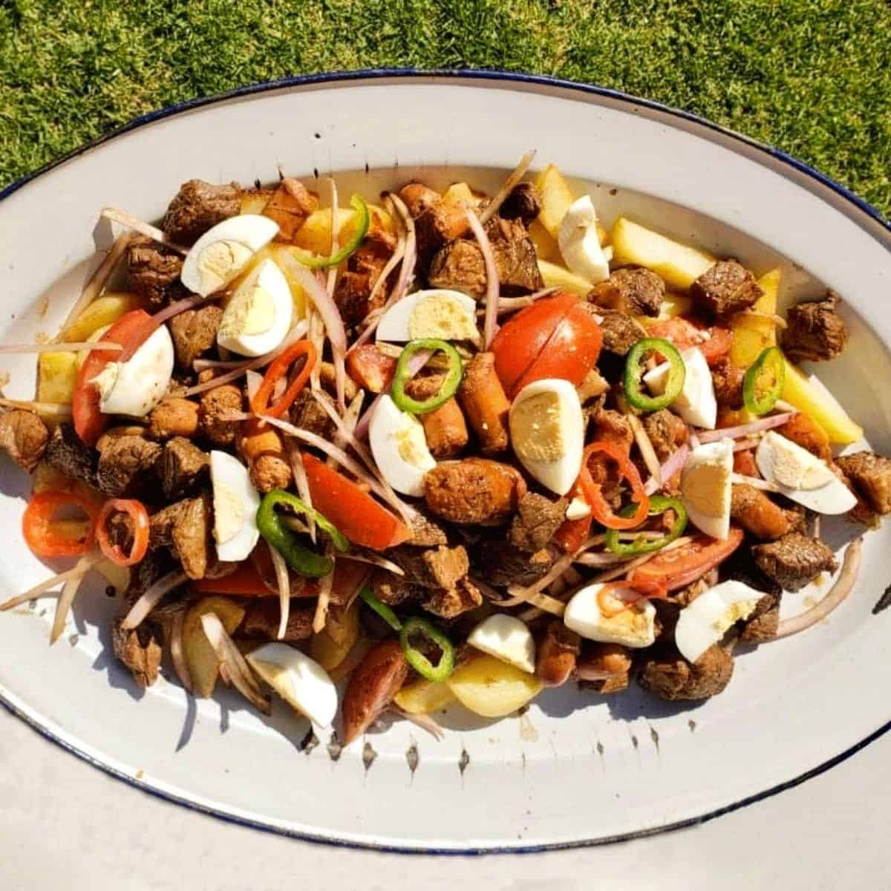

# Pique Macho

*Cochabamba's mountain-of-meat plate: chips heaped with sliced beef, sausage, boiled egg, onion, tomato and locoto chillies, dressed with mustard, ketchup and mayonnaise and eaten with friends from one platter.*

**Serves:** 4 generously (or 2 Cochabambinos)

**Prep Time:** 20 minutes

**Cook Time:** 30 minutes

## Overview
Pique macho was invented in the 1970s at a Cochabamba restaurant called Miraflores, supposedly when a group of late-night drinkers asked for "something for real men" and the cook piled everything he had into one dish. It stuck. The construction is non-negotiable: a deep bed of hot chips, then sliced beef and sliced sausage tossed with onion, tomato and sliced locoto chilli, then quartered hard-boiled eggs across the top, then a heavy lattice of mustard, ketchup and mayonnaise. It is communal food. One vast platter lands in the middle of the table and four to six people eat from it with forks. The locoto is the heat, the egg is the richness, the chips soak up the meat juice. Pair with cold beer.

## Ingredients

- 500 g beef rump or skirt, sliced into thin strips
- 200 g good frying sausage (chorizo or salchicha), sliced
- 800 g floury potatoes, cut into thick chips
- 2 large red onions, sliced into half-moons
- 2 large tomatoes, sliced into wedges
- 2 locoto chillies (or 2 green jalapeños), sliced
- 4 hard-boiled eggs, quartered
- 2 tbsp vegetable oil
- 1 tbsp soy sauce
- 1 tsp ground cumin
- Oil for deep-frying
- Salt and pepper

To dress:
- Yellow mustard
- Tomato ketchup
- Mayonnaise

## Method

### Stage 1 - Fry the chips
1. Heat the frying oil to 160C.
2. Blanch the chips for 6 minutes until cooked but pale; drain.
3. Raise the oil to 190C; fry the chips a second time for 4 minutes until crisp and golden.
4. Drain on paper; salt well.

### Stage 2 - Cook the meat
1. Heat the vegetable oil in a wide frying pan over high heat.
2. Add the beef strips; sear 3 minutes until browned.
3. Push to one side; add the sliced sausage and brown 2 minutes.
4. Add the onions and locoto; toss 3 minutes until the onions wilt but keep their bite.
5. Add the tomato; cook 1 minute more.
6. Splash in the soy sauce; sprinkle the cumin; season and toss together.

### Stage 3 - Build the platter
1. Pile the hot chips into a large warm platter.
2. Spoon the meat and vegetable mix across the top, juices and all.
3. Lay the quartered eggs across the surface.
4. Zigzag mustard, then ketchup, then mayonnaise across the whole platter.
5. Take to the table at once with forks for everyone.

## Notes
- **The locoto:** The Bolivian rocoto chilli is fruity and hot. Jalapeño is the closest substitute; for milder heat use bell pepper plus a pinch of cayenne.
- **The chip recipe:** Twice-fried is essential. Crisp chips hold up under the meat juices; soft chips collapse into mush.
- **The dressings:** Cochabambinos do not skimp. Heavy zigzags of all three. Diners add more from bottles at the table.
- **Communal eating:** Serve on one vast platter, not individual plates. The mess is the point.

## Variations
- Add sliced chorizo Boliviano (a paprika-heavy sausage) alongside the regular sausage
- Pique macho with viscera adds liver and kidney to the mix
- A vegetarian pique uses fried tofu or mushroom slices in place of the meat
- Some versions add boiled cassava chunks to the chip bed

## Serving
Serve at once on one huge platter · forks for everyone · cold beer · llajwa on the side for those who want more heat

## Storage
- The platter is best eaten on the day
- Leftovers refrigerate 2 days but the chips soften
- Reheat the meat mix in a frying pan and refry the chips fresh
