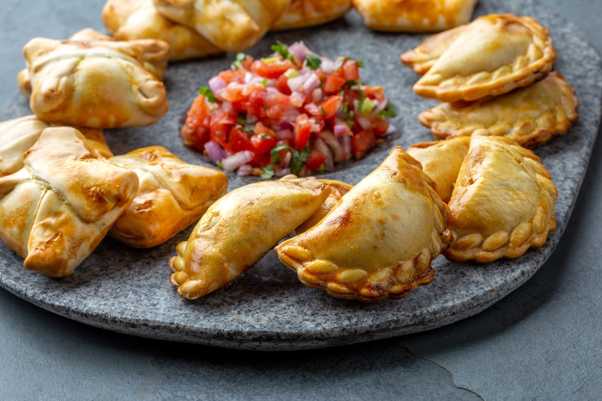

# Salteñas

*Bolivia's juicy baked pastry: a sweet golden crust holding a thickened chicken or beef stew with potato, peas and a hint of chilli, eaten standing up at 10am the country over.*

**Serves:** 12 salteñas

**Prep Time:** 1 hour plus 4 hours chilling

**Cook Time:** 25 minutes

## Overview
The salteña is Bolivia's mid-morning institution. Office workers, market traders and schoolchildren stop at 10am for one or two of these football-shaped pastries, eaten upright because the filling is liquid. The trick is the jelly: the stew is cooked the day before with a generous gelatine bloom, set firm in the fridge overnight, then spooned cold into the pastry. In the oven it melts back into a hot broth trapped behind a sweet golden crust. The dough is enriched with achiote-stained lard for colour and a touch of sugar for the signature crisp shell. Fillings split between chicken (pollo) and beef (carne); both carry potato, peas, a hard-boiled egg quarter and an olive. Bite the seam off first, sip the broth, then eat the rest.

## Ingredients

For the filling:
- 500 g chicken thigh or beef chuck, diced small
- 1 large onion, finely diced
- 3 spring onions, chopped
- 2 tbsp ground aji amarillo (Peruvian yellow chilli, fruity and medium-hot) or mild chilli paste
- 1 tbsp ground cumin
- 1 tsp dried oregano
- 1 tbsp sugar
- 500 ml chicken or beef stock
- 200 g waxy potato, diced 5 mm
- 150 g frozen peas
- 15 g powdered gelatine
- 3 hard-boiled eggs, quartered
- 12 green olives
- Salt and pepper

For the dough:
- 500 g plain flour
- 100 g lard or butter, melted
- 1 tbsp achiote (annatto) seeds, infused in the lard
- 2 tbsp sugar
- 1 tsp salt
- 1 egg
- 200 ml warm water

For the wash:
- 1 egg yolk beaten with 1 tbsp water

## Method

### Stage 1 - Make the filling
1. Heat 2 tbsp of the achiote lard in a wide pan; sweat the onion and spring onion for 6 minutes.
2. Add the diced meat; brown for 4 minutes.
3. Stir in the chilli paste, cumin, oregano and sugar.
4. Pour in the stock; simmer 30 minutes until the meat is tender.
5. Add the diced potato; cook 8 minutes until just tender, then stir in the peas.
6. Sprinkle the powdered gelatine over the surface; stir until dissolved. Season well.
7. Pour into a shallow tray; cool, then chill overnight until set firm.

### Stage 2 - Make the dough
1. Warm the lard with the achiote seeds until the fat turns red; strain.
2. Mix flour, sugar and salt in a bowl.
3. Add the warm coloured lard, egg and water; knead 8 minutes to a smooth supple dough.
4. Rest 30 minutes covered.

### Stage 3 - Shape and bake
1. Heat the oven to 220C.
2. Divide the dough into 12 balls; roll each to a 14 cm disc.
3. Place a heaped spoonful of cold filling in the centre of each disc.
4. Top with a quarter of hard-boiled egg and an olive.
5. Bring the edges up over the filling; pinch into a rope seam along the top to seal tight (a repulgue twist is traditional).
6. Brush with egg wash.
7. Bake 22-25 minutes on a heavy tray until deep golden.
8. Rest 5 minutes before eating; the filling is volcanically hot.

## Notes
- **The gelatine bloom:** This is the whole point. Without it the filling leaks out before the pastry browns. Use a full sachet for 500 ml of stew.
- **Chill the filling solid:** Spoon it in cold and firm, not warm. A warm filling will tear the dough.
- **Seal the seam:** Any gap and the broth boils out. Pinch hard and pinch twice.
- **Eat upright:** Bite a corner first, tilt to drink the broth, then work down. Sitting flat means broth on your shirt.

## Variations
- Pollo (chicken) is the city standard; carne (beef) is more common in Cochabamba
- Some cooks add raisins and a sliver of potato in each parcel
- Vegetarian versions use diced soya or mushrooms with the same gelled stock
- Picante salteñas double the aji for a spicier filling

## Serving
Eat hot from the oven · standing up · paper napkin in hand · with a tomato llajwa on the side and a coffee or api

## Storage
- Filling keeps 3 days refrigerated set firm
- Unbaked shaped salteñas freeze 1 month; bake from frozen at 220C for 30 minutes
- Baked salteñas eat best the day they are made; reheat at 180C for 8 minutes
