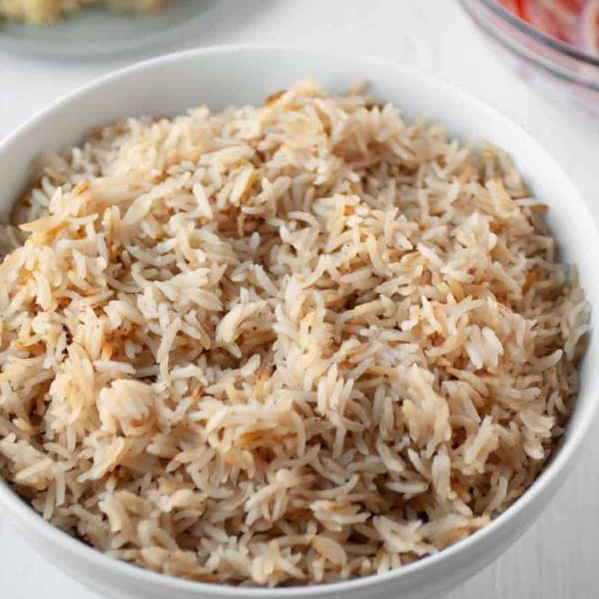

# Arroz Graneado Boliviano (Bolivian Fluffy Garlic Rice)

*Bolivia's daily rice plate: long-grain rice toasted briefly in oil with crushed garlic and salt, then steamed in measured water till every grain stands separate; the plain-and-loyal partner that sits next to silpancho, salteñas, pique macho, and every Sunday lunch.*

**Serves:** 4-6 as a side

**Prep Time:** 5 minutes

**Cook Time:** 22 minutes

## Overview
Arroz graneado (literally "grained rice" or "loose-grained rice") is the everyday Bolivian rice side, the one that anchors nearly every lunch plate across the country. The technique is unfussy and exacting: long-grain rice is rinsed thoroughly to wash off surface starch, briefly toasted in hot oil with crushed garlic, then covered with measured water (the standard 1:1.75 ratio by volume) and salted. The lid clamps on tight for 18 minutes of steam; a 5-minute off-heat rest follows; the rice fluffs into separate dry grains. Every Bolivian home cook learns this dish as their first kitchen lesson. The seasoning is austere on purpose: no butter, no broth, no aromatics other than garlic. The point is for the rice to sit beside vivid main-dish sauces without competing.

## Ingredients

### For 4-6 servings
- 400 g long-grain white rice
- 2 tablespoons vegetable oil (or mild olive oil)
- 4 cloves garlic (crushed flat with the side of a knife; left whole)
- 1 1/4 teaspoons fine sea salt
- 700 ml water (the 1:1.75 ratio; this is precise)

### To finish (optional)
- 1 small knob butter (10 g)
- 1 small handful fresh parsley (finely chopped, optional)

## Method

### Stage 1 - Rinse the rice
1. Tip the rice into a fine sieve.
2. Rinse under cold running water 1-2 minutes till the water runs clear.
3. Drain thoroughly; let the rice sit in the sieve for 2 minutes.

### Stage 2 - Toast the rice
1. Heat the vegetable oil in a heavy lidded saucepan over medium-high heat.
2. Add the crushed garlic cloves; cook 30 seconds till fragrant and golden at the edges (don't brown deeply).
3. Tip the drained rice into the pan.
4. Stir constantly for 2 minutes till the grains are coated with oil and start to look slightly translucent.

### Stage 3 - Add the water
1. Pour in the 700 ml water.
2. Add the salt.
3. Stir once with a spoon.
4. Bring to a rolling boil over high heat (about 90 seconds).

### Stage 4 - Steam
1. Drop the heat to its lowest setting.
2. Clamp the lid on tightly.
3. Cook 18 minutes undisturbed (no peeking; the steam does the work).

### Stage 5 - Rest
1. Take the pan off the heat.
2. Leave covered another 5 minutes.
3. The rice finishes by residual steam; the grains separate.

### Stage 6 - Fluff and serve
1. Lift the lid; fish out the crushed garlic cloves (eat them or discard).
2. Drop the small knob of butter into the rice if using.
3. Fluff with a fork (not a spoon, which crushes grains).
4. Tip into a warm serving bowl.
5. Scatter the chopped parsley over (optional).

## Notes
- **1:1.75 ratio of rice to water:** this is the Bolivian household standard; deviation gives sticky or undercooked rice.
- **Rinse till the water runs clear:** removes surface starch; without this step the rice glues itself into a clump.
- **Toast for 2 minutes in oil:** this is the move that gives arroz graneado its texture; un-toasted rice is sticky.
- **No peeking during the 18-minute steam:** every lid-lift loses 5 minutes of cooking momentum.
- **Crushed garlic, not chopped:** crushed cloves perfume the pan without breaking up into chewable pieces; chopped garlic burns at the toasting stage.

## Variations
- **Arroz con ají amarillo:** stir 1 teaspoon Peruvian-Bolivian aji amarillo paste into the cooking water for a yellow-tinted version.
- **Arroz graneado con aceitunas:** scatter 50 g chopped black olives over the rice at the rest stage.
- **Arroz con choclo:** add 100 g cooked corn kernels at the rest stage; the highland Sunday version.
- **Arroz amarillo:** add 1/2 teaspoon ground turmeric or 1 small pinch saffron with the salt for a yellow rice.
- **Vegan-friendly already:** skip the butter; the dish is plant-based by default.

## Serving
- At a Bolivian lunch alongside silpancho (the classic pairing) · with pique macho · beside chairo soup · with locro de papa · next to a salteña on a market table · with sajta de pollo · as the daily side at any Bolivian home table.

## Storage
- Refrigerates 3 days in a sealed container.
- Reheat in a covered pan with a splash of water (the microwave dries it).
- Don't freeze (the rice texture suffers).
- Cold leftover arroz graneado makes excellent fried rice the next day; warm in oil with diced onion and a splash of soy sauce.
