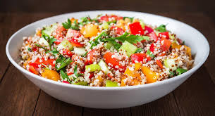

# Ensalada de Quinua

*Cool Andean salad of fluffy white quinoa tossed with sweet corn, red and green peppers, tomato and parsley, dressed with oil and vinegar.*

**Serves:** 4 as a side

**Prep Time:** 15 minutes

**Cook Time:** 15 minutes

## Overview
Quinoa is Bolivia's grain. Grown on the high salt-flat plains around Uyuni at over 3,700 metres, it has fed the Aymara for thousands of years. This salad is the everyday way Bolivians eat it: cooked to fluffy separate grains, cooled, then tossed with whatever is fresh on the counter. The standard pairing is sweet corn (choclo), a mix of red and green pepper, a ripe tomato and a handful of chopped parsley, all dressed with a sharp oil-and-vinegar. It eats cold or at room temperature and goes alongside almost anything: a piece of grilled chicken, a salteña, a soup at lunch. The corn must be the big-kernelled Andean choclo if you can find it; sweetcorn from a tin is the workable substitute.

## Ingredients

- 200 g white quinoa
- 400 ml water
- 1 tsp salt
- 200 g cooked corn kernels (preferably Andean choclo)
- 1 red pepper, finely diced
- 1 green pepper, finely diced
- 1 large ripe tomato, finely diced
- 1 small red onion, finely diced
- 1 small bunch flat-leaf parsley, chopped
- Optional: 100 g crumbled queso fresco or feta

For the dressing:
- 4 tbsp olive oil
- 2 tbsp white wine vinegar
- 1 tsp Dijon mustard
- 1 tsp dried oregano
- Salt and pepper

## Method

### Stage 1 - Cook the quinoa
1. Rinse the quinoa under cold running water for 30 seconds to remove the bitter saponin coating.
2. Place in a saucepan with the water and salt.
3. Bring to a simmer; cover; cook 12 minutes until the grains have unfurled and the water is absorbed.
4. Rest covered 5 minutes; fluff with a fork; spread on a plate to cool.

### Stage 2 - Prepare the vegetables
1. Dice all the vegetables to roughly the size of a corn kernel.
2. Place in a large bowl with the cooked corn and parsley.

### Stage 3 - Dress and toss
1. Whisk the dressing ingredients in a small jug.
2. Add the cooled quinoa to the vegetable bowl.
3. Pour the dressing over; toss thoroughly.
4. Taste for salt and acid; adjust.
5. Rest 15 minutes for flavours to come together.
6. Scatter the crumbled cheese over the top if using.

## Notes
- **Rinse the quinoa:** This is non-negotiable. Unrinsed quinoa tastes soapy from the natural saponin coating.
- **Cool the grain spread thin:** Cooling on a plate gives separate fluffy grains. Cooling in a heap gives a wet clump.
- **Andean choclo if you can:** The big white-kernelled Andean corn has a starchy chew that contrasts the quinoa beautifully. Tinned sweetcorn is the easy substitute.
- **Rest before serving:** The dressing needs 15 minutes to soak into the grain.

## Variations
- Add diced avocado just before serving (it discolours if added early)
- Toss in 100 g cooked black beans for a heartier salad
- Add a chopped fresh mint and lime juice version for a brighter take
- Quinoa tricolor (a mix of white, red and black quinoa) gives a prettier plate

## Serving
- Serve cool or room temperature · alongside grilled meat or chicken · in a lunch box · scoop with bread

## Storage
- Keeps 3 days refrigerated; the dressing soaks in further on day two
- Refresh with a splash more oil and vinegar before serving
- Do not freeze; the vegetables turn watery
