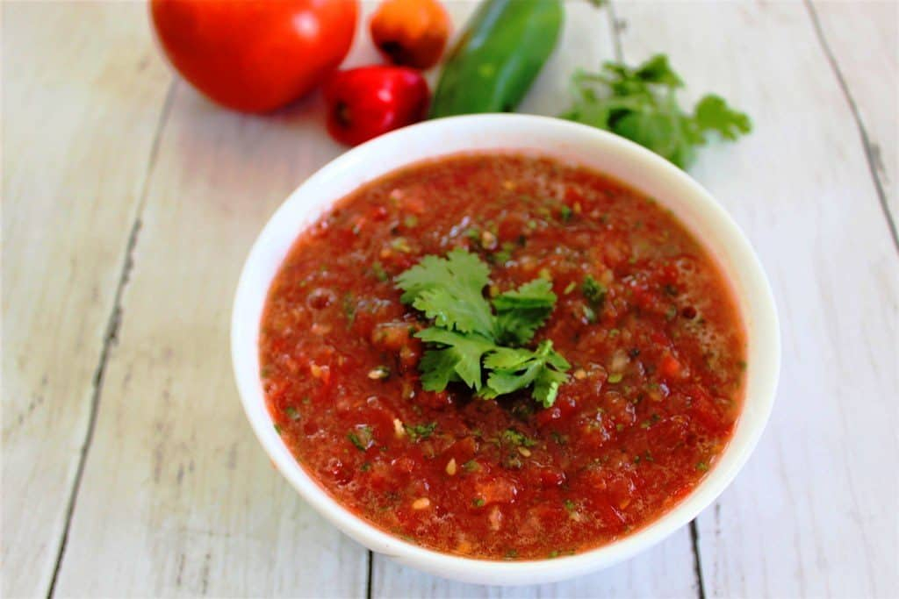

# Llajwa

*Bolivia's table salsa: fresh tomato and locoto chilli pounded with the fragrant Andean herb quirquiña, set on every table from breakfast to dinner.*

**Serves:** Makes about 300 g

**Prep Time:** 10 minutes

**Cook Time:** 0 minutes

## Overview
Llajwa (sometimes spelled llajua) is to Bolivian food what salsa mexicana is to Mexico: the table condiment that goes on everything. Rice and meat, breakfast eggs, a bowl of soup, a salteña on the way to work. The base is ripe tomato and a fierce locoto chilli, traditionally pounded together on a flat stone called a batán until the texture is rough and the juice runs. The herb that makes it Bolivian is quirquiña (also called papaloquelite), a soft-leafed Andean herb with a citrus-coriander flavour; outside the country, fresh coriander stands in. No vinegar, no oil, no garlic. Just tomato, chilli, herb and salt. Made fresh every day, eaten by the spoonful.

## Ingredients

- 3 ripe tomatoes (about 400 g), quartered
- 2 locoto chillies (or 2 small red chillies plus 1 jalapeño), stems removed
- 1 small bunch quirquiña (or fresh coriander), about 20 g
- 2 spring onions, white and pale green parts only
- 1 tsp salt

Optional:
- 1 small clove garlic
- 1 tsp huacatay (black mint) paste

## Method

### Stage 1 - Pound or process
1. If using a batán or pestle and mortar: place the chillies and salt in first; pound to a paste.
2. Add the tomatoes a quarter at a time; pound until broken down but still chunky.
3. Add the herbs and spring onions; pound briefly to break the leaves.
4. If using a food processor: pulse all ingredients together in short bursts until coarsely chopped, not pureed. Stop while there is still texture.

### Stage 2 - Rest and serve
1. Tip into a small serving bowl.
2. Rest 10 minutes for the flavours to come together.
3. Taste for salt; add more if the tomatoes are mild.
4. Eat the same day.

## Notes
- **Rough texture, not smooth:** Llajwa is not a sauce in the puréed sense. You want visible bits of tomato and chilli, juice pooling around them.
- **Quirquiña is the key flavour:** If you can find it (some Latin American greengrocers stock it), use it. Coriander is the next best; do not substitute parsley.
- **No vinegar:** The acid is the tomato. Adding vinegar pushes it toward Mexican pico de gallo and changes the character.
- **Locoto heat:** Bolivian locoto is hotter than jalapeño and fruity. Adjust the quantity to your guests' tolerance.

## Variations
- Llajwa de maní: blend in 2 tbsp toasted ground peanut for a richer version
- Add a small spoon of huacatay paste for a deeper, more savoury llajwa
- Some valley cooks add a single roasted clove of garlic to the mortar
- Llajwa verde uses green tomatoes and green locotos for a brighter sour version

## Serving
- Set a bowl on the table beside everything else · spoon over rice, meat, soup, eggs, salteñas · refill as it runs out

## Storage
- Eats best the day it is made
- Will keep 2 days refrigerated but loses its perfume
- Do not freeze; the tomato turns to water
