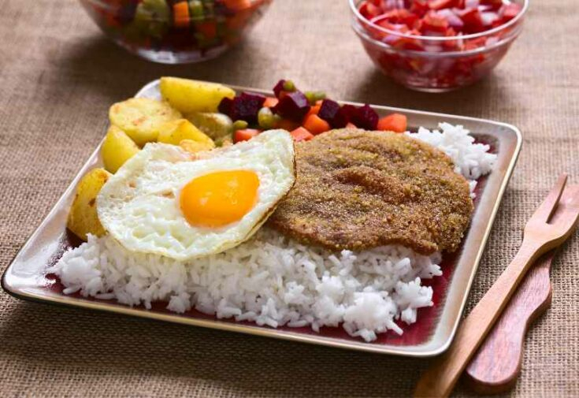

# Silpancho

*Cochabamba's flat-pounded breaded beef on a bed of white rice and boiled potato, topped with a fried egg and a fresh tomato-onion-locoto salsa, the city's everyday lunch.*

**Serves:** 4

**Prep Time:** 25 minutes

**Cook Time:** 25 minutes

## Overview
Silpancho is Cochabamba's signature lunch plate, eaten across the valley in market stalls and homes from noon onward. A thin slice of beef is pounded paper-flat (the name comes from the Quechua sillp'anchu, meaning thin and flat), coated in breadcrumbs and fried hard so the edges go ragged and crisp. It is laid over a bed of plain white rice and slices of boiled potato. A fried egg sits on top, runny-yolked. Around the rim of the plate goes a fresh chopped salsa of tomato, onion and locoto chilli with a splash of vinegar. The combination is everything Cochabamba food does well: starch, hot fat, a fresh acid kick, and a yolk that breaks across the lot when you cut in.

## Ingredients

For the silpancho:
- 4 thin slices of beef rump or topside (about 120 g each)
- 200 g dry breadcrumbs
- Salt and pepper
- 4 tbsp vegetable oil

For the base:
- 300 g white rice
- 4 medium waxy potatoes
- Salt

For the topping:
- 4 large eggs
- 2 tbsp vegetable oil

For the salsa:
- 2 large tomatoes, finely diced
- 1 red onion, finely diced
- 1 locoto chilli (or 1 jalapeño), finely chopped
- 2 tbsp white wine vinegar
- 1 tbsp vegetable oil
- Salt and pepper

## Method

### Stage 1 - Prepare the base
1. Rinse the rice; cook in salted water 18 minutes; rest covered.
2. Boil the whole potatoes 20 minutes in salted water until tender; peel and slice 1 cm thick.

### Stage 2 - Make the salsa
1. Mix the tomato, onion and locoto in a bowl.
2. Add the vinegar, oil, salt and pepper; toss and rest 10 minutes to soften.

### Stage 3 - Pound and bread the beef
1. Lay each beef slice between two sheets of cling film.
2. Pound with a heavy rolling pin or meat mallet until 3 mm thin and roughly doubled in area.
3. Season both sides with salt and pepper.
4. Press hard into the breadcrumbs to coat all over.

### Stage 4 - Fry and plate
1. Heat 4 tbsp oil in a wide frying pan over high heat.
2. Fry each breaded slice 90 seconds per side until crisp and deep gold; rest on paper.
3. Fry the eggs in the same pan, yolks runny.
4. Plate: rice bed, potato slices over the rice, beef slice over the potato (or overhanging the rim), egg on top of the beef, salsa spooned around the edge.

## Notes
- **The pounding:** Thin is everything. If your slice is still 5 mm thick the breading will burn before the beef cooks. Pound until you can almost see through it.
- **Dry breadcrumbs:** Use fine dry crumbs (pan rallado), not panko. The coating should be a fine crust, not a thick shell.
- **The salsa:** This is not optional. The acid cuts the fried beef and runny yolk and brings the whole plate together.
- **The egg:** Runny yolk is the seal. Break it across the beef and rice as you eat.

## Variations
- Silpancho a lo macho adds a heap of chopped sausage and chips between the rice and the beef
- A vegetarian silpancho uses breaded thick slices of fried cheese or tofu in place of the beef
- Some valley cooks serve the beef on top of mote (boiled hominy) instead of rice
- Trancapecho is a sandwich version: silpancho stuffed into a bread roll

## Serving
Serve hot · one slice per plate · the salsa always around the rim · llajwa offered alongside · cold drink to follow

## Storage
- Cooked beef keeps 2 days refrigerated; the breading softens
- Rice and potato keep 3 days
- Reheat the beef in a hot pan to re-crisp; fry a fresh egg each time
