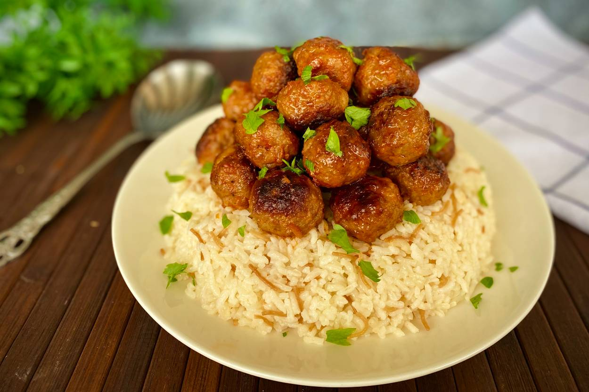

# Ali-paša Pilav

*A Bosnian rice pilaf named for the Ottoman pasha: tender chunks of lamb shoulder braised with onion and savory, layered through butter-perfumed long-grain rice and baked till every grain stands separate.*

**Serves:** 4-6

**Prep Time:** 20 minutes

**Cook Time:** 1 hour 30 minutes

## Overview
Ali-paša pilav is a noble dish from the Ottoman archive, named for one of the Bosnian pashas who served at the Sublime Porte and brought the Istanbul kitchen home. The technique is classic Ottoman pilaf: lamb is browned and slowly braised with onion and broth until the meat falls apart, then the cooking liquid is measured exactly and used to cook long-grain rice in a covered pot so the grains absorb every drop and stay separate. The herb that distinguishes Ali-paša pilav from the many other lamb pilafs of the region is savory (čubar), a small-leafed wild herb with a peppery oregano-and-thyme character, dropped into the broth during the braise. A spoon of butter goes on the rice at the end and is allowed to melt under a cloth-and-lid steam, the small detail that gives a Bosnian pilaf its signature gloss. Served from one wide platter with the lamb and rice mounded together, a bowl of yoghurt alongside, and a sprinkle of fresh dill across the top.

## Ingredients

### Lamb braise
- 800 g lamb shoulder, cut into 3 cm chunks
- 2 tablespoons sunflower oil
- 2 large onions, finely chopped
- 4 garlic cloves, finely chopped
- 1 tablespoon plain flour
- 1 tablespoon sweet paprika
- 1 teaspoon dried savory (čubar, or substitute with a mix of oregano and thyme)
- 1 bay leaf
- 1 teaspoon fine sea salt
- ½ teaspoon freshly ground black pepper
- 800 ml hot lamb or beef stock

### Rice
- 400 g long-grain rice (basmati or a Turkish baldo)
- 50 g unsalted butter
- 1 teaspoon fine sea salt
- 600 ml of the lamb braising liquid (measured exactly)

### To finish
- 40 g unsalted butter
- 2 tablespoons chopped fresh dill
- 2 tablespoons chopped flat-leaf parsley
- 400 g thick natural yoghurt, to serve

## Method

### Stage 1 - Brown the lamb
1. Pat the lamb dry on kitchen paper; season with half the salt and the pepper.
2. Heat the oil in a heavy lidded casserole over medium-high heat.
3. Brown the lamb in three batches, getting a deep crust on each side; lift out to a plate.

### Stage 2 - Braise
1. Lower the heat to medium; add the onion to the pan; cook 8 minutes until soft and lightly browned at the edges.
2. Add the garlic; stir 1 minute.
3. Sprinkle in the flour and paprika; stir into the onion for a further minute.
4. Return the lamb to the pan; add the savory, bay leaf and remaining salt.
5. Pour in the hot stock; bring to a simmer.
6. Cover; reduce to the lowest heat and braise 1 hour. The meat should be tender enough to cut with a spoon.

### Stage 3 - Strain and measure
1. Lift the lamb out with a slotted spoon; keep warm in a covered bowl.
2. Strain the braising liquid through a sieve into a jug; press the onion solids gently to extract the flavour.
3. Measure: you need exactly 600 ml. Top up with hot stock or water if short; reduce in a small pan if over.

### Stage 4 - Rice
1. Rinse the rice in cold water until the water runs almost clear; drain.
2. In a wide heavy pot with a lid, melt the 50 g butter over medium heat.
3. Add the drained rice; stir 2 minutes until the grains turn slightly translucent at the edges.
4. Pour in the 600 ml measured braising liquid; add the salt.
5. Bring to a simmer; stir once; lower the heat to the lowest setting; cover tightly.
6. Cook 15 minutes without lifting the lid.

### Stage 5 - Layer and steam
1. Lift the lid; the rice should have absorbed all the liquid and small steam holes should pock the surface.
2. Scatter the lamb pieces over the rice.
3. Dot the 40 g of butter across the top.
4. Cover the pot with a clean tea towel and replace the lid (the towel absorbs the steam and stops it dripping back).
5. Leave on the lowest heat for 10 minutes more.
6. Turn off the heat; rest, covered, a further 10 minutes.

### Stage 6 - Serve
1. Lift the lid; gently fold the lamb and rice together with a wide flat spoon, lifting from the bottom; do not stir hard or the grains break.
2. Tip onto a wide warmed platter, mounded.
3. Scatter with the chopped dill and parsley.
4. Serve with a bowl of cold yoghurt alongside.

## Notes
- **Measure the broth exactly:** Bosnian pilaf logic is that the rice absorbs every drop. The ratio is 1 part rice to 1.5 parts liquid by volume. Eyeball it and you get either mush or crunch.
- **The towel-and-lid steam:** the tea towel between pot and lid is what lifts the rice. Without it the steam drips back and the top layer goes sticky.
- **Savory is the right herb:** dried savory (čubar) is sold at Balkan grocers and online. If you cannot find it, a mix of oregano and thyme is the closest approximation. Do not use rosemary or sage, both wrong.
- **Rinse the rice:** the surface starch must come off or the grains stick. Rinse till the water is no longer cloudy.
- **No lifting the lid:** the worst habit in pilaf cooking. Trust the timer; lift only at the end.

## Variations
- **With chickpeas:** scatter 200 g of soaked dried chickpeas through the braise; common in eastern Bosnia.
- **Chicken Ali-paša:** use chicken thighs in place of lamb; the cook time drops to 40 minutes for the braise.
- **With pine nuts and currants:** add 50 g of toasted pine nuts and 50 g of currants to the rice during steaming; an Istanbul touch.
- **With Vegeta:** a teaspoon of Vegeta in the braise is the home shortcut; not strictly traditional but very common.

## Serving
On one shared wide platter · with cold yoghurt · with a scoop of ajvar · with a small dish of pickled green chillies · followed by tufahije and kafa

## Storage
- Keeps refrigerated 3 days; the pilaf reheats well.
- Reheat covered with a splash of stock in a low oven at 150°C for 20 minutes, or in a covered pan on the hob.
- Freezes 2 months; thaw overnight and reheat as above.
- Day-two pilaf with a beaten egg stirred through and pan-fried is a fine breakfast.

