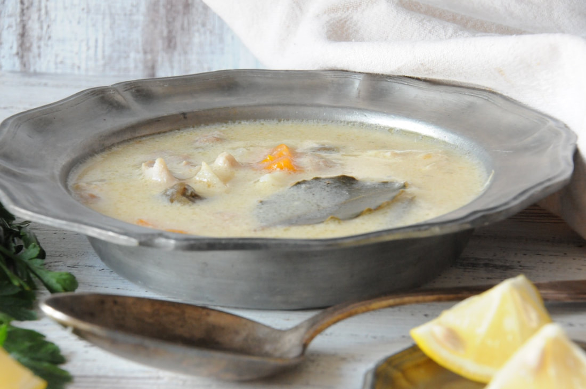

# Begova Čorba

*The Bey's soup: a creamy Ottoman-era chicken and okra soup thickened with egg yolks and soured cream, named for the Bosnian noble class that adapted it from Istanbul kitchens.*

**Serves:** 6

**Prep Time:** 20 minutes

**Cook Time:** 1 hour 45 minutes

## Overview
Begova čorba is the most refined soup in the Bosnian repertoire: a clear chicken broth enriched at the end with egg yolks and soured cream to give it a velvet body, threaded with shreds of poached chicken, soft cubes of carrot and parsnip, and the unmistakable scent of fresh okra. It came to Bosnia from Ottoman Istanbul during the imperial era, named for the begs and pashas of the Bosnian noble class who served it at the start of a long meal. The defining ingredient is okra (bamija in Bosnian), small dried pods reconstituted in warm water that give the broth its gentle thickness and faint vegetal sweetness. The thickening step is the technique to learn: yolks and cream are tempered with hot broth in a separate bowl before being whisked back into the pot off the heat, so they enrich without scrambling. Served as a starter in a wide soup plate with a slice of crusty bread, and traditionally a small glass of rakija alongside the spoon.

## Ingredients

### Broth
- 1 whole chicken (around 1.6 kg), jointed
- 3 carrots, scrubbed and roughly chopped
- 1 parsnip, peeled and chopped
- 1 small celeriac (200 g), peeled and chopped
- 1 large onion, peeled and halved
- 1 leek, washed and chopped
- 1 bay leaf
- 6 black peppercorns
- 1 small bunch parsley stalks
- 2 teaspoons fine sea salt
- 2.5 litres cold water

### Okra and roux
- 50 g dried okra pods (bamija, sold at Turkish or Balkan grocers); soaked in warm water 30 minutes
- 60 g unsalted butter
- 40 g plain flour
- 1 teaspoon sweet paprika

### Thickening (terlija)
- 3 large egg yolks
- 200 ml soured cream (or thick natural yoghurt)
- Juice of half a lemon
- A handful of chopped fresh parsley
- Salt and freshly ground white pepper to taste

## Method

### Stage 1 - Broth
1. Place the chicken in a tall stockpot with the carrots, parsnip, celeriac, onion, leek, bay leaf, peppercorns, parsley stalks and salt.
2. Cover with the cold water; bring slowly to a bare simmer.
3. Skim the grey foam that rises in the first 10 minutes.
4. Reduce to a gentle simmer; cook 1 hour 15 minutes, partly covered. The chicken meat should slip from the bone; the broth should be a clean pale gold.

### Stage 2 - Strain and prepare
1. Lift the chicken pieces out; let cool enough to handle.
2. Strain the broth through a fine sieve; you should have around 2 litres. Discard the spent vegetables.
3. Pull the chicken meat from the bones; tear into bite-sized pieces; set aside.
4. Drain the soaked okra; trim the stalks; cut larger pods in half.

### Stage 3 - Roux
1. In a clean wide pan, melt the butter over medium-low heat.
2. Sprinkle in the flour; whisk to a smooth paste.
3. Cook 3 minutes, stirring constantly; the roux should turn pale beige (a blonde roux, not a brown one).
4. Whisk in the paprika.
5. Ladle in the hot strained broth a cup at a time, whisking each addition smooth before the next.
6. Once all the broth is in, you should have a velvety pale soup.

### Stage 4 - Simmer with okra
1. Add the drained okra to the pot.
2. Simmer gently 25 minutes; the okra softens fully and lightly thickens the broth.
3. Return the shredded chicken to the pot; warm through 5 minutes.

### Stage 5 - Temper the thickening
1. In a wide bowl, whisk the egg yolks with the soured cream and lemon juice till smooth.
2. Take a ladle of the hot soup and pour it slowly into the yolk mixture, whisking hard, to warm it through. Repeat with two more ladles, whisking continuously.
3. Take the pot off the heat.
4. Pour the tempered yolk mixture back into the pot in a slow stream, stirring with a wooden spoon.
5. Return to the lowest heat for 1 minute only, stirring; the soup should thicken to a velvety body and never boil.

### Stage 6 - Finish and serve
1. Taste; adjust salt and white pepper.
2. Stir in the chopped parsley.
3. Ladle into wide warmed bowls.
4. Serve at once with crusty bread on the side.

## Notes
- **Off the heat for the yolks:** the most common mistake is whisking the egg-and-cream mixture into a boiling pot. The yolks scramble instantly. Pot off the heat; temper first; return briefly to low heat only.
- **Dried okra, not fresh:** Bosnian begova čorba uses small dried okra pods. Fresh okra works in summer but gives a slightly different texture and more rope. If using fresh, blanch first to reduce the sliminess.
- **A blonde roux:** the butter-flour mixture should never go past pale beige. A darker roux changes the colour of the soup and tastes nutty rather than clean.
- **Lemon juice is essential:** the small acid lift balances the cream and stops the soup feeling heavy.
- **No boil after the cream goes in:** once the tempered yolks are in, a hard boil splits the soup.

## Variations
- **Veal version:** the imperial original used veal shanks instead of chicken; richer, deeper, takes 3 hours of simmering.
- **With rice:** add 50 g of long-grain rice to the soup with the okra for a more substantial version.
- **Mushroom begova čorba:** add 200 g of sliced wild mushrooms to the roux stage; a vegetarian-friendly adaptation.
- **With Vegeta:** modern home cooks often add a teaspoon of Vegeta (Balkan stock seasoning) to the broth; not strictly traditional but very common.

## Serving
As the starter to a Bosnian feast · with thick slices of crusty white bread · with a small glass of rakija alongside · followed by a meat course like bosanski lonac or sogan dolma

## Storage
- Keeps refrigerated 3 days; the soup thickens noticeably as it cools.
- Reheat gently on the lowest heat with a splash of broth or water; do not boil or the cream splits.
- Does not freeze well; the cream-and-egg thickening breaks on thawing.
- Day-two soup is excellent ladled over plain rice as a light lunch.
