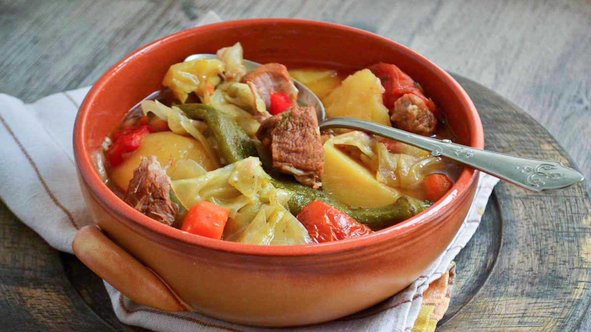

# Bosanski Lonac

*The Bosnian pot: layered chunks of beef and lamb with cabbage, root vegetables and whole garlic, sealed in an earthenware pot and cooked very slowly for four hours until the broth runs clear and the meat falls apart.*

**Serves:** 6-8

**Prep Time:** 30 minutes

**Cook Time:** 4 hours

## Overview
Bosanski lonac is the deepest expression of rural Bosnian cooking: a tall earthenware pot layered with chunks of beef and lamb, whole garlic cloves, slabs of cabbage, root vegetables, tomatoes and a small pour of vinegar, then sealed and left in the embers of a wood fire for four hours, sometimes longer. The shape of the lonac is the point. The narrow neck holds in the steam, the tall sides force the layers to cook in their own juices, and nothing is stirred from the moment the lid goes on. The result is a clear amber broth, meat soft enough to lift with a spoon, vegetables that hold their shape but yield at the lightest touch, and the unmistakable depth of slow time. A traditional household had a dedicated lonac that lived in the wood-fired stove from autumn to spring. A heavy lidded casserole in a low domestic oven gives a very close result. Served straight from the pot with thick slices of crusty bread to mop the broth.

## Ingredients

- 600 g beef shin or chuck, cut into 5 cm chunks
- 600 g lamb shoulder, cut into 5 cm chunks
- 1 small green cabbage (around 800 g), cut into 8 wedges through the core
- 4 large carrots, scrubbed and cut into 4 cm batons
- 4 medium potatoes, peeled and quartered
- 2 large onions, peeled and quartered
- 1 small celeriac (around 300 g), peeled and cut into 3 cm chunks
- 2 parsnips, peeled and cut into 4 cm batons
- 1 whole head of garlic, separated into cloves (left unpeeled)
- 4 ripe tomatoes, halved
- 2 long green peppers, seeded and quartered
- 2 bay leaves
- 1 small bunch flat-leaf parsley, tied with string
- 1 teaspoon black peppercorns
- 2 teaspoons fine sea salt
- 100 ml dry white wine
- 50 ml red wine vinegar
- 500 ml water or light beef stock

## Method

### Stage 1 - Prepare
1. Heat the oven to 150°C.
2. Pat the meat dry; season with half the salt and a grind of pepper.
3. Have all the vegetables ready before you start layering; the order matters.

### Stage 2 - Build the pot
1. Take a tall heavy lidded casserole or earthenware pot (around 5 litre capacity).
2. Begin with a layer of onion quarters across the base.
3. Lay the beef chunks over the onion.
4. Cover with a layer of carrot, parsnip and celeriac.
5. Tuck the garlic cloves and bay leaves between.
6. Next a layer of lamb chunks.
7. Then a layer of potato and tomato.
8. Top with the cabbage wedges, pushed down to compact slightly.
9. Lay the green peppers across the cabbage.
10. Slip the bundle of parsley and the peppercorns down the side.

### Stage 3 - Liquids
1. Pour the wine, vinegar and water down the inside edge of the pot so it seeps to the bottom.
2. Scatter the remaining salt over the top.

### Stage 4 - Seal and bake
1. Cover with the lid; if the lid is loose, seal with a strip of flour-and-water paste around the rim or a sheet of foil under the lid.
2. Place in the oven; cook 4 hours without lifting the lid.
3. The pot should be barely bubbling; turn the oven down to 140°C if it boils.

### Stage 5 - Rest and serve
1. Lift out and let rest 15 minutes with the lid still on; the layers settle.
2. Carry the pot to the table whole.
3. Serve directly from the pot into wide bowls, spooning a little of each layer into every portion with a ladle of the clear broth.

## Notes
- **Do not stir:** the whole point is the layered structure and the clear broth. Stirring breaks the vegetables and clouds the liquid.
- **The seal matters:** the dish cooks in trapped steam. A loose-fitting lid lets too much escape; use foil or a flour-paste seal if your lid is wobbly.
- **Choose firm potatoes:** waxy varieties (Charlotte, Désirée) hold their shape across four hours. Floury potatoes disintegrate.
- **Cabbage on top:** the cabbage forms a natural lid that protects the layers below and slowly releases its juices downward. Keep it on top.
- **Earthenware if you have it:** a glazed earthenware lonac gives a slightly different broth, sweeter and more rounded. A cast-iron casserole is the practical home alternative.

## Variations
- **All-beef version:** use 1.2 kg beef shin and skip the lamb; the broth comes out richer and darker.
- **With smoked meat:** add 200 g of smoked dried beef (suho meso) for a smokier depth, a Herzegovinian touch.
- **With chickpeas:** scatter 200 g of soaked dried chickpeas through the layers; common in eastern Bosnia.
- **Sač-cooked:** cook in a bell-shaped iron dome buried in wood embers for the most traditional version, takes 5 hours.

## Serving
Straight from the pot · with crusty bread · with a small dish of grated horseradish · a glass of red wine or cold rakija · followed by kafa

## Storage
- Keeps refrigerated 3 days; the flavour deepens overnight.
- Reheat covered in the oven at 140°C for 30 minutes; do not boil hard.
- Freezes well 2 months; thaw overnight in the fridge and reheat gently.
- Day-two lonac with the broth reduced makes an excellent ragù for short pasta.

