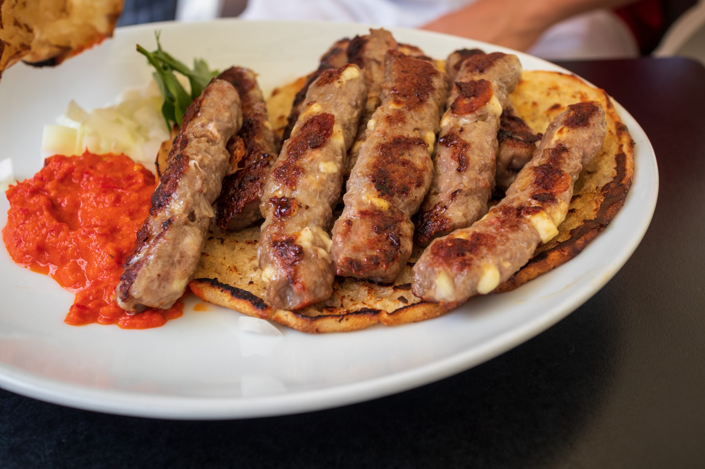

# Ćevapi

*Bosnia's national dish: small fingers of minced beef and lamb seasoned with garlic and bicarbonate, grilled fast over charcoal and packed inside a half-loaf of warm somun with raw onion and a spoon of kajmak.*

**Serves:** 4 (40 ćevapi)

**Prep Time:** 25 minutes (plus overnight chilling)

**Cook Time:** 10 minutes

## Overview
Ćevapi are small skinless sausages of minced beef and lamb that sit at the centre of Bosnian food: roughly the size of a thumb, ten to a portion, grilled hard over white-ashed charcoal in a ćevabdžinica and slid straight off the grate into a half-loaf of warm somun bread that has been split open and steamed against the meat. The mince is twice ground for fineness, kneaded with garlic water and a small pinch of sodium bicarbonate (the Bosnian trick that gives the meat its distinctive springy bite), and rested overnight so the flavours settle. The flame is fierce and the cooking quick, no longer than five minutes a side, so the outside chars while the inside stays juicy. Plated with raw chopped onion piled high, a knob of cool kajmak melting into the meat, and ajvar on the side. Eat with the hands, the bread tearing across the meat as you go.

## Ingredients

### Meat
- 500 g lean beef mince (chuck or shoulder)
- 500 g lamb mince (shoulder, around 20% fat)
- 6 garlic cloves
- 100 ml warm water
- 2 teaspoons fine sea salt
- 1 teaspoon bicarbonate of soda
- 1 teaspoon freshly ground black pepper
- 1 teaspoon sweet paprika
- ½ teaspoon ground cumin (optional, regional)

### To serve
- 4 fresh somun loaves (or large round pita; warm just before serving)
- 2 large red onions, finely chopped
- 200 g kajmak (or thick clotted cream as a substitute)
- 200 ml ajvar ([Bosnian ajvar](side-dishes/ajvar-bosnian.md))
- A handful of green pickled chillies (feferoni)

## Method

### Stage 1 - Garlic water
1. Crush the garlic with the flat of a knife and drop into a bowl with the warm water and salt.
2. Stir to dissolve the salt; rest 20 minutes; strain out the garlic solids, keeping the perfumed liquid.

### Stage 2 - Mix and knead
1. Combine the beef and lamb in a wide bowl.
2. Sprinkle over the bicarbonate, black pepper, paprika and cumin if using.
3. Pour the garlic water over the meat.
4. Knead with wet hands for 8-10 minutes, slapping the meat against the side of the bowl, until it turns tacky and clings to itself in a single mass.

### Stage 3 - Rest
1. Cover; refrigerate at least 12 hours, ideally 24. The bicarbonate works on the meat slowly; the texture firms and the flavours marry.

### Stage 4 - Shape
1. Take a heaped tablespoon of mixture (about 35 g) and roll between wet palms into a finger 8 cm long and 2 cm thick.
2. Lay on a tray lined with parchment.
3. Repeat for all 40 ćevapi. Chill 30 minutes while the grill heats.

### Stage 5 - Grill
1. Heat charcoal until white-ashed and no flames remain.
2. Place the ćevapi on the grate, leaving small gaps between each.
3. Grill 3-4 minutes; turn; grill 3-4 minutes more. The outside should be deeply charred; the inside just-cooked and juicy.
4. As they come off the grill, lay them in groups of ten against the inside of a split warm somun so the bread soaks the meat juices.

### Stage 6 - Serve
1. Open each somun loaf along one side like a pocket.
2. Tuck ten ćevapi inside each, mounded.
3. Top with a heap of chopped raw onion.
4. Add a generous spoon of kajmak so it begins to melt.
5. Serve immediately with ajvar and feferoni on the side.

## Notes
- **Bicarbonate is the Bosnian signature:** the small pinch gives the meat its springy bite, a texture you cannot get any other way. Do not skip it; do not double it (more turns the meat soapy).
- **Twice grind for fineness:** ask the butcher to run the mince through twice, or pulse briefly in a food processor. The texture is much finer than a burger.
- **Rest overnight:** the rest is not optional. The meat tastes flatter and chewier without it.
- **Wet hands when shaping:** the mix is tacky; a bowl of cold water alongside keeps your hands from sticking.
- **Somun, not pita:** somun is thicker, softer and steamier than Greek-style pita. A Turkish ramazan pidesi is the closest substitute.

## Variations
- **Sarajevski ćevapi:** longer, slimmer, all beef. The Sarajevo style.
- **Banjalučki ćevapi:** four fingers fused together in a flat block before grilling. The Banja Luka style.
- **Travnički ćevapi:** with a higher proportion of lamb and a little finely chopped sheep tail fat for richness.
- **With sour cream:** a spoon of pavlaka (sour cream) in place of kajmak; lighter, sharper.
- **Indoor version:** a heavy ridged cast-iron pan over high heat works if no charcoal is available; you lose the smoke but keep the char.

## Serving
- With somun · chopped raw onion · kajmak · ajvar · pickled feferoni chillies · a glass of cold yoghurt or a small rakija

## Storage
- Raw kneaded meat keeps 2 days refrigerated; shape just before grilling.
- Shaped raw ćevapi freeze well for 2 months on a tray, then bagged.
- Cooked ćevapi lose their char on reheating; eat warm in a low oven if you must.
- Leftovers chopped into a pita or scrambled with eggs the next morning.

