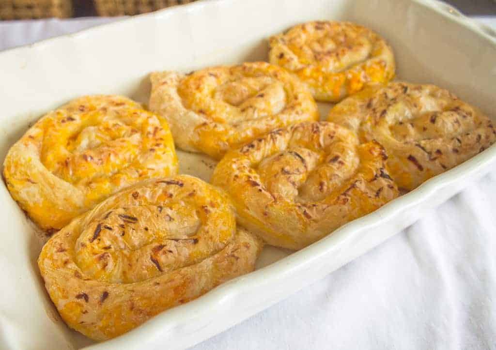

# Bosnian Pita

*The great Bosnian coiled pastry: hand-stretched filo dough rolled around a spiced meat filling, set into a round tin in a spiral and baked till deeply burnished, then brushed with a touch of warm milk so the crust softens just enough to bite cleanly.*

**Serves:** 6-8

**Prep Time:** 1 hour (plus 1 hour resting)

**Cook Time:** 50 minutes

## Overview
Pita is the bedrock of Bosnian baking: thin hand-stretched dough, a savoury or sweet filling rolled inside, and the finished log curled into a round tin in a tight spiral so the slices come out as concentric coils. The technique came in with the Ottomans and stayed; every Bosnian home has a jufka (the hand-rolled sheet) recipe and a particular trick for stretching it transparent over a tablecloth. Burek is the term reserved for the meat version; sirnica is the cheese; zeljanica is spinach; tikvenica is pumpkin. The dough is plain (flour, warm water, a little oil and salt) and rests twice so the gluten relaxes enough to pull. The filling for the meat version is raw mince mixed with grated onion, the onion juice keeping the meat moist through baking. The finished pita is brushed with a yoghurt-and-water wash or warm milk so the crust softens just enough to slice cleanly and not shatter. Eaten warm with a glass of cold yoghurt-drink (kiselo mlijeko) at any hour of the day.

## Ingredients

### Dough (jufka)
- 500 g strong white bread flour, plus extra for dusting
- 1 teaspoon fine sea salt
- 300 ml warm water
- 2 tablespoons sunflower oil
- 1 teaspoon white wine vinegar

### Meat filling (the classic)
- 500 g lean minced beef (or half beef, half lamb)
- 2 large onions, peeled and grated on the coarse side of a box grater
- 1 teaspoon fine sea salt
- 1 teaspoon freshly ground black pepper
- 1 teaspoon sweet paprika
- 100 ml sparkling water
- 50 g lamb tail fat or beef suet, very finely chopped (optional, traditional)

### To finish
- 100 ml sunflower oil, for brushing the dough
- 60 g unsalted butter, melted, for the top
- 100 ml warm milk, for the finishing wash

## Method

### Stage 1 - Make the dough
1. Combine the flour and salt in a wide bowl; make a well.
2. Pour in the warm water, oil and vinegar; mix to a soft tacky dough.
3. Turn onto a lightly floured surface; knead 10 minutes until smooth and elastic.
4. Divide into 4 equal balls; brush each with a little oil to stop a skin forming.
5. Cover with a damp cloth; rest 1 hour at room temperature.

### Stage 2 - Filling
1. In a wide bowl, mix the mince with the grated onion (and all its juice), salt, pepper and paprika.
2. Add the suet if using.
3. Pour in the sparkling water; mix with your hands for 3 minutes until light and slightly aerated.
4. Set aside; the filling stays raw and goes into the dough cold.

### Stage 3 - Stretch the dough
1. Spread a clean cotton tablecloth over your kitchen table; dust it lightly with flour.
2. Take one rested dough ball; roll on the cloth with a floured rolling pin to a thin round about 30 cm wide.
3. Tuck your hands underneath, palms flat and backs of hands touching, and stretch the dough outward with the backs of your hands, walking around the table as you go.
4. The dough will pull transparent and reach about 80 cm across; small holes are fine.
5. Brush all over with a film of oil.

### Stage 4 - Fill and roll
1. Take a quarter of the meat filling.
2. Lay it in a long thin sausage along one edge of the stretched dough, about 5 cm in from the edge.
3. Use the tablecloth to flip the edge of dough over the meat and roll the whole sheet into a long thin log, lifting the cloth as you go.
4. The finished log will be around 80 cm long and 3 cm thick.
5. Lift carefully and set aside on an oiled tray.
6. Repeat with the remaining three dough balls and filling.

### Stage 5 - Coil
1. Oil a round 28 cm baking tin generously.
2. Take one log and curl it into a tight spiral at the centre of the tin.
3. Join the next log on by tucking the end against the outer edge of the spiral; continue coiling outward.
4. Continue with all four logs until the tin is filled with one large spiral that nearly touches the rim.

### Stage 6 - Bake
1. Heat the oven to 200°C.
2. Brush the surface of the pita with the melted butter.
3. Bake 30 minutes; the top should be a deep mahogany gold.
4. Lower the heat to 180°C; bake a further 15-20 minutes.
5. Lift out of the oven.
6. Brush the surface immediately with the warm milk.
7. Cover with a clean tea towel; rest 10 minutes. The milk steams into the crust and softens it just enough.

### Stage 7 - Serve
1. Slice across the spirals into wedges, like a cake.
2. Serve warm with a glass of kiselo mlijeko (or thin yoghurt) on the side.

## Notes
- **The stretch is the skill:** the dough must pull thin enough to read newsprint through. Two rests give the gluten time to relax. Rushing means tearing.
- **Onion is the moisture:** grated onion (not chopped) releases its juice into the meat as it bakes, keeping the filling moist. Do not drain it.
- **Raw filling, not cooked:** Bosnian pita uses uncooked mince inside the dough. The filling cooks fully during baking, and a cooked filling dries out.
- **The milk wash at the end:** this is the small Bosnian detail that gives pita its tender bite. Skip it and the crust shatters when you slice.
- **A tablecloth helps:** the cloth lets you walk the dough outward without sticking, and you can lift the rolled log without tearing.

## Variations
- **Sirnica (cheese pita):** swap the meat filling for 500 g cottage cheese mixed with 200 g crumbled feta, 3 beaten eggs and a pinch of salt.
- **Zeljanica (spinach pita):** 500 g blanched chopped spinach mixed with 200 g cottage cheese, 100 g feta, 2 eggs and a chopped spring onion.
- **Krompiruša (potato pita):** grated raw potato with finely chopped onion, salt and a generous grind of pepper.
- **Tikvenica (pumpkin pita):** grated raw pumpkin with sugar, cinnamon and a handful of raisins; the sweet pita.
- **Sač-baked:** the most traditional bake is under a cast-iron sač dome buried in wood embers; gives a smokier crust and an even bake.

## Serving
- Warm, sliced into wedges · with a glass of kiselo mlijeko or thin natural yoghurt · with a bowl of ajvar on the side · with a chopped tomato-and-onion salad

## Storage
- Keeps wrapped at room temperature 1 day; refrigerated 3 days.
- Reheat covered in a 160°C oven for 12 minutes; the crust crisps and the filling warms through.
- Freezes 2 months; cool fully, slice into wedges, freeze on a tray, then bag.
- Reheat from frozen at 180°C for 20 minutes covered, then 5 minutes uncovered.

