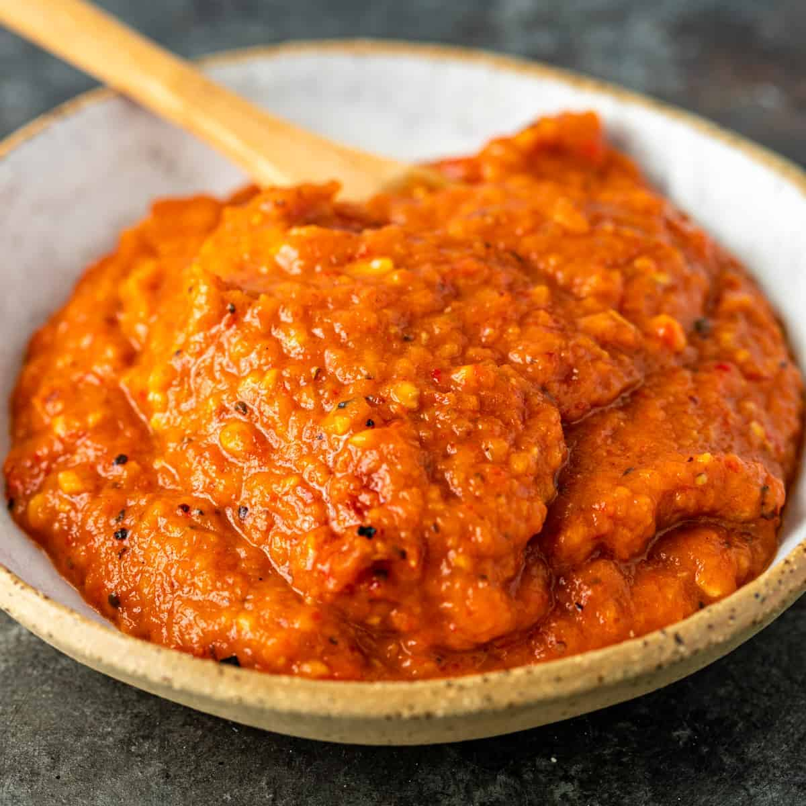

# Ajvar (Bosnian-Style)

*The Balkan red relish: long red peppers roasted over an open flame till the skins blister black, peeled, chopped fine and cooked down slowly with garlic, oil and a touch of vinegar into a glossy red spread.*

**Serves:** 6 jars (around 1.5 kg)

**Prep Time:** 1 hour (plus 30 minutes resting)

**Cook Time:** 1 hour 30 minutes

## Overview
Ajvar is autumn in a jar across the Balkans, the standing-army preserve of Bosnia, Serbia and North Macedonia, made every September when the long red roga peppers come in at the markets in great red mountains. The Bosnian version is the deeper-roasted style: peppers are charred over a wood or gas flame until the skins blister black and the flesh turns smoky and soft, peeled by hand still warm, then chopped fine on a wooden board (never blitzed, the texture should stay slightly bitty), and cooked down with sunflower oil and a few crushed garlic cloves over very low heat for an hour or more until the moisture cooks out and the colour deepens to a glossy red-mahogany. A small splash of white wine vinegar at the end balances the sweetness. Some Bosnian households add a small spoon of roasted aubergine to the mix, which gives a touch more body and a smokier edge. Eaten on toast for breakfast, with ćevapi at dinner, with cheese on a meze board, with a spoon straight from the jar.

## Ingredients

- 3 kg long red roga peppers (or red bell peppers; the roga shape is the right one but bell works)
- 1 small aubergine (300 g; optional, adds body)
- 150 ml sunflower oil
- 8 garlic cloves, finely chopped
- 2 tablespoons fine sea salt
- 1 tablespoon caster sugar
- 3 tablespoons white wine vinegar
- 1 teaspoon freshly ground black pepper

## Method

### Stage 1 - Roast the peppers
1. Heat the grill of your oven to its highest setting, or set up a charcoal grill, or use a direct gas flame.
2. Lay the peppers (and the aubergine if using) on a tray.
3. Roast or grill, turning every few minutes, until the skins are blistered black all over and the flesh has collapsed; around 20 minutes under a grill, 12 minutes over flame.

### Stage 2 - Sweat and peel
1. Transfer the hot peppers to a large bowl; cover tightly with cling film or a plate.
2. Rest 30 minutes; the trapped steam loosens the skins.
3. Pull off the skin with your fingers (do not rinse, you lose the smoky flavour); pull out the stalk and seeds.
4. Lift the flesh of the aubergine out with a spoon, discarding the skin.
5. Lay the peeled flesh in a colander 15 minutes to drain off the watery juices.

### Stage 3 - Chop
1. Tip the drained flesh onto a wooden board.
2. Chop fine with a heavy knife; the texture should be like a coarse paste with small visible pieces, not a smooth puree.
3. Alternatively pulse briefly in a food processor, but stop while there is still texture.

### Stage 4 - Cook down
1. Take a wide heavy-bottomed pan (a kazan, a wok, or a deep cast-iron skillet).
2. Pour in the oil and warm over low heat.
3. Add the garlic; stir 2 minutes until fragrant but not browned.
4. Tip in the chopped pepper mixture.
5. Add the salt, sugar and black pepper.
6. Cook on the lowest heat, stirring every 5 minutes with a wooden spoon, for 1 hour to 1 hour 15 minutes.
7. The colour deepens from bright red to a glossy mahogany; the texture thickens; the oil rises to the surface.
8. The test: drag the spoon across the pan; the trail should hold for 2 seconds before closing.

### Stage 5 - Finish
1. Stir in the vinegar; cook 5 minutes more to bind it in.
2. Taste; adjust salt and sugar.

### Stage 6 - Jar
1. Sterilise glass jars in a 110°C oven for 15 minutes.
2. Ladle the hot ajvar into the hot jars, leaving 1 cm headspace.
3. Tap the jars on the counter to release air pockets.
4. Pour a thin film of oil over the top of each jar.
5. Seal with tight lids; invert for 10 minutes; turn upright to cool.

## Notes
- **Char hard:** ajvar is defined by the smoky note from blistered black skins. Pale-roasted peppers give a flat sweet purée.
- **Do not rinse the peppers:** the temptation is to rinse off charred flecks. Resist it; the flavour goes down the drain.
- **Hand-chop for texture:** Bosnian ajvar has visible bits. A smooth blitz gives a baby-food texture that locals will spot at a glance.
- **Low and slow on the reduction:** a high heat scorches the bottom and changes the flavour. The hour-long simmer is what gives ajvar its depth.
- **Oil seal:** the layer of oil on top of each jar is the traditional preserving step. Refrigerated jars keep for months.

## Variations
- **Hot ajvar (ljuti ajvar):** add 4-6 hot chillies to the roasting tray; chop in with the rest.
- **Without aubergine:** the pure pepper version; cleaner flavour, slightly less body.
- **With walnuts:** stir in 100 g of finely chopped toasted walnuts at the end; gives a richer, nuttier ajvar.
- **Red and green:** half red peppers and half long green peppers; lighter colour, brighter flavour.
- **Pindjur:** the Macedonian close relative, finer chopped with added tomato.

## Serving
- On hot buttered toast for breakfast · with ćevapi and somun · on a meze board with feta and olives · with grilled meat · with hard cheese · stirred into yoghurt as a dip

## Storage
- Sealed jars keep 6 months in a cool dark cupboard.
- Once opened, keep refrigerated and use within 3 weeks; pour a thin film of fresh oil on top each time you reseal.
- Freezes 6 months in small tubs; thaw in the fridge overnight.
- For long storage water-bath the sealed jars 20 minutes at a simmer.

