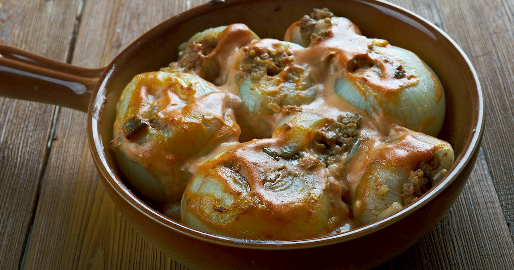

# Sogan Dolma

*Bosnian stuffed onions: large onions peeled into layers, each layer rolled around a rice-and-meat filling, packed tight in a deep pot and braised slowly in a pomegranate or sour-plum broth until the onions go translucent and silky.*

**Serves:** 6

**Prep Time:** 45 minutes

**Cook Time:** 2 hours

## Overview
Sogan dolma is the most patient dish in the Bosnian kitchen: large yellow onions are blanched whole, the layers separated like the leaves of a book, and each layer wrapped around a spoon of rice-and-meat filling. The stuffed rolls pack into a heavy pot so tightly that they cannot move, and a sour braising liquid is poured around them, traditionally sour plum (šljiva) juice or unripe grape juice, sometimes a spoon of pomegranate molasses, that cuts the natural sweetness of the slow-cooked onion. Three hours of low simmering turns the onion translucent and the filling tender, and the broth reduces to a thick mahogany glaze. The dish is Ottoman in origin and travelled into Bosnia in the sixteenth century. The Bosnian version is sharper than the Turkish, the sour element more pronounced. Served as a hearty side or a vegetable course in its own right, with thick crusty bread and a spoon of soured cream on top.

## Ingredients

### Onion shells
- 6 very large yellow onions (around 1.5 kg total; the largest you can find)
- 2 teaspoons fine sea salt (for the blanching water)

### Filling
- 400 g coarse beef and lamb mince (50/50)
- 100 g short-grain rice (or risotto rice), rinsed and drained
- 1 medium onion, very finely chopped (use a small cull from one of the large onions)
- 2 garlic cloves, finely chopped
- 1 small bunch flat-leaf parsley, finely chopped
- 1 teaspoon dried savory (čubar) or dried thyme
- 1 teaspoon sweet paprika
- 1 teaspoon fine sea salt
- ½ teaspoon freshly ground black pepper
- 2 tablespoons sunflower oil

### Braising liquid
- 1 tablespoon plain flour
- 1 tablespoon sweet paprika
- 30 g unsalted butter
- 500 ml beef or chicken stock
- 100 ml sour plum juice (or 50 ml lemon juice plus 50 ml water)
- 1 tablespoon pomegranate molasses (optional)
- 1 bay leaf

### To serve
- 200 g soured cream or thick yoghurt
- A handful of chopped fresh parsley

## Method

### Stage 1 - Prepare the onion shells
1. Peel the onions; trim the root end but leave a sliver intact so the layers hold together.
2. With a sharp knife, cut a slit from the top down to the centre of each onion, slicing through to the core but not splitting the onion in two.
3. Bring a wide pot of water to a boil with the salt.
4. Drop in the onions; blanch 6-7 minutes until the outer layers are translucent.
5. Lift out with a slotted spoon and plunge into cold water.
6. Once cool enough to handle, gently push from the root end and the layers will separate like rolled paper. Keep all the layers; you should have 30-40 usable shells. Reserve a small inner onion for the filling.

### Stage 2 - Mix the filling
1. Combine the mince, rice, finely chopped small onion, garlic, parsley, savory, paprika, salt, pepper and oil in a wide bowl.
2. Knead with your hands 3 minutes until uniform and slightly sticky.

### Stage 3 - Roll
1. Lay an onion shell flat on a board with the long edge toward you.
2. Place a heaped teaspoon of filling near the wider end.
3. Fold the sides in and roll into a small barrel, like a stubby cigar.
4. The natural curve of the onion holds the roll closed.
5. Repeat for all the shells.

### Stage 4 - Pack the pot
1. Take a heavy lidded casserole (around 24 cm wide).
2. Lay a few discarded smaller onion layers in the base to stop sticking.
3. Pack the stuffed rolls seam-side down in tight concentric circles; build a second layer if you have leftovers.
4. The rolls must be wedged tight against each other so they cannot move during cooking.

### Stage 5 - Make the braise
1. Melt the butter in a small saucepan over medium-low heat.
2. Whisk in the flour and paprika; cook 2 minutes to a smooth pale-rust roux.
3. Whisk in the stock a ladle at a time until smooth.
4. Stir in the sour plum juice, pomegranate molasses (if using) and the bay leaf.
5. Bring to a simmer.

### Stage 6 - Braise
1. Pour the hot braising liquid over the packed rolls; the liquid should come just over the top.
2. Cover with a small heavy plate inside the pot (an inverted saucer works) to weigh the rolls down and keep them submerged.
3. Put the lid on.
4. Bring to a bare simmer over medium heat; reduce to the lowest setting.
5. Braise 1 hour 45 minutes without disturbing.

### Stage 7 - Reduce and finish
1. Lift the plate out.
2. The braising liquid should be a deep mahogany. If it is still thin, simmer uncovered 10 minutes to reduce.
3. Taste; adjust salt and add a squeeze of lemon if the sourness needs lifting.

### Stage 8 - Serve
1. Lift the rolls out gently with a wide spoon onto a warmed shallow platter.
2. Spoon the rich braising liquid over the top.
3. Add small dollops of soured cream across the dish.
4. Scatter with chopped parsley.
5. Serve hot with crusty bread.

## Notes
- **Find very large onions:** small onions cannot be unrolled into useful shells. Spanish or Vidalia onions in the 250-300 g range are ideal.
- **Slit before blanching:** the cut from top to core is what lets you separate the layers cleanly. Without it the layers will not come apart.
- **Pack tight:** a loose pot lets the rolls float and unravel during cooking. Wedge them tight and weigh them down.
- **Sour is essential:** the sour element (plum juice, lemon, pomegranate molasses) is what stops the dish becoming cloying. Do not skip it.
- **Low and slow:** a hard simmer breaks the onion shells. A bare simmer over two hours gives translucent silky rolls and a glossy sauce.

## Variations
- **With dried fruit:** add a handful of dried sour cherries to the braise for an extra fruit-acid note.
- **Vegetarian sogan dolma:** swap the mince for 200 g of cooked chickpeas mashed with sautéed mushrooms.
- **All-lamb filling:** use only lamb mince and add a teaspoon of ground allspice; closer to the Turkish dolma.
- **With cabbage instead of onion:** the technique transfers directly to blanched cabbage leaves (sarma).

## Serving
- Warm on a wide platter · with soured cream on top · with crusty bread to mop the sauce · alongside a green salad · with a small glass of rakija

## Storage
- Keeps refrigerated 4 days; the flavour deepens overnight.
- Reheat covered in a 150°C oven for 20 minutes with a splash of stock to refresh the sauce.
- Freezes 2 months; thaw overnight and reheat as above.
- Day-two sogan dolma chopped into a hash with fried potatoes makes a fine lunch.

