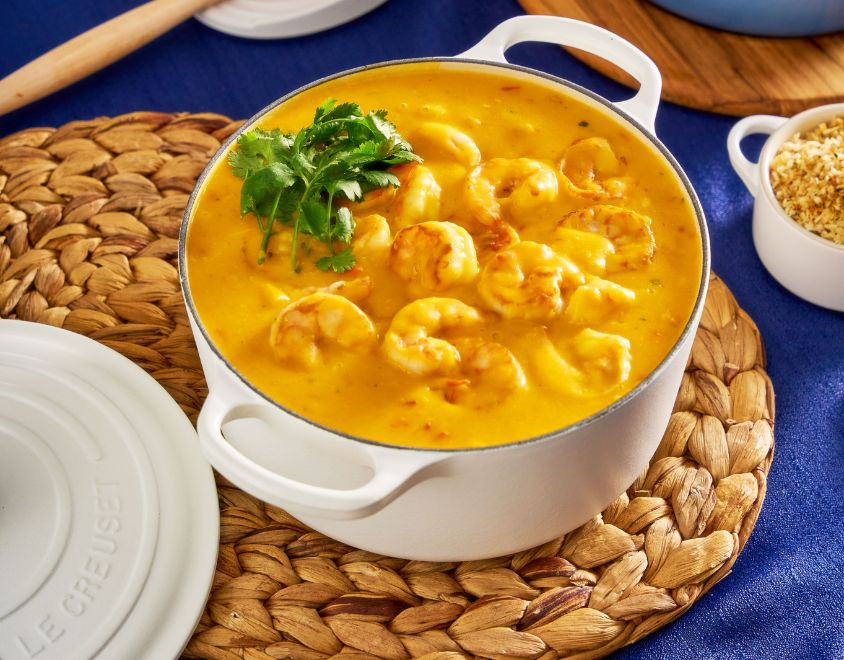

# Bobó de Camarão (Bahian Shrimp in Cassava-Coconut Cream)

*Bahia's most opulent stew: large prawns gently cooked in a velvety cream of cassava (yuca), coconut milk and dendê oil, with onion, garlic, tomato and ginger. Served over white rice with a sprinkle of coriander. The African-Brazilian dish that takes its name from the Yoruba word "ipete" (mashed beans), adapted in Bahia with cassava as the thickener. Rich, deeply orange, faintly sweet from the coconut.*

**Serves:** 4-6

**Prep Time:** 25 minutes

**Cook Time:** 40 minutes

## Overview
Bobó de camarão is one of Bahia's most luxurious and most distinctly African-Brazilian dishes - a velvety cream of cassava (yuca), coconut milk and red palm oil (dendê), enriched with sweated onion, garlic, ginger, fresh tomato and fresh coriander, with large prawns or shrimps gently poached in the cream for the last few minutes of cooking. The name "bobó" comes from the Yoruba word "ipete" (meaning a mashed-bean dish), adapted in Bahia by enslaved African cooks who used cassava - a local staple - instead of the African beans of the original. The texture is unmistakably bobó: thick, velvety, almost a soup-stew hybrid, with whole prawns nestled into the pale-orange cream. The dish is closely related to moqueca but distinguished by the cassava thickener (which gives it the bobó-signature density) and by the absence of bell peppers (moqueca uses peppers; bobó uses cassava as the body). Served in deep bowls over rice with farofa, a wedge of lime, and a glass of cold beer. Three details: COOK THE CASSAVA SEPARATELY first till very tender, then mash to a smooth cream (don't shortcut - the cream is the dish), DENDÊ oil is non-negotiable (gives the colour and flavour), and ADD THE PRAWNS LAST (8 minutes maximum cooking - over-cooked prawns are rubber).

## Ingredients

### Cassava cream base
- 800 g fresh cassava (yuca; or frozen cassava, defrosted)
- 600 ml chicken or fish stock (or water)
- 1 teaspoon fine sea salt

### Stew base
- 3 tablespoons dendê oil (red palm oil; non-negotiable for authentic bobó)
- 2 tablespoons olive oil
- 2 medium onions (finely diced)
- 8 garlic cloves (chopped)
- 1 tablespoon grated fresh ginger
- 1 small red chilli (chopped; optional)
- 3 large tomatoes (peeled, seeded, chopped)
- 400 ml full-fat coconut milk
- 1 teaspoon fine sea salt (or to taste)
- Juice of 1 lime
- 1 large bunch fresh coriander (about 80 g; chopped, half for the stew, half for garnish)

### The prawns
- 600 g large prawns (raw, shell-off, deveined; about 16-20 large prawns)
- Juice of 1 lime (for marinating)
- 2 garlic cloves (finely chopped)
- 1 teaspoon fine sea salt
- 1 teaspoon coarsely cracked black pepper

### To serve
- 600 g white long-grain rice (cooked)
- 200 g farofa
- Lime wedges
- Cold Brazilian beer
- Optional: chopped fresh chillies on the side for those who want heat

## Method

### Stage 1 - Cook the cassava
1. Peel the cassava: cut into 6-8 cm chunks; with a sharp knife, remove the thick brown skin and the fibrous pink layer beneath. Cut each chunk in half lengthways and remove the woody centre fibre (cassava always has a stringy central fibre - pull it out).
2. Cut the prepared cassava into 3 cm chunks.
3. Place in a saucepan; cover with the stock; add the salt.
4. Bring to a boil; reduce to simmer; cook 25-30 minutes till the cassava is completely tender (a knife slides through with no resistance).
5. Drain (reserve 200 ml of the cooking liquid).
6. While still hot, mash with a fork or pass through a ricer/blender to a smooth purée; thin with a little of the reserved cooking liquid if needed.
7. The cream should be thick but pourable; aim for a thick custard consistency.
8. Set aside.

### Stage 2 - Marinate the prawns
1. In a bowl, combine the prawns, lime juice, chopped garlic, salt, and pepper.
2. Cover; refrigerate 15-20 minutes.

### Stage 3 - Make the stew base
1. In a large heavy pan, heat the olive oil over medium heat.
2. Add the diced onions; sweat 8-10 minutes till soft and golden (don't brown).
3. Add the garlic, ginger, and chilli (if using); cook 1-2 minutes.
4. Add the chopped tomatoes; cook 5-7 minutes till they break down into a sauce.

### Stage 4 - Combine with cassava cream
1. Add the cassava cream to the pan.
2. Stir thoroughly.
3. Pour in the coconut milk.
4. Add half the chopped coriander.
5. Bring to a gentle simmer (don't boil hard).
6. Simmer 10 minutes for the flavours to combine.
7. Add the dendê oil; stir to incorporate (the cream turns a beautiful pale orange).
8. Taste; adjust salt and lime juice.

### Stage 5 - Add the prawns
1. Stir the marinated prawns into the cream.
2. Cover; cook 6-8 minutes (no more) till the prawns are just opaque and curled.
3. Don't overcook; rubber prawns ruin the dish.

### Stage 6 - Finish
1. Squeeze the lime juice over.
2. Stir in most of the remaining coriander.
3. Reserve a little for garnish.
4. Drizzle a little extra dendê oil over (optional, for colour).

### Stage 7 - Serve
1. Ladle the bobó over warm white rice in deep bowls.
2. Sprinkle the reserved coriander.
3. Add a wedge of lime.
4. Pass farofa at the table (spoon a little over each portion for crunch).
5. Drink cold beer alongside.

## Notes
- **Fresh cassava is canonical:** frozen cassava (defrosted) works perfectly well. Cassava flour does NOT work - it's not a substitute.
- **Pull out the fibrous centre:** every cassava chunk has a woody central fibre. Remove it before cooking.
- **Dendê oil is the dish:** without it, the bobó has no Bahian character. Don't substitute.
- **Coconut milk full-fat:** light coconut milk gives a thin, watery bobó.
- **Add prawns at the very end:** 6-8 minutes maximum. Over-cooked prawns are rubber.

## Variations
**Bobó de frango (chicken bobó):** swap prawns for cubed chicken; cook chicken 15 minutes in the cream before serving.
**Bobó de peixe (fish bobó):** swap prawns for firm white fish chunks (snapper, grouper).
**Bobó de quiabo (okra bobó):** add 200 g sliced okra to the stew base (cook 5 minutes before adding cassava cream); add a slight viscous note.
**Without dendê (lighter version):** skip the dendê; the result is paler and less Bahian. Acceptable substitute is olive oil + a teaspoon of paprika for colour.
**Hot bobó:** add 1-2 chopped Brazilian malagueta chillies (or Scotch bonnets) for the spicy version.
**Bobó with coconut cream on top:** drizzle a swirl of full-fat coconut cream over each bowl just before serving - restaurant presentation.
**Bobó de feijão verde (green-bean bobó variant):** add 200 g cooked green beans to the cream for texture.

## Serving
At a Salvador beachfront restaurant in Bahia (the canonical setting) · at a Bahian wedding reception · at a Brazilian Carnival lunch · at a Brazilian seafood-restaurant special · at a Brazilian Sunday family lunch in the north-east · at a Brazilian-themed dinner party as a stunning Bahian showpiece · at home with rice, farofa, and cold beer.

## Storage
- Refrigerates 2 days; reheat gently with a splash of stock to loosen.
- The flavour intensifies overnight.
- Don't freeze (prawn texture suffers).
- The cassava cream base (without prawns) freezes 1 month.
- Leftover bobó stirred into rice makes a Brazilian-style "shrimp risotto" the next day.
