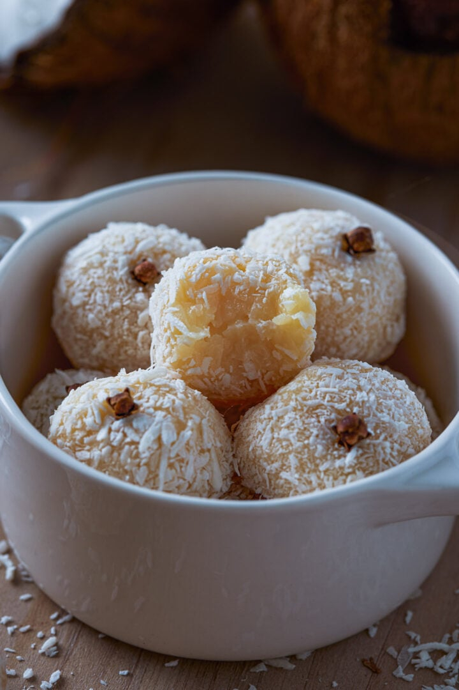

# Beijinhos (Coconut Truffles)

*Brazil's white sister to brigadeiros: a fudgy truffle made with sweetened condensed milk, butter, grated coconut and a touch of vanilla, rolled in desiccated coconut with a clove pressed into the top. The traditional Brazilian birthday-party companion to brigadeiros; the dessert that always appears in pairs on the same tray.*

**Serves:** Makes 30-40 small truffles

**Prep Time:** 10 minutes (plus 2 hours chilling)

**Cook Time:** 12-15 minutes

## Overview
Beijinhos (literally "little kisses"; the name reflects the truffles' small bite-sized format) are Brazil's coconut counterpart to brigadeiros, and the two always appear together on every Brazilian birthday-party dessert tray, every wedding canapé table, and every children's celebration. The construction is identical in technique to brigadeiros: a heavy-bottomed pan, sweetened condensed milk, butter, gentle simmer with constant stirring till the "pulling away from the pan" test is passed, cool, roll into balls, coat in desiccated coconut. The difference: instead of cocoa, beijinhos use shredded coconut + vanilla as the flavour base, and the coating is desiccated coconut instead of chocolate sprinkles. The traditional finishing touch is a single whole clove pressed into the top of each beijinho (which adds a subtle aromatic note and serves as a visual marker distinguishing beijinhos from white-coated brigadeiros). The result is a soft, dense, intensely coconutty truffle that's lighter and more aromatic than the chocolate-dominant brigadeiro.

## Ingredients

### For 30-40 truffles
- 2 tins (each 397 g) sweetened condensed milk
- 60 g unsalted butter (plus extra for rolling hands)
- 80 g desiccated coconut (added into the cooking mixture)
- 1 teaspoon vanilla extract
- A pinch of fine sea salt

### Coating
- 200 g desiccated coconut (for rolling)
- 40 whole cloves (one per truffle)

### Optional flourishes
- A pinch of ground cardamom (modern aromatic variant)
- Dragees or edible silver beads (party variant)
- A drop of rose water (for a Persian-Brazilian crossover)

### Equipment
- A heavy-bottomed saucepan (the fudge thickens significantly)
- A wooden spoon
- A buttered plate or shallow dish (for cooling)
- Small paper cases (for serving)

## Method

### Stage 1 - Combine in the pan
1. In a heavy-bottomed saucepan, combine the sweetened condensed milk, butter, desiccated coconut (the 80 g for cooking), salt, and vanilla.
2. Stir thoroughly to combine.

### Stage 2 - Cook
1. Place the pan over medium heat.
2. Stir constantly with a wooden spoon.
3. After about 5 minutes, the mixture will start to bubble.
4. Continue stirring for 10-15 minutes total.
5. The mixture will thicken and start to pull away from the sides and bottom of the pan.

### Stage 3 - Test for doneness
1. The "pulling away" test: draw the wooden spoon across the bottom of the pan, leaving a clear path; the path should remain visible for 2-3 seconds before flowing back.
2. Alternatively, drop a small amount on a cold plate; if it forms a soft fudge ball after 30 seconds, it's ready.

### Stage 4 - Cool
1. Once the mixture passes the test, remove from heat.
2. Pour onto a buttered plate or shallow dish.
3. Spread to about 1.5 cm thickness.
4. Cool to room temperature (about 30 minutes).
5. Refrigerate at least 2 hours, ideally overnight.

### Stage 5 - Roll the truffles
1. Butter your hands lightly.
2. Using a small spoon, scoop walnut-sized portions (about 1-2 teaspoons each).
3. Roll between your buttered palms into smooth balls.
4. Place on a tray.

### Stage 6 - Coat
1. Place the desiccated coconut (the 200 g for rolling) in a bowl.
2. Roll each ball in the coconut to coat completely.
3. Press lightly to make the coconut adhere.

### Stage 7 - Finish with a clove
1. Press a single whole clove into the top of each beijinho (decorative and aromatic).
2. The clove also serves as the traditional Brazilian marker that distinguishes beijinhos from any white-coated truffle.

### Stage 8 - Display and serve
1. Place each finished beijinho in a small paper case.
2. Arrange on a tray alongside brigadeiros (the traditional Brazilian dessert pair).
3. Serve at room temperature.

## Notes
- **The coconut in the fudge:** this is what makes beijinho different from a white brigadeiro. Don't skip.
- **The clove on top:** the traditional Brazilian marker. Without it, beijinhos look identical to white brigadeiros.
- **Eat the clove or not:** some Brazilians eat the whole clove (it's small and edible); others remove it before eating. Either is fine.
- **Don't substitute fresh shredded coconut:** the fresh version contains too much moisture; you'd need to dry it out first. Desiccated coconut (dried, packaged) is traditional.
- **Brigadeiros and beijinhos together:** always paired. A Brazilian party dessert tray ALWAYS has both.

## Variations
**Beijinho com chocolate (with chocolate):** add 50 g of white chocolate to the mixture for extra richness.
**Beijinho de coco fresco (fresh coconut):** use fresh grated coconut (with some moisture squeezed out) instead of desiccated.
**Beijinho de coco queimado (toasted coconut):** roll in lightly toasted coconut for a more intense coconut flavour.
**Beijinho de Bahia (Bahian variant):** add a tablespoon of cachaça to the cooking mixture for an adult touch.
**Beijinho com leite de coco (with coconut milk):** swap 50 ml of the condensed milk for full-fat coconut milk for extra coconut depth.
**Beijinho de cardamomo (cardamom variant):** add ½ teaspoon ground cardamom to the cooking mixture. Persian-Brazilian crossover.
**Beijinho gelado (frozen):** freeze for 30 minutes after rolling for a firmer texture - modern dessert-bar variant.
**Beijinho com nozes (with walnuts):** roll the truffles in finely chopped walnuts mixed with coconut.

## Serving
At every Brazilian birthday party alongside brigadeiros (the traditional pairing) · at a Brazilian wedding's dessert table · at a Brazilian baby shower · at a Brazilian friends gathering · at a Brazilian Christmas table · at a Brazilian school bake-sale · at home as a sweet weekend treat · alongside Brazilian coffee.

## Storage
- Refrigerates 1 week in a sealed container.
- The coating stays fresh; the fudge stays firm.
- Don't freeze (the coconut texture changes on defrosting).
- Best at room temperature or slightly chilled; not warm.
- Made-ahead beijinhos are perfect for parties; the traditional Brazilian party-prep is 1-2 days ahead.
