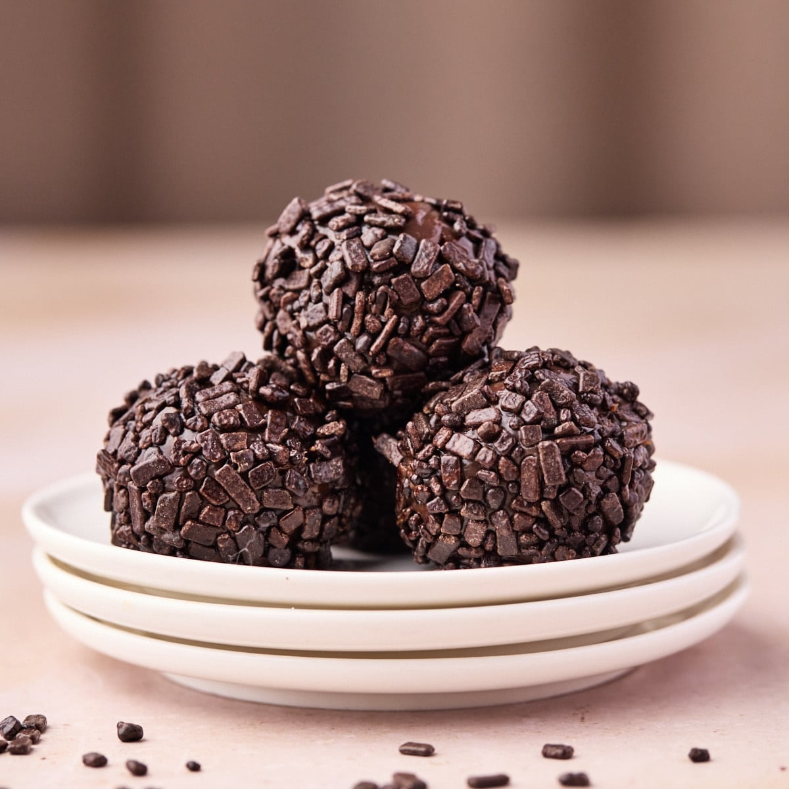

# Brigadeiros

*Brazil's most beloved dessert: a fudgy chocolate truffle made by simmering sweetened condensed milk with butter and cocoa to a thick fudge, then rolled into balls and coated in chocolate sprinkles. The traditional Brazilian birthday-party dessert; the dish every Brazilian grandmother makes; the one Brazilian dessert that's exported worldwide.*

**Serves:** Makes 30-40 small truffles

**Prep Time:** 10 minutes (plus 2 hours chilling)

**Cook Time:** 12-15 minutes

## Overview
Brigadeiros (named after Brigadier Eduardo Gomes, a 1940s Brazilian political candidate whose supporters supposedly served the truffles at campaign events) are Brazil's most universally beloved dessert. Every Brazilian birthday party from infants to ninety-year-olds features a tray of brigadeiros; every Brazilian dessert table has them; every Brazilian schoolchild can name them; every Brazilian grandmother has a signature method. The construction is brilliantly simple: sweetened condensed milk, unsweetened cocoa and butter simmered together to a thick fudge, cooled, rolled into walnut-sized balls with buttered hands, and rolled in chocolate sprinkles (granulado, the traditional coating). The Brazilian doneness test is "pulling away from the pan"; when you draw a wooden spoon through the mixture, the bottom of the pan should stay visible for 2 to 3 seconds before the fudge flows back. The result is a soft, dense, dark-chocolate fudgy truffle that is both intensely Brazilian and instantly addictive.

## Ingredients

### For 30-40 truffles
- 2 tins (each 397 g) sweetened condensed milk (commercial brands: Nestlé Moça, La Lechera)
- 60 g good-quality unsweetened cocoa powder (Cadbury or similar; not drinking-chocolate mix)
- 60 g unsalted butter (plus extra for rolling hands)
- A pinch of fine sea salt (optional; modern variant)
- 1 teaspoon vanilla extract (optional)

### Coating (the "granulado")
- 300 g chocolate sprinkles (the small round chocolate-flavoured ones; not coloured rainbow sprinkles)

### Equipment
- A heavy-bottomed saucepan (the fudge thickens significantly; a thin pan burns)
- A wooden spoon
- A buttered plate or shallow dish (for cooling)
- Small paper cases (for serving)

### Optional finishes
- Cocoa nibs (sprinkle over the top for crunch)
- Edible gold leaf (modern luxury variant)
- A single Brazilian nut on top (a Brazilian variant on the truffle)
- Halved roasted hazelnuts (modern fancy version)

## Method

### Stage 1 - Combine in the pan
1. In a heavy-bottomed saucepan, combine the sweetened condensed milk, cocoa powder, butter, and pinch of salt.
2. Sift the cocoa powder into the pan to avoid lumps (cocoa clumps if dumped in).
3. Stir thoroughly with a wooden spoon till the cocoa is fully integrated and the mixture is smooth.

### Stage 2 - Cook
1. Place the pan over medium heat.
2. Stir constantly with the wooden spoon, non-negotiable; the mixture burns very quickly otherwise.
3. After about 5 minutes, the mixture will start to bubble.
4. Continue stirring for 10-15 minutes total cooking time.
5. The mixture will gradually thicken; you'll see it pulling away from the sides and bottom of the pan as you stir.

### Stage 3 - Test for doneness
1. The traditional Brazilian "pulling away" test: draw the wooden spoon across the bottom of the pan, leaving a clear path; the path should remain visible for 2-3 seconds before the mixture flows back to fill it.
2. Alternatively, drop a small amount on a cold plate; if it forms a soft fudge ball after 30 seconds (rather than a flat splat), it's ready.
3. If you go too long, the mixture will get too hard.
4. If you go too short, the mixture will be too soft to roll.

### Stage 4 - Cool
1. Once the mixture passes the test, remove from heat.
2. Stir in the vanilla extract (if using).
3. Pour onto a buttered plate or shallow dish.
4. Spread to about 1.5 cm thickness.
5. Cool to room temperature first (about 30 minutes).
6. Then refrigerate at least 2 hours, ideally overnight.
7. The mixture should be firm enough to roll into balls without sticking heavily.

### Stage 5 - Roll the truffles
1. Butter your hands lightly (a small amount of butter rubbed in; prevents sticking).
2. Using a small spoon, scoop walnut-sized portions of the fudge (about 1-2 teaspoons each).
3. Roll between your buttered palms into smooth balls.
4. Place on a tray.

### Stage 6 - Coat
1. Place the chocolate sprinkles in a bowl.
2. Roll each ball in the sprinkles to coat completely.
3. Press lightly to make the sprinkles adhere.
4. Place each finished brigadeiro in a small paper case.

### Stage 7 - Chill and serve
1. Refrigerate the finished brigadeiros at least 30 minutes before serving (they firm up nicely).
2. Serve at room temperature or slightly chilled.
3. Each brigadeiro is one bite or two.
4. Display on a tray; they look beautiful in their paper cases.

## Notes
- **Stir constantly:** non-negotiable. The mixture burns in seconds without constant stirring.
- **The "pulling away" test:** the traditional Brazilian test. With practice you know the exact moment.
- **Butter your hands:** essential for rolling. The fudge is sticky.
- **Don't substitute cocoa with chocolate:** cocoa powder is the traditional ingredient. Melted chocolate gives a different (less authentic) texture.
- **Roll while the fudge is still slightly warm:** if it gets too cold and hard, it cracks when you try to roll. If too soft, it slumps.

## Variations
**Brigadeiro branco (white brigadeiro):** skip the cocoa; use white chocolate instead. Same technique. Roll in shredded coconut.
**Brigadeiro de morango (strawberry brigadeiro):** use fresh strawberry purée + white chocolate instead of cocoa. Roll in granulated sugar.
**Brigadeiro de café (coffee brigadeiro):** add 2 tablespoons of strong espresso to the cooking mixture. Roll in cocoa powder + crushed coffee beans.
**Brigadeiro de pistache (pistachio):** use white chocolate + 80g ground pistachios. Roll in chopped pistachios.
**Brigadeiro de coco (coconut):** use full-fat coconut milk instead of condensed milk + add 100g desiccated coconut. Roll in shredded coconut.
**Brigadeiro com nozes (with nuts):** add 80 g chopped walnuts or hazelnuts to the cooking mixture. Roll in chopped same nuts.
**Beijinho (the white version with coconut):** see [beijinhos recipe](beijinhos.md): the traditional white sister.
**Brigadeiro de panela (the pan-eating version):** don't roll into balls; just eat warm from the pan with a spoon. The illicit Brazilian "I-eat-the-leftovers" version.
**Black brigadeiro (modern):** add 20g of activated charcoal for visual drama, modern dessert-bar version.

## Serving
At every Brazilian birthday party (the traditional setting, never absent) · at a Brazilian wedding's dessert table · at a Brazilian Christmas dinner · at a Brazilian baby shower · at a Brazilian friends-meet-at-home gathering · at a Brazilian school bake-sale · at home as a quick weeknight treat · alongside coffee at a Brazilian café (the "brigadeiro-of-the-day" tradition).

## Storage
- Refrigerates 1 week in a sealed container.
- The sprinkles stay crisp; the fudge stays firm.
- Don't freeze (the texture changes on defrosting).
- Best at room temperature or slightly chilled; never warm (the fudge softens too much).
- Made-ahead brigadeiros are perfect for parties; the traditional Brazilian party-prep is to make brigadeiros 1-2 days ahead.
