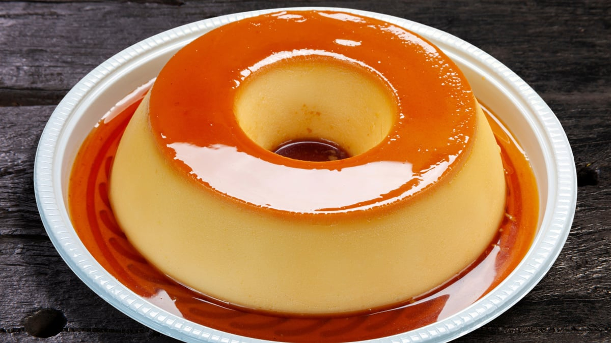

# Pudim de Leite Condensado (Brazilian Condensed-Milk Flan)

*Brazil's silky condensed-milk flan: a bain-marie-baked custard made with one tin of sweetened condensed milk, one tin of milk, and three eggs, baked in a caramelised ring tin and unmoulded to a glossy amber dome topped with caramel sauce. The dessert of every Brazilian Sunday lunch, every birthday, every wedding; the traditional Brazilian flan; sometimes literally called "the Brazilian dessert".*

**Serves:** 8-10

**Prep Time:** 20 minutes (plus 4 hours chilling)

**Cook Time:** 1.5 hours

## Overview
Pudim de leite condensado (literally "condensed milk pudding"; sometimes pudim de leite, or simply pudim) is the most beloved dessert in Brazil, on the table at every Sunday lunch, every birthday, every wedding, every Christmas and every buffet table across the country. The construction is brilliantly simple but technically demanding: a ring tin (the traditional forma de pudim with the central tube) coated in dark caramel, then filled with a blended custard of one tin of sweetened condensed milk, one tin of whole milk and three large eggs, baked low in a bain-marie till just set, chilled overnight and unmoulded at the last moment onto a serving plate. The result is a silky dense custard with a glossy amber caramel top; the caramel flows during baking to form a sauce around the unmoulded dome. The texture is unlike any other flan: dense, smooth, intensely creamy from the condensed milk, with a perfect proportion of caramel bitterness against the sweet custard.

## Ingredients

### Caramel layer
- 250 g granulated white sugar
- 4 tablespoons water

### Custard
- 1 tin sweetened condensed milk (397 g)
- 1 tin whole milk (use the empty condensed-milk tin to measure; about 400 ml)
- 3 large eggs (room temperature)
- A pinch of fine sea salt
- 1 teaspoon vanilla extract (optional)

### Equipment
- A ring-shaped pudim tin (forma de pudim with central tube; about 22 cm diameter; 1.5 litre capacity)
- A larger roasting tin (for the bain-marie; deep enough to hold water halfway up the pudim tin)
- A jug or pourer for the custard

### To serve
- A serving plate (large enough to hold the unmoulded pudim and its caramel sauce)
- A small jug for extra caramel (optional)

## Method

### Stage 1 - Make the caramel
1. Place the sugar and water in a heavy-bottomed pan.
2. Stir to combine; place over medium-high heat.
3. DO NOT stir after this point.
4. Boil the sugar syrup, swirling the pan occasionally to ensure even cooking, for 6-8 minutes.
5. The syrup will gradually turn pale gold, then darker amber.
6. Watch closely, sugar burns fast at the end stage.
7. Remove from heat when the caramel is a deep amber colour (not black; pull off before it burns).

### Stage 2 - Coat the pudim tin
1. Immediately pour the hot caramel into the pudim tin.
2. Tilt the tin to coat the bottom and sides evenly with the caramel (be careful, caramel is dangerously hot).
3. Set aside; the caramel will set hard.

### Stage 3 - Make the custard
1. In a blender (or large jug with a stick blender), combine the condensed milk, whole milk, eggs, salt, and vanilla (if using).
2. Blend on low speed for 30 seconds (avoid creating foam; too much foam gives bubbles in the finished pudim).
3. Strain the mixture through a fine sieve (catches any unbeaten egg threads).

### Stage 4 - Prep the bain-marie
1. Preheat oven to 160°C / 140°C fan / 325°F.
2. Place the caramel-coated pudim tin in a larger roasting tin.
3. Pour the strained custard into the pudim tin (it will sit on top of the set caramel).
4. Pour hot water into the larger roasting tin so it comes halfway up the sides of the pudim tin (this is the water bath).
5. Cover the pudim tin loosely with a piece of foil (optional; gives a smoother top).

### Stage 5 - Bake
1. Carefully place the bain-marie in the oven.
2. Bake for 1 hour to 1 hour 30 minutes.
3. Test at 1 hour: gently shake the pudim tin; the centre should still jiggle slightly (like a soft custard) but the outer 4 cm should be set.
4. Continue baking in 10-minute increments if needed.
5. DO NOT overcook; an overcooked pudim is dry and grainy.
6. The skewer test isn't reliable here, go by jiggle.

### Stage 6 - Cool
1. Remove from the oven.
2. Lift the pudim tin out of the water bath; place on a wire rack.
3. Cool at room temperature for 1 hour.
4. Cover with cling film; refrigerate AT LEAST 4 hours, ideally overnight.
5. The pudim needs the chill to set fully; rushing this gives a sloppy unmoulding.

### Stage 7 - Unmould
1. The next day (or after 4+ hours), run a thin sharp knife around the inside edge AND the central tube of the pudim tin to loosen the custard.
2. Place a large serving plate (deep-rimmed if possible) over the top of the pudim tin.
3. Invert sharply, the pudim should release with a satisfying glop, and the caramel will flow down to surround it.
4. Lift off the tin (gently; if it sticks, give a gentle shake).
5. The finished pudim is a glossy amber dome with caramel sauce pooled around it.

### Stage 8 - Serve
1. Cut into wedges with a sharp wet knife.
2. Each wedge has the soft custard with the caramel top and side flowing down.
3. Spoon extra caramel sauce over each portion.
4. Serve chilled; the traditional Brazilian dessert finale.

## Notes
- **Bain-marie is non-negotiable:** direct heat ruins the pudim. The water bath gives even, gentle cooking.
- **Don't overbake:** centre should jiggle when you remove it. Overcooked = grainy, dry.
- **Overnight chill is essential:** 4 hours is minimum; overnight is ideal. The custard sets fully during chilling, not during baking.
- **The blender introduces tiny air bubbles:** blend on low and strain through a sieve to minimise bubbles in the finished pudim. Or whisk by hand for a denser, more old-fashioned pudim.
- **Use the empty condensed-milk tin to measure the milk:** the traditional Brazilian recipe ratio (1 tin condensed milk : 1 tin milk : 3 eggs) is the foundation.
- **Caramel goes dark amber:** not black. Pale caramel gives a sweet but boring pudim; properly dark caramel gives the deep bitter-sweet edge.

## Variations
- **Pudim de coco (coconut pudim):** swap the milk for full-fat coconut milk. Add 80 g desiccated coconut to the custard. Bahian variant.
- **Pudim de café (coffee pudim):** add 2 tablespoons strong espresso to the custard. Coffee-flavoured.
- **Pudim de chocolate:** add 4 tablespoons of unsweetened cocoa powder to the custard. Chocolate variant.
- **Pudim de leite com queijo (with cheese):** add 80 g grated mature Brazilian Catupiry or cream cheese. Surprising and very rich.
- **Pudim de microondas (microwave pudim):** controversial but real, bake in a microwave at 50% power for 25 minutes. Faster, denser, less elegant.
- **Pudim de banana:** add 2 mashed ripe bananas to the custard. Banana-flavoured.
- **Pudim de doce de leite:** swap caramel for dulce de leche sauce on top. The Argentine-Brazilian variant.
- **Pudim sem furo (smooth pudim):** strain the custard twice and bake at 150°C; gives a perfectly smooth top with no holes.

## Serving
- At every Brazilian Sunday family lunch as the dessert (the traditional setting) · at every Brazilian birthday party · at every Brazilian wedding reception · at a Brazilian Christmas dinner · at a Brazilian funeral wake (a traditional comfort dessert) · at a Brazilian café as the dessert-of-the-day · at home as a weekend showpiece dessert · at any Brazilian restaurant menu.

## Storage
- Refrigerates 5 days, well-wrapped.
- The caramel may dissolve into the custard slightly over time; this is normal and delicious.
- Don't freeze (the custard texture changes badly on defrosting).
- A leftover pudim cubed and used as a parfait base is excellent.
- The longer it sits (up to 5 days), the more the caramel infuses the custard, many Brazilians believe day-2 pudim is the best.
