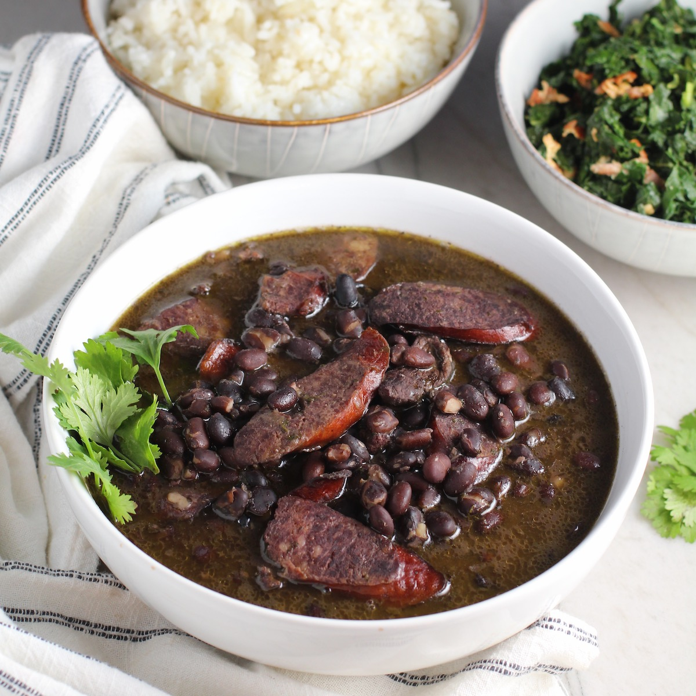

# Feijoada

*Brazil's national dish: black beans slow-cooked for hours with multiple cuts of salted, smoked and fresh pork (linguiça calabresa, paio sausage, smoked ribs, pork shoulder, ears, snout, trotters), served with white rice, sautéed collard greens (couve à mineira), farofa (toasted cassava flour), orange segments, and a glass of cold beer. The Saturday-afternoon family lunch that brings every Brazilian generation around one table.*

**Serves:** 8

**Prep Time:** 30 minutes (plus overnight bean soak)

**Cook Time:** 3-4 hours

## Overview
Feijoada is Brazil's national dish, eaten across all regions but particularly anchored in Rio de Janeiro, where the Saturday-lunch feijoada is a near-sacred family ritual. The dish has Portuguese colonial roots (Portugal's own feijoada uses white beans and Iberian cured meats) but in Brazil it transformed into a black-bean stew with African and Amerindian influences: dried beef, salt-cured pork, and the accompanying farofa (toasted cassava flour) of indigenous origin. Dried black beans are soaked overnight, then slow-cooked for hours with a parade of pork cuts (carne seca; smoked linguiça calabresa; paio sausage; smoked pork ribs; fresh pork shoulder; sometimes ears, snout and trotters for collagen and depth). After three or four hours the meat falls apart, the beans absorb the smoke, salt and pork-fat richness, and the broth turns thick and deep black-brown. The Saturday plate is white rice, couve à mineira (sautéed collards), farofa, sliced orange segments to cut the richness, a sprinkle of bright sliced raw onion, and an ice-cold beer or caipirinha.

## Ingredients

### Beans and pork
- 500 g dried black beans (soaked overnight)
- 300 g carne seca (Brazilian salted dried beef; or substitute with salt-cured beef brisket; rinse well before using)
- 250 g linguiça calabresa (smoked Portuguese-style sausage)
- 250 g paio sausage (or smoked Polish kielbasa as substitute)
- 500 g smoked pork ribs (slabs of smoked spare ribs, cut into individual ribs)
- 500 g fresh pork shoulder (cubed 4 cm)
- 200 g smoked bacon (in one piece, cubed)
- Optional: 1 pig's ear (cleaned, blanched) + 1 pig's snout + 2 trotters - these add collagen and authenticity; skip if squeamish

### Aromatics
- 2 large onions (finely diced)
- 8 garlic cloves (finely chopped)
- 4 bay leaves
- 1 teaspoon ground cumin
- 1 teaspoon dried oregano
- 1 teaspoon coarsely cracked black pepper
- 2 tablespoons olive oil
- 1 small chilli (optional, mild)

### To serve (essential accompaniments)
- 600 g white long-grain rice (cooked)
- 1 bunch couve à mineira (collard greens), finely shredded and sautéed with garlic and bacon fat
- 200 g farofa (toasted cassava flour with bacon and onion - see [farofa recipe](side-dishes/farofa.md))
- 2 oranges (peeled and segmented)
- 1 small red onion (very thinly sliced)
- A bottle of pinga (cachaça) or several cold beers

## Method

### Stage 1 - Prep the cured meats (the day before / morning of)
1. The carne seca (salted dried beef) needs desalting: rinse very thoroughly under cold water; soak in cold water 4-6 hours, changing the water 2-3 times. Drain.
2. If using pig's ear, trotters, or snout: blanch in boiling water for 10 minutes; drain; rinse; reserve.
3. Slice all sausages (linguiça calabresa, paio) into 2 cm slices.
4. Cut the pork shoulder into 4 cm cubes.
5. Cut the smoked bacon into 2 cm cubes.

### Stage 2 - Drain and rinse the beans
1. Drain the soaked black beans; rinse well.

### Stage 3 - Brown the meats (in batches)
1. Heat a large heavy stockpot (8+ litres) over medium-high heat with the olive oil.
2. Brown the fresh pork shoulder cubes in batches till deeply golden on all sides (about 5 minutes per batch).
3. Set aside.
4. Brown the bacon, linguiça, and paio (about 5 minutes); the fat will render and flavour the pot. Don't worry if they go slightly dark.
5. Set the meats aside on a plate.

### Stage 4 - Sweat the aromatics
1. In the same pot, in the rendered fat, add the diced onion.
2. Cook 8-10 minutes till soft and golden.
3. Add the garlic; cook 1 minute more.
4. Add the bay leaves, cumin, oregano, and black pepper.
5. Stir 30 seconds till fragrant.

### Stage 5 - Combine and simmer
1. Return all the browned meats to the pot.
2. Add the carne seca, smoked ribs, and (if using) the pig parts.
3. Add the drained beans.
4. Cover with 3 litres of cold water - the level should be 5 cm above the contents.
5. Bring to a gentle simmer (don't boil hard; you want low slow cooking).
6. Reduce heat; cover with the lid ajar.

### Stage 6 - Slow cook
1. Simmer 3-4 hours, stirring occasionally with a wooden spoon, till:
   - The beans are very tender and creamy
   - The meat is falling apart
   - The broth has thickened to a thick mahogany-brown sauce
2. Top up with water if needed; the consistency should be like a thick stew, not a soup.

### Stage 7 - Finish
1. Taste; adjust salt (the cured meats provide most of the salt, but adjust).
2. Remove and discard the bay leaves.
3. For the canonical Brazilian texture: lift out about a cup of the beans, mash with a fork, and stir back in. This thickens the broth.

### Stage 8 - The accompaniments (made simultaneously)
1. Cook the rice.
2. Sauté the shredded collard greens in 2 tablespoons of bacon fat with 2 chopped garlic cloves over high heat for 2-3 minutes till bright green and just wilted; salt to taste.
3. Make or warm the farofa.
4. Peel and segment the oranges.
5. Slice the red onion very thin.

### Stage 9 - Serve
1. The Brazilian way: serve in a clay or earthenware pot in the centre of the table.
2. Each person takes a plate with a generous spoon of feijoada, a mound of rice, a small pile of collards, a spoonful of farofa, a few orange segments on the side, and a sprinkle of raw red onion over.
3. Eat with a glass of very cold beer (the canonical pairing) or a caipirinha.
4. Conversation around the table is mandatory; the lunch should last 2-3 hours.

## Notes
- **Variety of pork cuts is the key:** more variety = more depth. Don't reduce to just one type of pork.
- **Long slow simmer (3-4 hours):** undercooked feijoada has tough beans and meat. Don't rush.
- **Desalt the carne seca:** if you don't, the whole pot is over-salted.
- **All the accompaniments:** rice, collards, farofa, orange, raw onion - feijoada without the spread is incomplete.
- **Saturday lunch:** the canonical day in Brazil. Don't make for a quick Tuesday dinner; this is a slow Saturday affair.

## Variations
**Feijoada light (modern, less pork):** use only pork shoulder, smoked sausage, and bacon - lighter, more weeknight-friendly. Less authentic.
**Vegetarian feijoada:** swap all pork for smoked tofu, mushrooms, and ½ teaspoon liquid smoke; surprisingly satisfying. Brazilian vegetarian restaurants serve this.
**Feijão tropeiro variant:** the Minas Gerais version mixes beans with sausage, eggs, kale and farofa as a one-pan dish. Lighter than feijoada.
**Feijoada with cachaça reduction:** finish with 50 ml cachaça stirred in at the end; the alcohol burns off and leaves a smoky-rum note.
**Pressure cooker version:** use a pressure cooker (45 minutes high pressure) for a 90-minute total cook. Faster but lacks some depth.
**Smoked-paprika feijoada:** add 2 teaspoons smoked paprika in stage 4 - modernised, less traditional.
**Beef-only feijoada:** swap all pork for beef chuck, smoked beef sausage, and smoked beef ribs - for halal/non-pork eaters.

## Serving
At a Saturday-afternoon Brazilian family lunch (the canonical setting) · at a Rio de Janeiro botequim (corner restaurant) on Saturdays · at a Brazilian-Portuguese wedding lunch · at a Brazilian carnival party · at a Brazilian football-watching gathering · at a Brazilian birthday celebration · at home with friends for a long lazy weekend afternoon · at a New Year's Day brunch.

## Storage
- Refrigerates 4 days; the flavour improves over the first 2 days.
- Freezes 3 months; defrost overnight in the fridge before reheating.
- Reheat gently with a splash of water if too thick.
- Leftover feijoada makes excellent burrito or empanada filling.
- The beans, once cooked, can be used as a base for other Brazilian bean dishes (caldo de feijão soup, feijão tropeiro).
