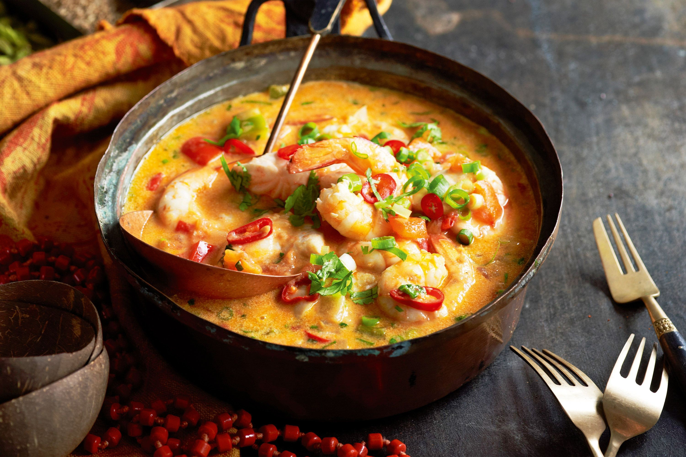

# Moqueca (Bahian Fish Stew)

*Brazil's spectacular Bahian fish stew: firm white fish gently cooked in a stew of tomatoes, onions, bell peppers, coriander, garlic, lime, coconut milk and a generous slug of dendê (red palm oil), served bubbling in a clay panela with white rice and farofa. The signature dish of Salvador, Bahia; one of Brazil's most colourful and most distinctly African-Brazilian dishes.*

**Serves:** 4-6

**Prep Time:** 20 minutes (plus 20 minutes marinade)

**Cook Time:** 25 minutes

## Overview
Moqueca is a Bahian fish stew with deep African roots. The name comes from the indigenous Tupi word pokeka (to cook by wrapping in leaves), and the dish was adapted over centuries by enslaved African cooks in Bahia who introduced the West African use of palm oil (dendê) and coconut milk. The result is the traditional Bahian dish, distinctively orange-red from the dendê, intensely fragrant with coriander and lime, and unmistakably West African in character. Firm white fish (snapper, grouper, halibut, monkfish, or in Brazil garoupa or pintado) is marinated briefly in lime, salt, garlic and coriander, then layered in a clay pot (the traditional panela de barro) over a base of sweated onion, sliced bell peppers, fresh tomato, garlic and coriander. Coconut milk and dendê go in last; the pot simmers gently (never boils) till the fish is just set and the broth turns thick and red-orange. Served in the same panela it cooked in, with white rice, farofa, pirão (a thick fish-stock sauce thickened with cassava flour) and a cold beer.

## Ingredients

### Fish marinade
- 800 g firm white fish fillets (snapper, grouper, halibut, monkfish; skin-on if possible)
- Juice of 2 limes
- 4 garlic cloves (finely chopped)
- 1 teaspoon fine sea salt
- 1 teaspoon coarsely ground black pepper
- 2 tablespoons chopped fresh coriander

### Moqueca base
- 3 tablespoons dendê oil (red palm oil; available at Brazilian and West African shops; non-negotiable for authentic Bahian moqueca)
- 2 large onions (sliced thin into half-moons)
- 1 red bell pepper (sliced into thin strips)
- 1 green bell pepper (sliced into thin strips)
- 1 yellow bell pepper (sliced into thin strips)
- 4 large ripe tomatoes (sliced into 1 cm slices)
- 8 garlic cloves (chopped)
- 1 small red chilli (sliced thin)
- 1 large bunch fresh coriander (about 80 g - both stems and leaves)
- 400 ml full-fat coconut milk
- 1 teaspoon fine sea salt
- A few squeezes of lime

### To serve
- 600 g white long-grain rice (cooked)
- A small bowl of farofa
- Lime wedges
- A cold bottle of Brazilian beer (Brahma, Antarctica)
- A small bowl of pirão sauce (optional; see notes)

## Method

### Stage 1 - Marinate the fish (20 minutes)
1. In a shallow dish, combine the lime juice, chopped garlic, salt, pepper, and 2 tablespoons of chopped coriander.
2. Add the fish fillets; turn to coat.
3. Cover; refrigerate 20 minutes (don't go longer; the lime starts to "cook" the fish).

### Stage 2 - Prep the vegetables
1. Slice the onions, bell peppers, and tomatoes into roughly uniform thin slices (5 mm thick).
2. Chop the garlic.
3. Chop the coriander, separating stems (finely chopped) from leaves (left whole).

### Stage 3 - Build the moqueca (layer in the pot)
1. Place a heavy clay pot or enamelled Dutch oven (4-litre capacity) over low heat.
2. Heat 2 tablespoons of dendê oil.
3. Spread half the sliced onions in a layer on the bottom.
4. Add half the bell peppers.
5. Add half the tomato slices.
6. Sprinkle half the chopped garlic over.
7. Sprinkle a third of the chopped coriander stems.

### Stage 4 - Add the fish
1. Lay the marinated fish fillets on top (in a single layer if possible).
2. Pour over any remaining marinade.

### Stage 5 - Top with the second layer
1. Layer the remaining onion, peppers, tomatoes, garlic, and coriander stems over the fish.

### Stage 6 - Add the liquid
1. Pour the coconut milk evenly over the top.
2. Drizzle the remaining 1 tablespoon dendê oil.
3. Add the sliced chilli.
4. Scatter half the coriander leaves over.
5. Add ½ teaspoon salt.

### Stage 7 - Simmer
1. Cover the pot tightly with a lid.
2. Bring to a gentle simmer over medium-low heat.
3. DO NOT boil; the fish overcooks quickly.
4. Simmer 15-20 minutes (the time depends on the fish thickness - test at 15 minutes; the fish should be just flaking with a fork but still tender).
5. The dendê oil and coconut milk will combine into a beautiful red-orange broth.

### Stage 8 - Finish
1. Squeeze a final lime over the dish.
2. Taste the broth; adjust salt.
3. Scatter the remaining coriander leaves over.
4. Let stand 2 minutes off the heat.

### Stage 9 - Serve
1. Serve directly from the pot (the traditional Brazilian way).
2. Each diner spoons a portion of fish with its broth onto a plate of white rice.
3. Add a side of farofa and a wedge of lime.
4. Pirão (optional): thicken a ladle of the moqueca broth with 2 tablespoons of cassava flour; serve as a separate sauce.
5. Drink cold beer alongside.

## Notes
- **Dendê (red palm oil) is non-negotiable:** without it, the moqueca is just a fish stew. Available at Brazilian markets, African shops, or online. Don't substitute with regular palm oil (which is processed and pale).
- **Clay pot is traditional:** the traditional Bahian "panela de barro" gives the dish a slightly smoky-earthy note. Enamelled Dutch oven works fine if you don't have one.
- **Gentle simmer, never boil:** fish overcooks fast. Low heat, lid on.
- **Marinade only 20 minutes:** longer and the lime starts to "cook" the fish (ceviche territory).
- **Layer, don't stir:** the dish is built in layers and gently simmered; vigorous stirring would break up the fish.

## Variations
**Moqueca capixaba (Espírito Santo state):** swap the coconut milk and dendê for olive oil and tomato base. Lighter, more Portuguese-influenced.
**Shrimp moqueca:** swap fish for 800 g large prawns (shell-on); reduce cooking time to 8-10 minutes.
**Mixed seafood moqueca:** combine fish + prawns + squid + scallops; layered moqueca with multiple seafoods.
**Crab moqueca (caranguejo):** swap fish for crab claws - coastal Bahian variant.
**Mussel moqueca:** swap fish for mussels - fast (8 minutes cooking).
**Vegetarian moqueca:** swap fish for hearts of palm + chunks of plantain + chickpeas - surprising and excellent.
**Moqueca de ovos:** swap fish for eggs poached in the moqueca broth.
**Moqueca de banana (sweet variant):** with plantains and palm hearts instead of fish - Bahian street food.

## Serving
At a Salvador (Bahia) beachfront restaurant (the traditional setting) · at a Brazilian Sunday family lunch in any northeast city · at a Brazilian dinner party in São Paulo or Rio · at a Bahian Carnival party · at a Brazilian-themed dinner abroad as a stunning showpiece · at home with friends and a bottle of Brazilian beer.

## Storage
- Refrigerates 2 days (the fish gets slightly less tender on day 2; the broth is even better).
- Don't freeze (the fish texture suffers).
- Leftover moqueca makes excellent fish-stew sandwiches the next day.
- The base sauce (without fish) freezes well 3 months; add fresh fish when reheating.
- Pirão sauce (made from the broth) refrigerates 2 days.
