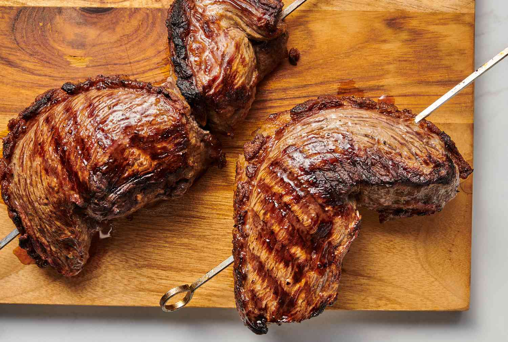

# Picanha (Top-Sirloin Cap Steak)

*Brazil's prince of cuts: the top-sirloin cap (with its prized fat layer intact), salted heavily on the fat side, skewered on a long churrasco sword, grilled over hot coals till the fat cap renders and crisps, and sliced thin against the grain at the table. The dish that defines the Brazilian churrasco; the cut that every Brazilian gaucho swears by.*

**Serves:** 6

**Prep Time:** 10 minutes

**Cook Time:** 15-20 minutes

## Overview
Picanha is the Brazilian gaucho tradition's most prized cut of beef: the top-sirloin cap, the triangular muscle on top of the sirloin with its thick layer of natural fat still attached. In Brazil picanha is THE steak; it turns up at every churrasco, every churrascaria, every gaucho weekend across Rio Grande do Sul. The cut goes on whole with the fat cap intact, salted heavily on the fat side with coarse rock salt (just salt; no marinade, no garlic; this is sacred), folded into a C-shape with the fat on the outside and skewered onto a long churrasco sword. Grilled over hot coals till the fat renders and crisps and the meat develops a deep mahogany crust. Sliced thin against the grain at the table, each slice carries a strip of crisp fat and a strip of medium-rare beef. Served plainly: farofa, white rice, vinaigrette molho, and an ice-cold beer or caipirinha.

## Ingredients

### The picanha
- 1 whole picanha (top-sirloin cap), 1-1.2 kg, fat cap fully intact (3-5 mm thick fat layer)
- 3 tablespoons coarse rock salt (Brazilian "sal grosso"; or coarse sea salt)
- A drizzle of olive oil (very small amount, optional)

### Equipment
- A churrasco sword (the long flat metal skewer): if you don't have one, you can use a heavy steel skewer or just grill the picanha flat
- A grill with high heat, gas works, but charcoal is traditional

### Brazilian vinaigrette molho (the traditional relish)
- 3 ripe tomatoes (finely diced)
- 1 small white onion (finely diced)
- 1 small green bell pepper (finely diced; optional)
- A small bunch of fresh parsley (chopped)
- A small bunch of fresh coriander (chopped, optional)
- 4 tablespoons olive oil
- 4 tablespoons red wine vinegar
- 1 teaspoon fine sea salt
- 1 teaspoon freshly ground black pepper

### To serve
- 600 g white long-grain rice (cooked)
- 200 g farofa (toasted cassava flour)
- A bowl of black-bean stew (or feijão tropeiro)
- A bottle of Brazilian beer (Brahma, Antarctica)
- A pitcher of caipirinha alongside

## Method

### Stage 1 - Prep the picanha
1. Take the picanha out of the fridge 30 minutes before cooking (bring to room temperature; cold meat doesn't sear properly).
2. Pat the meat dry on all sides with kitchen paper.
3. DO NOT trim the fat. Score the fat cap in a crosshatch pattern (just shallow - 5 mm deep, through the fat but not into the meat; this lets the fat render).

### Stage 2 - Salt the picanha
1. Place the picanha on a board fat-side-up.
2. Sprinkle the coarse rock salt generously over the fat side (the salt creates the crust and seasons through the rendering fat).
3. Press the salt into the fat with your fingers.
4. Don't salt the meat side directly; it draws moisture and gives a wet sear.
5. Optional: a very light drizzle of olive oil on the meat side.

### Stage 3 - Form into a "C" shape and skewer
1. Cut the picanha across the grain into 2-3 wedge-shaped pieces (each about 5-7 cm wide at the fat side).
2. Fold each piece into a "C" shape with the fat cap on the outside.
3. Skewer through the meat with the churrasco sword, locking the C shape (the fat cap is on the outside, facing outward).
4. If grilling flat (no sword), just lay the pieces fat-side-down to start.

### Stage 4 - Heat the grill
1. Heat your grill to MEDIUM-HIGH (about 250°C / 480°F).
2. Charcoal: the coals should be glowing white-grey with no flames.
3. The grill should be hot enough that you can hold your hand over it for only 2-3 seconds.

### Stage 5 - Grill the picanha
1. Place the picanha on the grill FAT-SIDE-DOWN first.
2. Cook 6-8 minutes; the fat cap will render, drip, and the surface will turn deeply brown and crisp.
3. The renderings will catch fire briefly; this is fine (don't move the meat).
4. Turn so the meat side faces down.
5. Cook 6-8 minutes; the meat develops a beautiful mahogany crust.
6. For medium-rare picanha (the traditional Brazilian doneness), the internal temperature should reach 50-55°C (test with a probe in the centre of the meat).
7. Remove from the grill.

### Stage 6 - Rest
1. Lift off the skewer (or off the grill).
2. Place on a board; tent loosely with foil.
3. Rest 8-10 minutes (essential, the juices redistribute).

### Stage 7 - Make the molho
1. Combine the diced tomatoes, onion, green pepper (if using), parsley, coriander, olive oil, vinegar, salt, and pepper in a bowl.
2. Stir; taste; adjust acid and salt.
3. Let sit 15 minutes for flavours to marry.

### Stage 8 - Slice and serve
1. Place the rested picanha on a wooden board.
2. Slice ACROSS THE GRAIN (perpendicular to the muscle fibres) into 5 mm thick slices.
3. Each slice should show a strip of crisp fat at the top and pink-red beef beneath.
4. Plate with white rice, farofa, a spoon of black bean stew, and a generous dollop of the molho vinaigrette.
5. Drink very cold beer alongside.

## Notes
- **Buy fresh picanha with fat cap intact:** a proper butcher's cut. Many supermarkets sell trimmed sirloin labeled as picanha, this is not the same. Ask your butcher.
- **Salt the fat side only:** the rendering fat carries the salt into the meat. Salting the meat side draws moisture.
- **Score the fat cap:** the crosshatch lets the fat render properly without bunching up.
- **Sear the fat side first:** the rendering fat creates the cooking medium for the rest of the cook.
- **Slice against the grain:** crucial for tenderness. The muscle fibres are long; slicing across them shortens the chew.
- **Medium-rare is traditional:** 50-55°C internal temperature. Don't cook beyond medium; you'll dry the fat-crust magic out.

## Variations
**Picanha steaks (instead of whole cut):** slice the picanha into 2 cm thick "steaks" before grilling, each steak gets its own fat cap. Pan-sear or grill 4 minutes per side.
**With chimichurri (Argentine-Brazilian crossover):** swap the molho for chimichurri sauce, Argentine influence.
**Picanha and provoleta:** grill provolone cheese alongside the picanha (with oregano and chilli): classic Brazilian sides.
**Espeto picanha (street-food version):** small chunks of picanha on bamboo skewers, charcoal-grilled at Brazilian markets and beachfront stalls.
**Pan-seared picanha:** if you don't have a grill, sear in a screaming-hot cast-iron pan with the fat side first; same technique.
**Picanha sandwich:** sliced grilled picanha in a fresh bread roll with chimichurri or molho, the classic Brazilian-Uruguayan street food.

## Serving
At a Brazilian churrasco (the traditional setting) · at a Rio Grande do Sul gaucho ranch (the original picanha territory) · at a Brazilian steakhouse (churrascaria) anywhere in the world · at a Brazilian World Cup viewing party · at a Brazilian wedding reception · at home for a Saturday family barbecue · alongside cold beer and football on TV.

## Storage
- Cooked picanha refrigerates 3 days; eat cold sliced or reheat gently.
- Leftover sliced picanha makes excellent sandwiches with chimichurri or molho.
- The fat cap rendered and saved is excellent for roasting potatoes.
- Don't freeze the cooked meat (texture suffers).
- Raw picanha freezes well wrapped in butcher paper + cling film, 6 months.
