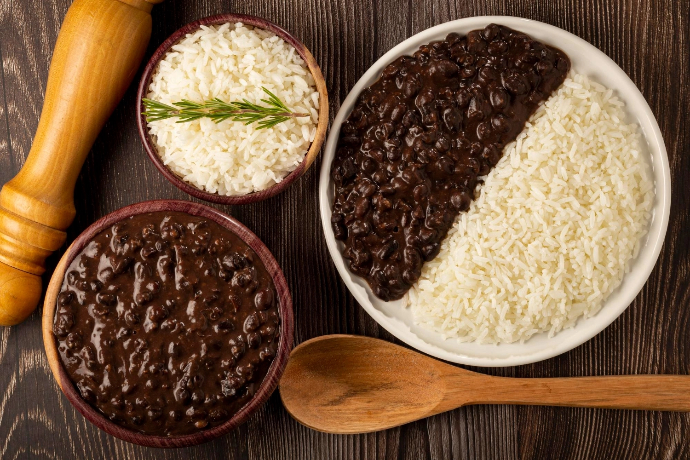

# Arroz com Feijão (Brazilian Rice and Beans)

*Brazil's daily staple: long-grain white rice cooked with garlic and onion, and a separate pot of black or brown beans cooked with onion, garlic and bay leaf, both served together on the same plate. The dish that every Brazilian eats every day of their life; the canonical Brazilian breakfast, lunch, and dinner; the symbol of "comfort" and "home" across the entire country.*

**Serves:** 6

**Prep Time:** 10 minutes (plus overnight bean soak)

**Cook Time:** 1 hour 30 minutes

## Overview
Arroz com feijão (rice and beans) is the Brazilian daily staple - eaten at lunch and often dinner across the country, by every Brazilian regardless of class, age, region, or political persuasion. The dish appears on the daily menu at every Brazilian "prato feito" (set lunch plate restaurant), every family kitchen, every government-subsidised "restaurante popular", and every Brazilian work canteen. It's not a side dish; it's the centre of the Brazilian plate, with proteins and salads arranged around it. The construction is two pots: (1) long-grain white rice toasted briefly in oil with garlic and onion, then cooked in water with salt; (2) dried black beans (or brown beans/feijão carioca in some regions) soaked overnight, then simmered with onion, garlic, bay leaf, and a piece of pork ham hock or smoked bacon for richness. The rice is fluffy, slightly garlicky, with each grain separate; the beans are creamy with a thick savoury broth. Served together on the same plate, side-by-side or with the beans ladled over the rice, with a piece of grilled meat or fried egg, a small green salad, and a sprinkle of farofa or hot sauce.

## Ingredients

### Rice
- 400 g long-grain white rice (parboiled or regular long-grain)
- 2 tablespoons olive oil (or sunflower oil)
- 1 small onion (finely diced)
- 3 garlic cloves (chopped)
- 800 ml boiling water
- 1 teaspoon fine sea salt

### Beans
- 300 g dried black beans OR feijão carioca (brown beans), soaked overnight
- 1 large onion (finely diced)
- 6 garlic cloves (chopped)
- 2 bay leaves
- 1 small piece of ham hock OR 100 g smoked bacon (cubed) OR 1 smoked sausage (sliced)
- 2 tablespoons olive oil
- 1 teaspoon fine sea salt (or to taste)
- 1 teaspoon coarsely ground black pepper
- 1 small green chilli (optional; for mild heat)

### To serve
- Sliced grilled meat, fried egg, or roast chicken
- A handful of green salad
- A spoon of farofa (see farofa recipe)
- A small dish of Brazilian hot sauce (molho de pimenta)
- A bowl of slow-cooked black beans (the "feijão tropeiro" variant)
- Optional: orange segments alongside

## Method

### Stage 1 - Soak the beans
1. The night before, place the beans in a large bowl.
2. Cover with cold water by 5 cm.
3. Leave at room temperature overnight (12+ hours).
4. Drain and rinse before using.

### Stage 2 - Cook the beans
1. Heat the olive oil in a large heavy pot over medium heat.
2. Add the diced onion; sweat 8-10 minutes till soft and golden.
3. Add the chopped garlic; cook 1 minute.
4. Add the cubed bacon or ham hock; brown 4-5 minutes.
5. Add the drained beans.
6. Add the bay leaves, salt, and pepper.
7. Pour over enough cold water to cover the beans by 4 cm.
8. Bring to a boil.
9. Reduce heat; simmer with the lid ajar for 1 hour to 1 hour 15 minutes.
10. Check periodically and top up with hot water as needed; the beans should always be just covered.
11. The beans are ready when they're tender and creamy, and the broth is thick.
12. Taste; adjust salt.

### Stage 3 - Cook the rice
1. Rinse the rice under cold water till the water runs clear (washes off excess starch).
2. Heat 2 tablespoons of oil in a heavy pot over medium heat.
3. Add the diced onion; sweat 4-5 minutes till translucent.
4. Add the chopped garlic; cook 30 seconds.
5. Add the rice; toast 2-3 minutes, stirring constantly, till the grains are slightly translucent at the edges and shiny with oil.
6. Pour over the 800 ml of boiling water.
7. Add the salt.
8. Stir once; reduce heat to LOW.
9. Cover with a tight-fitting lid.
10. Cook 12-15 minutes (don't lift the lid).
11. Remove from heat; let stand covered for 5 minutes.
12. Fluff with a fork.

### Stage 4 - The Brazilian "tempero" finishing (for the beans)
1. In a small pan, heat 1 tablespoon olive oil.
2. Add 2 chopped garlic cloves; cook 30 seconds.
3. Pour into the beans pot and stir; this is the canonical Brazilian finishing technique that lifts the beans.

### Stage 5 - Mash some of the beans for thickness
1. Use a slotted spoon to lift out 1 cup of cooked beans with their broth.
2. Mash with a fork.
3. Stir back into the bean pot.
4. This thickens the bean broth to the canonical creamy consistency.

### Stage 6 - Serve
1. On each plate, spoon a mound of rice on one side.
2. Spoon a generous ladle of beans (with their thick broth) next to it OR over the rice.
3. Add a piece of grilled meat, a fried egg, or a piece of roast chicken.
4. Add a small green salad.
5. Sprinkle a spoon of farofa over.
6. Add a few drops of Brazilian hot sauce to taste.
7. Pass hot sauce, farofa, and lime wedges at the table.

## Notes
- **Two pots:** rice and beans are cooked separately, combined on the plate.
- **Toast the rice:** the Brazilian technique. Don't skip the brief toast in oil with onion and garlic.
- **Mash a cup of beans:** the trick to creamy bean broth. Don't skip.
- **The pork element makes the beans:** ham hock, bacon, or smoked sausage. Vegetarian beans can be excellent but lose this signature note.
- **Serve generously:** Brazilians eat large portions of rice and beans. Not a side dish - the centre of the plate.

## Variations
**Arroz com feijão carioca (brown beans):** swap black beans for the lighter brown "carioca" beans - São Paulo / Minas Gerais standard.
**Feijão tropeiro (Minas Gerais):** stir cooked beans with bacon, sausage, kale, farofa, and a fried egg - one-pan version.
**Arroz à grega (Greek-style rice):** add diced carrot, raisins, and peas to the rice - the Brazilian Christmas variant.
**Arroz de festa (party rice):** rice + raisins + diced cooked ham + chopped olives - party version.
**Vegetarian arroz com feijão:** skip the bacon/ham; use a vegetable stock and a few drops of liquid smoke - Brazilian vegetarian restaurants make this well.
**Arroz com feijão preto (the Rio standard):** specifically black beans + white rice - the Rio version, as opposed to carioca beans elsewhere.
**Arroz tropical:** rice with chopped tropical fruit (pineapple, mango) - modern Brazilian variant.

## Serving
At every Brazilian lunch every day (the canonical setting; no exaggeration - Brazilians eat this every day of their life) · at every Brazilian "prato feito" set-lunch restaurant · at every Brazilian work canteen · at every Brazilian family table · at a Brazilian Sunday lunch alongside feijoada · at home as the centre of a Brazilian plate.

## Storage
- Both rice and beans refrigerate 4-5 days.
- Reheat with a splash of water for the rice and stock for the beans.
- Beans freeze 3 months; rice freezes 1 month (slightly less well).
- Leftover rice + beans + a fried egg + chopped sausage = the canonical Brazilian "arroz de carreteiro" (charger's rice - the gaucho cart-driver's one-pan dish).
- The flavour of the beans improves over the first 2 days as the broth tightens.
