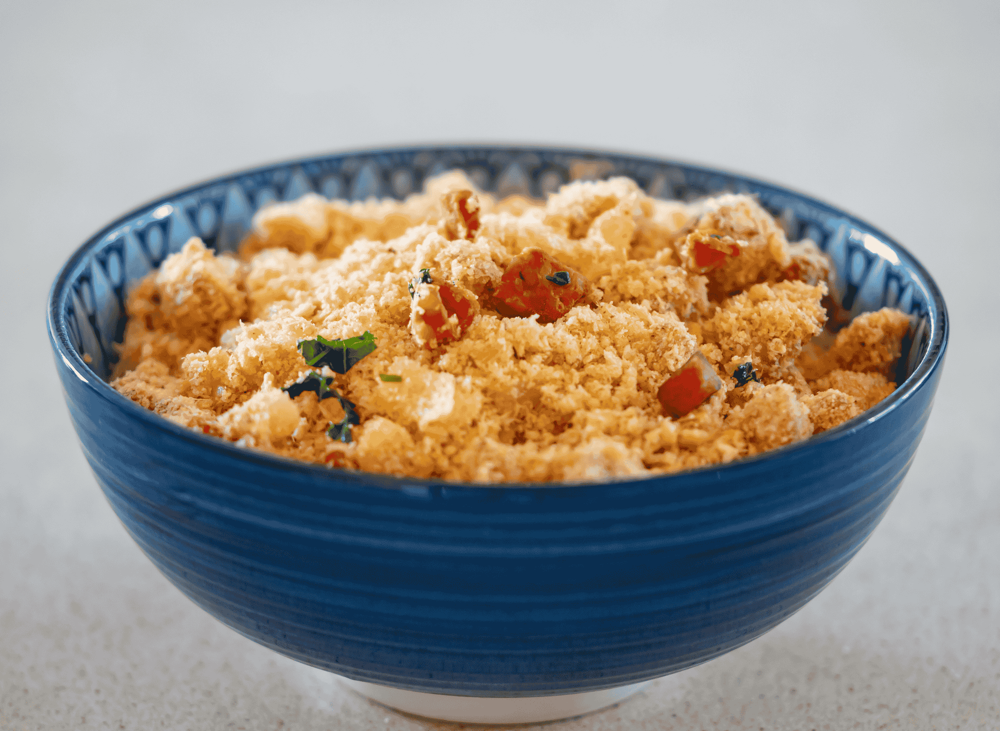

# Farofa

*Brazil's iconic toasted cassava flour: golden-brown granular cassava flour cooked in butter with diced bacon, onion, garlic, sometimes egg, sometimes banana, scattered over feijoada, picanha, and any Brazilian rice-and-bean plate as the canonical textural accent. The Brazilian answer to bread crumbs; the side that defines Brazilian dining.*

**Serves:** 8 (as a side)

**Prep Time:** 10 minutes

**Cook Time:** 15 minutes

## Overview
Farofa (the name comes from "farinha" - cassava flour - plus the diminutive "-ofa") is Brazil's most distinctively Brazilian side dish: granular cassava flour toasted in butter and pork fat with diced bacon, onion, garlic, and frequently chopped hard-boiled egg, ripe banana, or chopped olives. The base is "farinha de mandioca" (cassava flour) - also called "yuca flour" or "manioc flour" - which is a coarse, grainy flour made from dried cassava root. The dish is the canonical Brazilian textural accent: a small mound of farofa is sprinkled over every plate of feijoada, churrasco, picanha, frango com quiabo, and the daily rice-and-beans plate at family lunch. The texture is unique: dry, slightly crunchy, golden-brown, with diced bacon and crisp onion providing additional texture. Brazilians regard a meal without farofa on the table as incomplete.

## Ingredients

### For 8 portions
- 400 g coarse cassava flour ("farinha de mandioca crua" - yellow, granular; available at Brazilian and Latin American shops, online)
- 60 g butter (unsalted)
- 60 g smoked bacon (finely diced)
- 1 medium onion (finely diced)
- 4 garlic cloves (chopped)
- 1 teaspoon fine sea salt (or to taste)
- ½ teaspoon coarsely cracked black pepper

### Canonical add-ins (use any or all)
- 2 hard-boiled eggs (chopped) - adds richness
- 1 ripe banana (sliced into rounds) - adds sweet contrast
- 30 g raisins or chopped dried apricots - sweet variant
- 50 g chopped green olives - savoury variant
- A small handful of chopped fresh parsley (for garnish)
- A pinch of paprika (optional, for colour)

### To serve alongside
- Feijoada
- Picanha or any churrasco
- White rice + black beans
- Roast chicken or fish
- Any Brazilian rice-and-bean plate

## Method

### Stage 1 - Render the bacon
1. In a large heavy frying pan, melt 30 g of the butter over medium heat.
2. Add the diced bacon.
3. Cook 4-6 minutes till the bacon is crisp and the fat has rendered.

### Stage 2 - Sweat the onion and garlic
1. Add the diced onion to the pan; cook 6-8 minutes till soft and golden (not brown).
2. Add the chopped garlic; cook 1 minute.

### Stage 3 - Toast the cassava flour
1. Add the remaining 30 g butter to the pan.
2. Once melted, add the cassava flour all at once.
3. Stir thoroughly to coat every grain with the butter and pan fat.
4. Toast over medium-low heat, stirring constantly with a wooden spoon, for 5-8 minutes.
5. The flour will gradually deepen from pale yellow to golden brown.
6. Don't let it burn - keep stirring, keep moving.

### Stage 4 - Season
1. Add the salt and pepper.
2. Stir.
3. Taste; adjust seasoning.

### Stage 5 - Add the optional ingredients
1. If using chopped hard-boiled eggs, stir in now.
2. If using banana slices, stir in gently (don't break up the slices too much).
3. If using olives or raisins, stir in now.
4. Heat through 1 minute.

### Stage 6 - Serve
1. Transfer to a serving bowl.
2. Scatter chopped parsley over.
3. Optional: a pinch of paprika for colour.
4. Serve warm or at room temperature alongside any Brazilian main dish.
5. Diners spoon a small amount of farofa over their portion of food.

## Notes
- **Coarse cassava flour (farinha grossa):** not the fine white flour. The granular yellow type is canonical.
- **Toast gently:** golden, not brown. Burnt farofa is bitter.
- **Bacon and onion are minimum:** add eggs, banana, olives, or raisins to personalise.
- **Make ahead-friendly:** farofa keeps warm well; you can make it 30 minutes before serving and let it rest covered.
- **Add-ins matter:** the simplest farofa is bacon-onion-cassava; the canonical Brazilian Sunday-lunch version adds egg, banana, and parsley.

## Variations
**Farofa de banana:** add 2 ripe bananas (sliced) - the Bahian-Brazilian variant; sweet-savoury contrast.
**Farofa de ovo:** add 4 chopped hard-boiled eggs - protein-rich version.
**Farofa de vegetais (vegetarian):** skip the bacon; use olive oil and butter; add diced carrot, celery, and parsley.
**Farofa de azeite (with palm oil):** swap butter for dendê (red palm oil) - Bahian Afro-Brazilian variant; golden-orange.
**Farofa de queijo:** add 100 g grated mature Cheddar at the end - modern cheesy variant.
**Farofa para Natal (Christmas farofa):** add raisins, dried cranberries, chopped pecans, and a tablespoon of cinnamon-sugar - Christmas variant.
**Farofa com gorduras (rich version):** double the butter and bacon - extra-fat, party-style.
**Farofa carioca (Rio-style):** add chopped green olives and finely diced ham.

## Serving
At every Brazilian Sunday lunch (the canonical setting - never absent from the table) · alongside feijoada · alongside picanha or any churrasco · with rice and beans as the daily Brazilian plate · at a Brazilian birthday party · at a Brazilian wedding reception · at a Brazilian Christmas dinner (the festive farofa with raisins) · at home as a quick side for any roasted meat.

## Storage
- Refrigerates 5 days in a sealed container; reheats in a pan with a small extra knob of butter.
- Doesn't freeze well (the cassava flour gets clumpy on defrosting).
- The plain (no-add-ins) farofa keeps better than the add-in versions; eggs and banana shorten the life.
- Make fresh ideally; the texture is best within 24 hours of cooking.
- Stale farofa (3+ days old) is fine but slightly less crispy.
