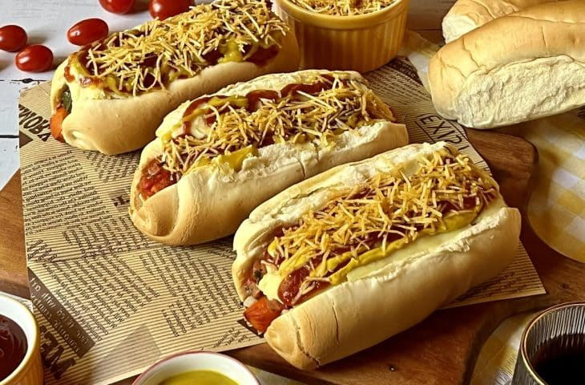

# Cachorro Quente Brasileiro (Brazilian Hot Dog)

*Brazil's loaded hot dog: a sausage simmered in a tomato-and-corn sauce, then tucked into a soft split roll and topped with pico de gallo, sweet corn, grated Parmesan, shredded carrot, mashed potato, diced ham, fresh coriander, and a heap of crispy shoestring fries (batata palha). The São Paulo and Rio street-food spectacle.*

**Serves:** 4

**Prep Time:** 25 minutes

**Cook Time:** 30 minutes

## Overview
The Brazilian cachorro quente (literally "hot dog") is one of South America's most maximalist street foods and a fixture of every São Paulo and Rio de Janeiro street stall, late-night kiosk and lanchonete. The construction is layered and extravagant: a sausage (traditionally a long mild salsicha, Brazilian pork-and-beef sausage similar to a Vienna sausage) first simmered in a tomato-and-vegetable braising sauce that flavours the dog from the outside. Then tucked into a soft white split roll alongside a heaped assortment of toppings stacked in a small tower: chopped pico de gallo (tomato + onion + cilantro), warm sweet corn kernels, grated Parmesan cheese, shredded raw carrot, a small dollop of warm mashed potato, diced ham (presunto), fresh chopped coriander, and finished with a generous fistful of crispy shoestring potato sticks (batata palha, the traditional Brazilian crunchy element). Eat with both hands and many napkins; the tower of toppings overflows the bun.

## Ingredients

### Sausages and braising sauce
- 4 long mild salsicha sausages (or any pork-and-beef hot dogs)
- 1 small onion (finely chopped)
- 4 garlic cloves (crushed)
- 1 small carrot (grated)
- 1 small green bell pepper (chopped)
- 2 tablespoons tomato paste
- 1 tin (400 g) chopped tomatoes
- 200 ml water
- 1 teaspoon paprika
- 1 teaspoon ground cumin
- 1 teaspoon dried oregano
- 1 ½ teaspoons fine sea salt
- ½ teaspoon ground black pepper
- 2 tablespoons vegetable oil

### Toppings (the cachorro-quente tower)
- 200 g sweet corn kernels (drained tin or frozen, warmed)
- 100 g grated Parmesan
- 1 medium carrot (grated raw)
- 400 g warm mashed potato (made simply with butter, milk, salt)
- 150 g diced ham (presunto cozido)
- 4 large tomatoes (chopped, for pico de gallo)
- 1 small red onion (chopped, for pico de gallo)
- 1 small bunch fresh coriander (chopped)
- Juice of 1 lime (for pico de gallo)
- 1 teaspoon fine sea salt (for pico de gallo)
- 200 g batata palha (Brazilian crispy shoestring potato sticks; substitute with crushed kettle chips if unavailable)

### Sauces (the traditional Brazilian zigzags)
- 4 tablespoons mayonnaise
- 4 tablespoons ketchup
- 4 tablespoons yellow mustard

### Buns
- 4 large soft white split rolls (about 18cm; longer and wider than standard hot-dog buns)

### To serve
- A cold Guaraná Antarctica or a Brazilian beer (Brahma, Skol)
- A side of plain feijão (beans) for completeness, or just call it a meal in itself

## Method

### Stage 1 - Make pico de gallo
1. Mix chopped tomato, red onion, lime juice, salt, half the coriander.
2. Set aside.

### Stage 2 - Cook the braising sauce and sausages
1. Heat oil in a wide pan over medium heat.
2. Add chopped onion; cook 6 minutes till soft.
3. Add garlic; cook 30 seconds.
4. Stir in grated carrot, chopped bell pepper; cook 5 minutes.
5. Add tomato paste; cook 1 minute.
6. Add chopped tomatoes, water, paprika, cumin, oregano, salt, pepper.
7. Simmer 8 minutes till saucy.
8. Add the sausages to the sauce; simmer gently 8-10 minutes (the sausages absorb the tomato-vegetable flavour).
9. Lift out the sausages; keep the sauce simmering on low.

### Stage 3 - Warm the mashed potato
1. If not freshly made: warm the prepared mashed potato in a small pan with a splash of milk and a knob of butter; mix till silky.

### Stage 4 - Toast the rolls
1. Briefly toast the cut rolls 60 seconds in a dry pan or under a hot grill till golden inside.

### Stage 5 - Build the cachorro quente
1. Place a warm sausage in each roll.
2. Spoon some of the braising sauce over the sausage (let it pool slightly).
3. A small spoonful of warm mashed potato alongside the sausage.
4. A spoon of pico de gallo across the dog.
5. A scatter of sweet corn kernels.
6. A scatter of diced ham.
7. A scatter of grated raw carrot.
8. A small heap of fresh chopped coriander.
9. Stripes of mayo, ketchup, and mustard zigzagged across the top.
10. A generous heap of crispy batata palha piled on top (it should rise above the bun like a hairdo).
11. A final dusting of grated Parmesan cheese.

### Stage 6 - Serve immediately
1. Wrap in waxed paper from the bottom up to hold the structure.
2. Eat with two hands and many napkins.
3. Cold beer or Guaraná.

## Notes
- **Simmer the sausage in tomato sauce:** the Brazilian flavour signature; the sausage absorbs the sauce.
- **Crispy batata palha:** non-negotiable. The crunch on top is the texture signature.
- **Both warm and cold toppings together:** the layered hot-cold contrast is the dish.
- **Tower of toppings:** the visual signature. Don't be restrained.

## Variations
**Without mashed potato:** lighter version; popular in Rio.
**With grated mozzarella:** added with the Parmesan.
**With pickled jalapeños:** for heat.
**With cream-cheese stripe:** spread inside the bun before the sausage.
**Spicier:** add a Brazilian malagueta hot sauce on top.

## Serving
At a São Paulo street stall after midnight; at a Rio lanchonete; at a Brazilian birthday party as part of the buffet.

## Storage
- Braising sauce refrigerates 5 days; freezes 3 months.
- Cooked sausages refrigerate 4 days.
- Don't assemble in advance; the batata palha goes soggy fast.
