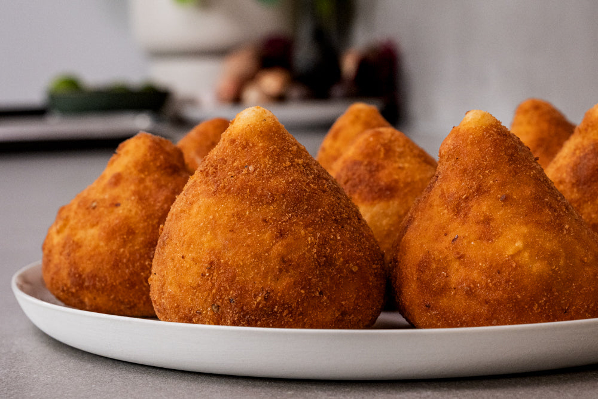

# Coxinha (Chicken-Stuffed Tear-Drops)

*Brazil's most beloved street-food snack: tear-drop-shaped balls of soft wheat-flour dough wrapped around a shredded chicken filling enriched with cream cheese (Catupiry), breaded, and deep-fried till deeply golden. The canonical Brazilian "snack" - sold from every street-corner padaria (bakery), every bus-station kiosk, every Brazilian bar, every childhood birthday party.*

**Serves:** Makes 24-30 coxinhas

**Prep Time:** 1 hour (plus 1 hour dough chill)

**Cook Time:** 30 minutes deep frying

## Overview
Coxinha (literally "little drumstick"; the shape mimics a chicken-leg-bone-and-meat) is Brazil's most universally beloved street-food snack. Walk into any Brazilian padaria (bakery-café) at any time of day and you'll see a glass case full of golden tear-drop-shaped fried balls - coxinha. They're sold at every bus station kiosk, every Brazilian bar (with cold beer), every children's birthday party (alongside brigadeiros, beijinhos, and pão de queijo), every Brazilian buffet, and they're eaten at all hours from breakfast to midnight. The construction is intricate but learnable: a thick batter dough (called "massa de coxinha") is made by simmering chicken stock with flour, butter and salt till it forms a stiff but pliable dough; the dough is cooled, then small portions are flattened in the palm of the hand, a spoonful of shredded chicken-and-cream-cheese filling is placed in the centre, and the dough is closed around it and shaped into a tear-drop with a pointed top (the "drumstick" shape). Coxinhas are then dipped in beaten egg, rolled in breadcrumbs (or fine farinha de rosca), and deep-fried till deeply golden. Three details: STOCK-BASED DOUGH (not water; the chicken stock gives flavour and texture), CATUPIRY OR CREAM CHEESE in the filling (the Brazilian signature creamy element), and SHAPE PROPERLY (the tear-drop with pointed top is canonical; round balls are pretenders).

## Ingredients

### Filling
- 600 g chicken thigh fillets (boneless, skinless)
- 1 litre chicken stock (homemade preferred; commercial stock works)
- 1 small onion (whole; for poaching)
- 2 garlic cloves (smashed)
- 1 bay leaf
- 2 tablespoons olive oil
- 1 small onion (finely diced)
- 4 garlic cloves (chopped)
- 1 chopped fresh tomato (peeled, seeded)
- 1 tablespoon tomato paste
- A small bunch of fresh parsley (chopped)
- 1 small bunch of spring onions (chopped)
- 200 g Catupiry cheese (Brazilian creamy cheese; or cream cheese mixed with a touch of grated mozzarella as substitute)
- 1 teaspoon fine sea salt
- 1 teaspoon coarsely ground black pepper

### Dough (massa de coxinha)
- 750 ml of the chicken stock used to poach the chicken
- 60 g butter
- 1 teaspoon fine sea salt
- 500 g plain flour

### Coating
- 3 large eggs (beaten)
- 250 g fine breadcrumbs (farinha de rosca; or panko)

### For frying
- 1.5 litres vegetable oil

### To serve
- Hot sauce (Brazilian molho de pimenta)
- A cold beer (the canonical Brazilian coxinha companion)
- A wedge of lime

## Method

### Stage 1 - Poach the chicken
1. In a large pot, combine the chicken thighs, chicken stock, whole onion, smashed garlic, and bay leaf.
2. Bring to a gentle simmer.
3. Cover; poach 25-30 minutes till the chicken is fully cooked and very tender.
4. Lift out the chicken; reserve the stock (you'll use 750 ml in the dough).
5. Strain the stock (discard onion, garlic, bay leaf).
6. Shred the chicken finely (use two forks or a stand mixer with the paddle attachment for ultra-fine shreds).

### Stage 2 - Make the filling
1. In a large frying pan, heat the olive oil over medium heat.
2. Add the diced onion; sweat 5 minutes till translucent.
3. Add the chopped garlic; cook 1 minute.
4. Add the chopped tomato and tomato paste; cook 5 minutes till the mixture is jammy.
5. Add the shredded chicken; stir to combine.
6. Add the chopped parsley and spring onions.
7. Stir in 100 g of the Catupiry (reserve the other 100 g for stuffing).
8. Season with salt and pepper.
9. Cook 2-3 minutes more.
10. Remove from heat; cool completely.

### Stage 3 - Make the dough
1. In a heavy-bottomed pot, bring the 750 ml chicken stock to a boil.
2. Add the butter and salt; stir till the butter melts.
3. Reduce heat to low.
4. Add all the flour at once.
5. Stir vigorously with a wooden spoon for 3-4 minutes till the dough comes together into a smooth, glossy mass that pulls away from the sides of the pot.
6. Remove from heat.
7. Cool slightly (10 minutes) on a buttered plate.
8. Knead briefly until smooth (about 1 minute).
9. Cover with cling film pressed onto the surface.
10. Refrigerate 30-60 minutes to firm up.

### Stage 4 - Shape the coxinhas
1. Divide the cooled dough into 24-30 equal portions (about 30 g each).
2. Take one portion; flatten in the palm of your hand into a 7-8 cm disc (about 5 mm thick).
3. Place a small spoonful of chicken filling in the centre.
4. Add a small dab of reserved Catupiry on top of the chicken (about ½ teaspoon).
5. Close the dough around the filling, pinching the top to seal completely.
6. Shape into a tear-drop with a pointed top (use your fingers to taper the top into a slight point).
7. Place on a tray.
8. Continue with the remaining dough.

### Stage 5 - Bread the coxinhas
1. Set up a station: beaten eggs in one bowl, breadcrumbs in another.
2. Dip each coxinha in beaten egg.
3. Roll in breadcrumbs to coat completely.
4. Press the crumbs to adhere; reform the tear-drop shape if it's lost.
5. Place breaded coxinhas on a tray.
6. Optional: refrigerate 30 minutes for the breading to set.

### Stage 6 - Fry
1. Heat the vegetable oil to 170°C in a deep pan or fryer.
2. Lower coxinhas in batches (don't overcrowd; 4-5 at a time depending on pan size).
3. Fry 4-5 minutes till deeply golden brown.
4. Turn occasionally to ensure even browning.
5. Lift out with a slotted spoon; drain on kitchen paper.

### Stage 7 - Serve
1. Serve warm; the crispy crust and hot filling are at their peak just out of the fryer.
2. Place on a serving plate.
3. Add lime wedges and a small dish of hot sauce.
4. Pair with cold Brazilian beer.

## Notes
- **Stock-based dough is essential:** water-based dough is bland. The chicken stock infuses the dough with flavour.
- **Catupiry or good cream cheese:** the creamy filling element that distinguishes Brazilian coxinha.
- **Tear-drop shape with pointed top:** the canonical Brazilian shape. Round balls aren't coxinhas.
- **Don't overload the filling:** a moderate filling is canonical. Overfilled coxinhas split during frying.
- **170°C is the right oil temperature:** higher and the outside burns before the inside heats; lower and the breading absorbs too much oil.

## Variations
**Coxinha de queijo (cheese coxinha):** swap the chicken for 100% Catupiry or cream cheese - the vegetarian version.
**Coxinha de pizza:** stuff with chopped pepperoni + mozzarella + tomato sauce - modern fusion variant.
**Coxinha doce (sweet coxinha):** make the dough with milk + a touch of sugar; stuff with chocolate sauce + caramelised condensed milk - Brazilian dessert variant.
**Coxinha de jaca (jackfruit):** swap chicken for shredded young jackfruit (a vegan alternative). Increasingly popular.
**Mini coxinhas:** make 50-60 small bite-size versions for canapés.
**Coxinha assada (baked):** brush with egg wash; bake at 200°C for 25 minutes instead of deep-frying. Less crispy but healthier.
**Coxinha de bacalhau:** swap chicken for desalted shredded cod - Portuguese-Brazilian fusion.
**Spicy coxinha:** add 1-2 finely chopped jalapeños to the chicken filling.

## Serving
At every Brazilian padaria (bakery-café) at any time of day (the canonical setting) · at every Brazilian children's birthday party · at every Brazilian bar with a cold beer · at every Brazilian bus station kiosk · at a Brazilian wedding canapé reception · at a Brazilian family Sunday lunch as a starter · at a Brazilian football match (the match-day food) · at home for a weekend afternoon treat.

## Storage
- Cooked coxinhas refrigerate 3 days; reheat in a 180°C oven for 10 minutes (don't microwave; crispy crust goes soft).
- Freeze breaded but uncooked coxinhas for 2 months; fry from frozen for 7-8 minutes at 165°C.
- Freeze cooked coxinhas (well-wrapped) for 1 month; reheat from frozen in a 180°C oven for 15 minutes.
- The chicken filling can be made 2-3 days ahead.
- The dough can be made 1 day ahead (refrigerated).
