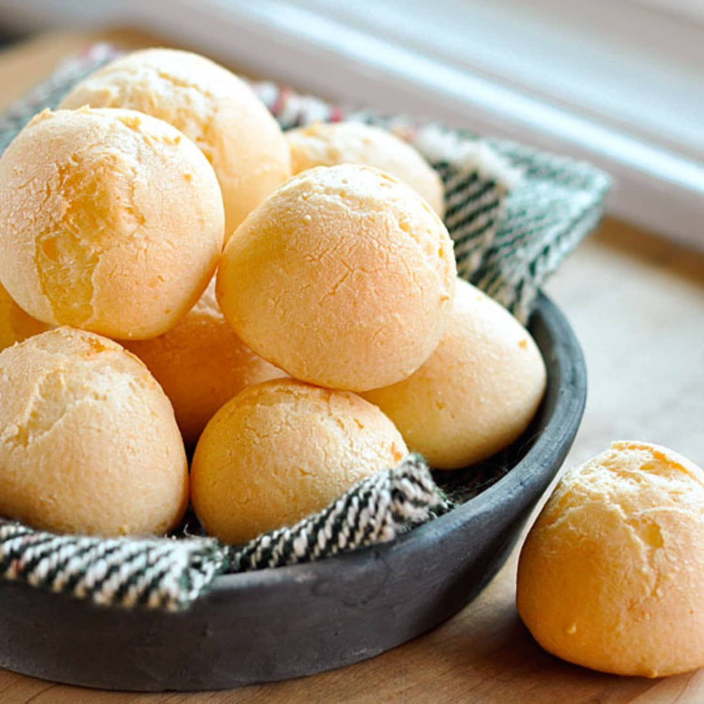

# Pão de Queijo (Brazilian Cheese Bread)

*Brazil's beloved cheese roll: small naturally gluten-free buns made from tapioca starch (polvilho), eggs, milk, oil and grated cheese, baked till crisp on the outside, gooey-stretchy on the inside. Native to Minas Gerais. Eaten warm with a coffee, at every Brazilian breakfast, every bakery counter, every birthday party.*

**Serves:** Makes 24-30 small rolls

**Prep Time:** 20 minutes

**Cook Time:** 20-25 minutes

## Overview
Pão de queijo (literally "bread of cheese") is Brazil's most universally beloved bread, and one of the only naturally gluten-free breads in the world's canon, made entirely from tapioca starch (polvilho) rather than wheat. It has roots in 18th-century Minas Gerais, where cassava starch was abundant, wheat was scarce and the local fresh Minas cheese was being made on every farm. Polvilho, milk, oil, egg, cheese and salt mixed and baked into small rolls became the canonical Mineiro bread. The exterior is crisp and sounds slightly hollow when tapped; the interior is dense, slightly stretchy, intensely cheese-flavoured and warm. Two types of tapioca starch matter: polvilho doce (sweet; gentler, fluffier) and polvilho azedo (sour; tangier, chewier). A 50/50 blend is canonical. The cheese is canonically queijo minas (fresh) or meia cura (semi-aged); mature cheddar or parmesan are widely used as substitutes outside Brazil.

## Ingredients

### For 24-30 small rolls
- 250 g polvilho doce (sweet tapioca starch; canonical; available at Brazilian shops or online)
- 250 g polvilho azedo (sour tapioca starch; canonical; the 50/50 blend is correct)
- 200 ml whole milk
- 100 ml sunflower oil (or olive oil)
- 1 teaspoon fine sea salt
- 2 large eggs (lightly beaten)
- 200 g grated cheese (canonical: queijo Minas meia cura or queijo Minas curado; substitutes: 50/50 mature Cheddar + Parmesan, or 100% Parmesan, or queso fresco)

### Equipment
- A baking tray lined with parchment
- A stand mixer (helpful but not essential; can be done by hand)

### Optional flavour boosts
- 1 tablespoon finely chopped fresh chives or parsley (for variety)
- A pinch of dried oregano (Mineiro variant)
- A small piece of butter on top of each roll just before baking (modern variant; gives glossy top)

## Method

### Stage 1 - Scald the milk and oil
1. In a small saucepan, combine the milk, oil, and salt.
2. Heat gently till just below boiling (you'll see small bubbles around the edge; not a rolling boil).
3. Don't let it boil over.

### Stage 2 - Combine with the polvilhos
1. Place both polvilhos (doce + azedo) in a large bowl or the bowl of a stand mixer.
2. Pour the hot milk-oil-salt over the polvilho.
3. Mix vigorously with a wooden spoon (or use the paddle attachment of a stand mixer on medium speed) for 2-3 minutes till the mixture is a sticky, glossy paste.
4. The polvilho will absorb the liquid and the mixture will be tacky to the touch.

### Stage 3 - Cool slightly
1. Let the mixture sit for 5-10 minutes to cool down to a warm-but-not-hot temperature (you'll want to add eggs without scrambling them).

### Stage 4 - Add the eggs
1. Add the beaten eggs to the cooled mixture.
2. Mix thoroughly (use the stand mixer if you have one; otherwise vigorous wooden-spoon work).
3. The dough will look ugly at first - clumpy and resistant.
4. Keep mixing till the eggs are fully incorporated and the dough is smooth-ish (about 2 minutes).

### Stage 5 - Add the cheese
1. Add the grated cheese.
2. Mix in thoroughly.
3. The dough should be very soft, sticky, and stretchy - not a typical bread dough.

### Stage 6 - Form into rolls
1. Preheat oven to 200°C / 180°C fan / 400°F.
2. Line a baking tray with parchment.
3. With a small ice-cream scoop or two spoons, drop rounded portions (about 3 cm balls; size of a large walnut) onto the lined tray, spaced about 4 cm apart.
4. The rolls will rise and spread during baking.
5. Don't try to roll into perfect balls; the sticky dough doesn't allow it and the natural rough shape is canonical.

### Stage 7 - Bake
1. Bake at 200°C for 20-25 minutes till deeply golden and the surface is cracked and crisp.
2. The rolls should rise to about 1.5-2× their original size.
3. The exterior should be crisp; the interior should be soft and slightly stretchy.

### Stage 8 - Serve
1. Serve immediately, warm from the oven (the canonical pão de queijo experience).
2. Tear open with the fingers (don't slice - the steam escapes).
3. Pair with a strong Brazilian coffee.
4. Optional: a small dish of cured Brazilian sausage alongside.

## Notes
- **Use both polvilhos:** the 50/50 sweet-sour blend gives the canonical texture. Pure sweet polvilho gives soft rolls; pure sour gives tangy chewy ones.
- **Scald the milk-oil first:** the hot liquid "cooks" the polvilho slightly, giving the right texture.
- **The dough is sticky:** don't try to flour it. Use a scoop or wet hands.
- **Use queijo Minas if possible:** the canonical cheese. Failing that, 50/50 Parmesan + mature Cheddar gives the closest approximation.
- **Eat warm:** pão de queijo's magic is the contrast between the crisp shell and the stretchy interior. Cold pão de queijo loses this entirely.

## Variations
**Pão de queijo com chia e linhaça (modern healthy variant):** add 2 tablespoons each of chia and linseed to the dough.
**Pão de queijo de tomate e manjericão:** add 2 tablespoons of tomato paste + chopped basil to the dough - Italian-Brazilian variant.
**Pão de queijo recheado (stuffed):** form into small discs, place a cube of mozzarella in the centre, close up - discover-the-cheese version.
**Pão de queijo doce (sweet):** swap savoury cheese for cream cheese + add 50 g sugar + ½ teaspoon cinnamon - modern dessert variant.
**Pão de queijo de presunto (with ham):** add 60 g finely diced ham - savoury filling.
**Pão de queijo de bacon:** add 60 g finely diced cooked bacon - smoky variant.
**Mini pão de queijo:** smaller rolls (1.5 cm balls) for cocktail parties - same recipe, smaller portions.
**Pão de queijo de massa preta (black cheese bread):** add 30 g charcoal powder for visual drama - modern dessert-bar variant.

## Serving
At every Brazilian breakfast (the canonical Brazilian morning bread) · at every Brazilian padaria with a coffee · at a Brazilian children's birthday party · at a Brazilian wedding canapé reception · at a Brazilian airport's coffee shop (the canonical Brazilian air-travel snack) · at a Brazilian afternoon coffee break · at a Brazilian-themed dinner abroad · at home as the perfect warm-from-the-oven Sunday-morning treat.

## Storage
- Best eaten same day, warm from the oven (the canonical experience).
- Refrigerates 2 days; reheat in a 180°C oven for 5-7 minutes (don't microwave; the texture becomes rubbery).
- Freeze (raw, formed but unbaked) for 3 months; bake from frozen for 30 minutes.
- Freeze cooked rolls for 1 month; reheat from frozen for 8-10 minutes at 180°C.
- Day-old pão de queijo split and toasted with butter is excellent for breakfast.
