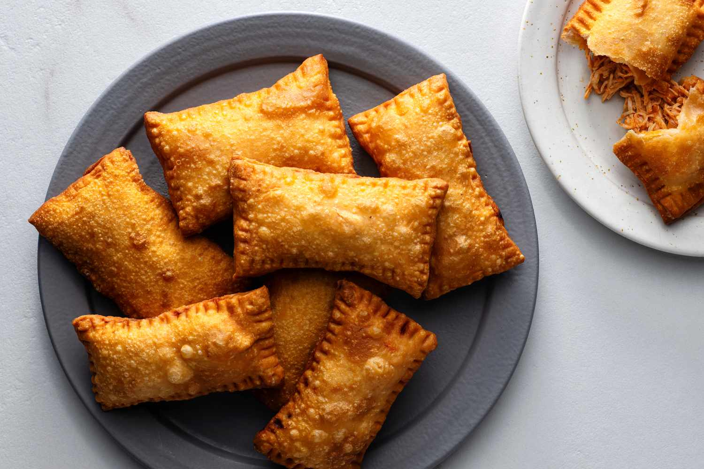

# Pastéis (Brazilian Fried Pastries)

*Brazil's most beloved street-food pastry: a thin rectangular pocket of pasta-like dough filled with seasoned meat, cheese, hearts of palm, or chicken-and-cream-cheese, sealed with a fork-press and deep-fried till deeply golden and crisply bubbled. Sold at every Brazilian street market, every Saturday-morning feira, every bus station, every neighbourhood pastel-shop. The Brazilian answer to a Cornish pasty crossed with a samosa crossed with a Chinese spring roll.*

**Serves:** Makes 12-16 large pastéis

**Prep Time:** 1 hour (plus 1 hour dough rest)

**Cook Time:** 20 minutes deep frying

## Overview
Pastéis (singular pastel) are Brazil's most iconic street-food pastries, traceable to Asian immigrant influences (Chinese and Japanese spring-roll wrappers adapted to local fillings) and developed into a uniquely Brazilian form in São Paulo's street markets and Asian neighbourhoods during the early 20th century. They are the heart of every feira (Saturday-morning street market), where the traditional Brazilian breakfast is a hot pastel and a glass of sugarcane juice (caldo de cana). Two parts: a thin pasta-like dough (flour, water, oil and a touch of cachaça or vinegar; the cachaça is the secret Brazilian touch that makes the surface bubble in the fryer), rolled extremely thin and cut into rectangles; and a filling (traditionally seasoned ground beef, ham-and-cheese, chicken-with-Catupiry, hearts of palm or shrimp), folded inside and sealed with a fork press. Deep-fried hot and fast till deeply golden and the dough has bubbled into characteristic crisp ridges. The result is a paper-thin, ultra-crisp, blistered exterior around a hot savoury filling.

## Ingredients

### Dough
- 500 g plain flour
- 1 teaspoon fine sea salt
- 250 ml warm water
- 4 tablespoons sunflower oil
- 1 tablespoon cachaça (or white vinegar as substitute; non-traditional but works)
- A pinch of caster sugar

### Beef filling (the most traditional; makes 12-14 pastéis worth)
- 500 g lean minced beef
- 2 tablespoons olive oil
- 1 small onion (finely diced)
- 4 garlic cloves (chopped)
- 1 chopped tomato (peeled, seeded)
- 1 tablespoon tomato paste
- 2 tablespoons finely chopped fresh parsley
- 1 small bunch of spring onions (chopped)
- 1 hard-boiled egg (chopped; optional, the Brazilian classic touch)
- 8 green olives (chopped; optional)
- 1 teaspoon fine sea salt
- 1 teaspoon coarsely ground black pepper
- ½ teaspoon ground cumin
- 1 teaspoon Brazilian sazon mix (or paprika + dried oregano)

### Alternative fillings
- **Ham and cheese:** 200 g sliced ham + 200 g mozzarella
- **Chicken with Catupiry:** 300 g cooked shredded chicken + 150 g Catupiry cheese (or cream cheese)
- **Hearts of palm (palmito):** 1 large tin hearts of palm (chopped) + 100 g cream cheese
- **Shrimp (camarão):** 300 g cooked shrimp + 100 g cream cheese + chopped parsley

### For frying
- 1.5 litres vegetable oil

### To serve
- Hot sauce (Brazilian molho de pimenta)
- A wedge of lime
- A glass of sugarcane juice (caldo de cana, the traditional Brazilian street-food pairing)
- A small bowl of mayonnaise (some Brazilians dip their pastel in mayo; less traditional but real)

## Method

### Stage 1 - Make the dough
1. In a large bowl, combine the flour and salt.
2. In a jug, mix the warm water, oil, cachaça, and sugar.
3. Pour into the flour; mix with a wooden spoon, then your hands, till a smooth elastic dough forms.
4. Knead 5 minutes till smooth and slightly tacky.
5. Cover with cling film; rest 1 hour at room temperature.

### Stage 2 - Make the beef filling
1. In a large pan, heat the olive oil over medium heat.
2. Add the minced beef; break up with a spoon and brown for 6-8 minutes till deeply caramelised.
3. Add the diced onion; cook 5 minutes till soft.
4. Add the garlic; cook 1 minute.
5. Add the chopped tomato and tomato paste; cook 3 minutes till the mixture is jammy.
6. Stir in the parsley, spring onions, hard-boiled egg, and olives (if using).
7. Season with salt, pepper, cumin, and sazon.
8. Cool completely (the filling must be cold or room temperature when assembling).

### Stage 3 - Roll the dough
1. Divide the rested dough into 4 equal portions.
2. On a lightly floured surface, roll one portion as THIN as possible, aim for 1 mm thickness, almost translucent.
3. The dough should be elastic and stretchy; use a pasta machine if you have one for the perfect thinness.
4. Cut into rectangles roughly 14 cm wide × 20 cm long.

### Stage 4 - Fill and shape
1. Place a portion of the cooled filling (about 2 heaped tablespoons) on one half of each rectangle, leaving a 2 cm border.
2. Brush the border with cold water.
3. Fold the empty half over the filling.
4. Press the edges firmly with your fingers to seal.
5. Press the edges again with the tines of a fork to crimp and seal completely.
6. Trim the edges if necessary with a knife to neaten.
7. Place finished pastéis on a tray; cover with a clean cloth.

### Stage 5 - Fry
1. Heat the vegetable oil to 180°C in a deep pan.
2. Lower 2-3 pastéis at a time into the hot oil.
3. Fry 90-120 seconds, the dough will bubble dramatically.
4. Turn once during cooking.
5. The pastéis should be deeply golden and crisply bubbled.
6. Lift out with a slotted spoon; drain on kitchen paper.

### Stage 6 - Serve
1. Serve immediately while crispy and piping hot.
2. Add lime wedges and a small dish of hot sauce.
3. Drink a glass of cold caldo de cana (sugarcane juice): the traditional Brazilian street-food pairing.
4. Eat with the hands; cut a small corner to let the steam out (the filling is volcanic).

## Notes
- **Ultra-thin dough:** the traditional pastel has paper-thin, blistered dough. Thicker dough gives a pasty, not a pastel.
- **The cachaça secret:** the small amount of cachaça (or vinegar) reacts during frying to give the traditional Brazilian bubbled exterior.
- **180°C is the right temperature:** too hot and the outside burns; too low and the dough absorbs oil.
- **Eat fresh:** pastéis are a "from-the-fryer-to-the-mouth" food. They lose their crispness within 10 minutes.
- **Cold filling when assembling:** hot filling melts the dough during shaping. Cool completely.

## Variations
**Pastel de queijo (cheese pastel):** filled with mozzarella + a few oregano leaves, the simplest and most universally loved.
**Pastel de carne (beef pastel):** the traditional variant; described above.
**Pastel de palmito (heart of palm):** filled with chopped hearts of palm + Catupiry, vegetarian standard.
**Pastel de camarão (shrimp pastel):** filled with cooked shrimp + Catupiry + spring onion, premium variant.
**Pastel de pizza:** filled with mozzarella + sliced tomato + oregano, modern Italian-Brazilian.
**Pastel de bacalhau (cod):** filled with desalted shredded cod + onion + parsley, Portuguese-Brazilian.
**Mini pastéis:** smaller rectangles (6×10 cm) for cocktail parties.
**Sweet pastéis (dessert):** filled with chocolate + banana + cinnamon-sugar, the sweet dessert variant.

## Serving
At a Brazilian Saturday-morning feira (street market) with a glass of caldo de cana (the traditional setting) · at a Brazilian bus station kiosk · at a São Paulo Brazilian street-food cart · at a Brazilian bar with cold beer · at a Brazilian children's birthday party · at a Brazilian wedding canapé reception · at home as a weekend treat with friends.

## Storage
- Best eaten same day; pastéis lose crispness within an hour.
- Freeze (raw, assembled) for 2 months; deep-fry from frozen at 170°C for 4-5 minutes.
- Refrigerate cooked pastéis 1 day; reheat in a 180°C oven for 5-7 minutes (don't microwave).
- The filling makes excellent next-day toast topping if you have leftovers.
- The dough can be made 1 day ahead (refrigerated).
