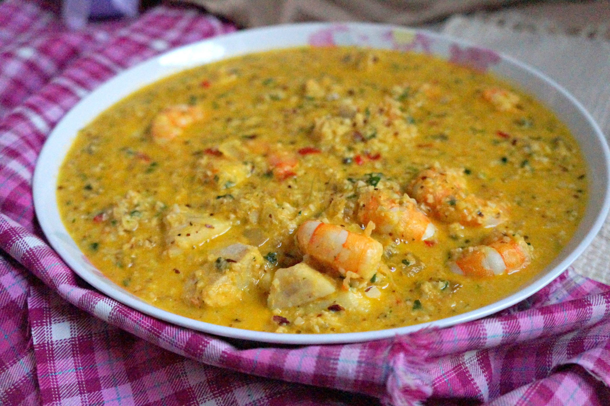

# Vatapá (Bahian Shrimp Stew with Bread, Palm Oil and Cashews)

*Bahia's most opulent African-Brazilian stew: dried shrimp, cashews, peanuts, ginger and onion are pounded into a paste, then cooked into a thick golden cream with bread, coconut milk and dendê oil. Whole fresh shrimp are folded in for the final cooking. Served over rice with farofa or stuffed inside the famous Bahian street food "acarajé" (black-eyed-pea fritters). One of the most distinctly African dishes in the Brazilian canon.*

**Serves:** 6

**Prep Time:** 30 minutes (plus 30 minutes shrimp soak)

**Cook Time:** 45 minutes

## Overview
Vatapá is one of Brazil's most opulent and most distinctly African dishes: a Bahian specialty with direct roots in West African cooking, brought to Brazil by enslaved African cooks who adapted their traditional dishes to local ingredients. The construction is complex. Dried shrimp are soaked then ground with raw cashews, raw peanuts, fresh ginger, onion and garlic into a thick paste (the vatapá base), which is cooked into a thick golden cream with stale bread (the thickener), coconut milk and dendê (red palm oil, which gives the dish its trademark golden-orange colour). Fresh prawns are folded in at the end, just till opaque. The result is a deeply rich, faintly sweet, intensely savoury cream-stew of remarkable depth. Vatapá appears in two contexts in Bahia: as a main over white rice with farofa, and as the filling for acarajé, the famous Bahian black-eyed-pea fritters sold from street stalls by baianas in their traditional white dresses, the iconic image of Salvador.

## Ingredients

### Vatapá base
- 80 g dried shrimp (small whole; soaked in warm water 30 minutes)
- 100 g raw cashews
- 100 g raw peanuts (or peanut butter as a substitute)
- 4 garlic cloves (chopped)
- 2 medium onions (chopped)
- 1 tablespoon grated fresh ginger
- 1 small chilli (optional)
- 1 teaspoon ground cumin
- 1 teaspoon ground coriander

### Cream
- 300 g stale white bread (crusts removed; torn into chunks; about 6 slices)
- 500 ml fish stock or chicken stock (warm)
- 400 ml full-fat coconut milk
- 4 tablespoons dendê oil (red palm oil)
- 2 tablespoons olive oil

### Fresh prawns
- 500 g raw large prawns (shell-off, deveined)
- 1 teaspoon fine sea salt
- 1 teaspoon coarsely cracked black pepper
- 2 garlic cloves (chopped)
- Juice of 1 lime

### To serve
- 600 g white long-grain rice (cooked)
- 200 g farofa
- Lime wedges
- Acarajé (optional; black-eyed pea fritters that get stuffed with vatapá - Brazilian street food)
- Cold Brazilian beer

## Method

### Stage 1 - Soak the dried shrimp
1. Place the dried shrimp in a bowl; cover with warm water.
2. Soak 30 minutes; drain (reserve a few tablespoons of the soaking liquid for flavour).

### Stage 2 - Soak the bread
1. Place the torn bread in a bowl.
2. Pour the warm stock over.
3. Let sit 10 minutes for the bread to absorb the liquid.

### Stage 3 - Make the vatapá paste
1. In a food processor, combine the soaked drained shrimp, cashews, peanuts, garlic, onion, ginger, chilli (if using), cumin, and ground coriander.
2. Pulse to a thick coarse paste.
3. Add a few tablespoons of the soaked-bread liquid; pulse again to combine.

### Stage 4 - Cook the paste
1. In a large heavy pan, heat the olive oil over medium heat.
2. Add the vatapá paste from the food processor.
3. Stir constantly; cook 8-10 minutes till the paste is fragrant, slightly browned, and the raw onion-garlic flavours have mellowed.

### Stage 5 - Combine with bread
1. Add the soaked bread (with its liquid) to the paste.
2. Stir thoroughly to combine.
3. Pour in the coconut milk.
4. Stir well till you have a thick velvety cream.
5. Simmer 10-15 minutes over low heat, stirring occasionally.
6. The cream should be thick enough to coat a spoon heavily; if too thick, add a little more stock; if too thin, simmer longer.

### Stage 6 - Add the dendê
1. Stir in the dendê oil; the cream turns a beautiful golden orange.
2. Taste; adjust salt.

### Stage 7 - Marinate and add the prawns
1. In a bowl, combine the raw prawns with the lime juice, salt, pepper, and chopped garlic.
2. Let sit 10 minutes.
3. Add the prawns to the simmering cream.
4. Stir gently; cook 5-7 minutes till the prawns are just opaque and curled.
5. Do NOT overcook.

### Stage 8 - Finish
1. Taste; adjust salt and lime.
2. Optional: drizzle a final teaspoon of dendê over for colour.
3. Stir in a handful of chopped fresh coriander.

### Stage 9 - Serve
1. Ladle over warm white rice in deep bowls.
2. Add a sprinkle of chopped coriander.
3. Serve a wedge of lime.
4. Pass farofa at the table (a spoonful over each portion).
5. Drink cold beer.

### Stage 10 - Variation: stuff into acarajé (street-food style)
1. Make acarajé: black-eyed peas are blended into a paste, formed into balls, deep-fried in dendê oil.
2. Split each fritter open and fill with vatapá, dried shrimp, vatapá sauce, and salsa.
3. The canonical Bahian street food, sold from streetside food stalls.

## Notes
- **Grind the base well:** the texture is everything. A coarse paste gives chunks (not bad); a fine paste gives a velvety cream (better).
- **Stale bread is the thickener:** fresh bread is too soft and gummy. Use day-old or older bread.
- **Dendê oil is non-negotiable:** without it, the dish has no African character.
- **Don't overcook the prawns:** 5-7 minutes in the simmering cream is enough.
- **Spice level is up to you:** Bahian vatapá ranges from mild to fiery. Add fresh malagueta chillies (or Scotch bonnets) to taste.

## Variations
**Vatapá de frango (chicken vatapá):** swap prawns for cubed chicken; cook chicken 15 minutes in the cream before serving.
**Vatapá de bacalhau (cod):** swap prawns for salt cod (desalted overnight) - Portuguese-Brazilian crossover.
**Vatapá nordestino (northeastern variant):** add 100 g grated coconut to the paste; gives extra coconut depth.
**Acarajé vatapá filling (street food):** smaller portions, served inside the fritters. The acarajé is the bigger production; the vatapá is the filling.
**Vatapá com siri (with crab):** swap prawns for crab claws or picked crab meat.
**Without bread (low-carb variant):** swap the bread for 200 g cooked cauliflower (mashed); the texture is different but the dish works.
**Vatapá pernambucano (Pernambuco variant):** uses tomato in the base; slightly redder than Bahian version.

## Serving
At a Salvador (Bahia) beachfront restaurant (the canonical setting) · at a Bahian wedding banquet · at a Brazilian Carnival celebration · at a Bahian street-food market with acarajé · at a Brazilian Sunday family lunch in the north-east · at a Brazilian special-occasion dinner abroad as a stunning showpiece · at home with rice, farofa, lime, and cold beer.

## Storage
- Refrigerates 2 days; the flavour deepens overnight.
- Reheat gently; if too thick, loosen with stock.
- Don't freeze (the prawn texture suffers).
- The vatapá cream (without prawns) freezes 1 month.
- Leftover vatapá stuffed into a pita or hot dog roll makes an excellent next-day lunch sandwich.
