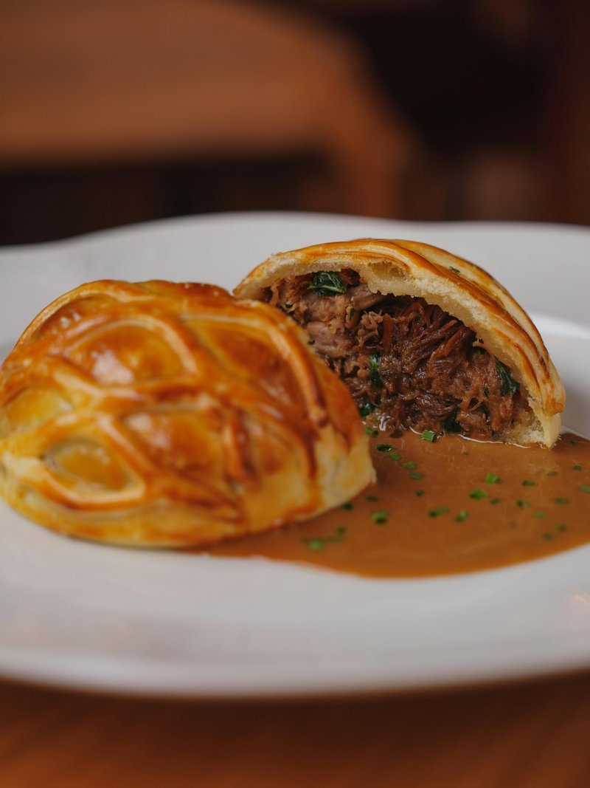

# Beef Wellington

*Britain's showpiece roast: a whole seared beef fillet slathered in mushroom duxelles and prosciutto, wrapped in puff pastry and baked till mahogany.*

**Serves:** 6

**Prep Time:** 45 minutes (plus 30 minutes resting)

**Cook Time:** 35-40 minutes

## Overview
The defining British dinner-party showpiece, somewhere between French haute cuisine and English roast tradition, made famous in the modern era by Gordon Ramsay even if the Iron Duke himself probably never ate it. You sear a centre-cut beef fillet hard for colour, smear it with English mustard, wrap it in a tight blanket of mushroom duxelles and prosciutto, then encase the lot in all-butter puff pastry and roast at high heat. The pastry insulates the beef so it cooks gently to medium-rare while the crust crisps to deep mahogany above. The one technical trick the recipe insists on is drying the duxelles thoroughly so the pastry stays crisp underneath rather than going soggy from leaking mushroom water. Sliced at the table into thick rosy rounds, with a red-wine jus and roasted root vegetables on the side, the kind of plate that makes the evening feel like a special occasion before anyone says it.

## Ingredients

### Beef
- 1 kg piece centre-cut beef fillet (chateaubriand)
- salt
- pepper
- 1 tablespoon vegetable oil
- 2 tablespoons English mustard

### Duxelles
- 500 g chestnut mushrooms (stalks included)
- 2 tablespoons unsalted butter
- 2 banana shallots (finely chopped)
- 2 garlic cloves (crushed)
- 1 tablespoon fresh thyme leaves
- 50 ml dry sherry (or Madeira)
- salt
- pepper

### To wrap and bake
- 8-10 slices prosciutto (about 100 g)
- 500 g all-butter puff pastry, chilled
- Plain flour for dusting
- 2 egg yolks beaten with 1 tablespoon water (egg wash)
- Flaky sea salt

## Method

### Stage 1 - Sear the beef
1. Pat the fillet dry with kitchen paper. Tie at 5 cm intervals with kitchen string to hold its shape.
1. Season generously with salt and pepper.
1. Heat the oil in a heavy pan over high heat until just smoking. Sear the fillet on every side (including the ends) for 1 minute each, until evenly browned.
1. Transfer to a plate and brush all over with the mustard while still warm.
1. Snip off the strings; refrigerate while you make the duxelles.

### Stage 2 - Make the duxelles
1. Pulse the mushrooms in a food processor in batches until finely chopped (almost a coarse paste).
1. Melt the butter in a large pan over medium heat. Add the shallots and cook for 5 minutes until soft.
1. Add the mushrooms, garlic and thyme. Season generously.
1. Cook for 15-20 minutes, stirring often, until all the liquid has evaporated and the mushrooms are dark and dry. This step is non-negotiable; wet duxelles will ruin the pastry.
1. Pour in the sherry and cook for 2 minutes more until completely dry. Spread on a tray to cool.

### Stage 3 - Wrap the beef
1. Lay a large sheet of cling film on the work surface. Arrange the prosciutto slices in an overlapping rectangle large enough to wrap the fillet.
1. Spread the cooled duxelles evenly over the prosciutto.
1. Place the fillet at one short end and use the cling film to roll it up tightly, twisting the ends like a sweet wrapper.
1. Refrigerate for at least 30 minutes (or up to 24 hours) to firm up.

### Stage 4 - Wrap in pastry
1. On a lightly floured surface, roll the puff pastry to a rectangle about 35 x 30 cm and 4 mm thick.
1. Unwrap the chilled fillet and place it at one long edge.
1. Brush the pastry edges with egg wash. Roll the fillet up, sealing the seam underneath. Trim the ends to neaten and crimp closed.
1. Transfer seam-side down to a baking tray lined with parchment.
1. Brush all over with egg wash. Score the top in a diagonal cross-hatch (cuts about 1 mm deep, just into the surface).
1. Refrigerate for 15 minutes while the oven heats.

### Stage 5 - Bake
1. Heat the oven to 220°C (200°C fan).
1. Brush the wellington with a second coat of egg wash and sprinkle with flaky salt.
1. Bake for 35 minutes for medium-rare (a probe in the centre should read 50°C; it'll climb to 54-55°C while resting).
1. Rest the wellington on a board for 10 minutes before slicing into 2-3 cm thick pieces with a sharp serrated knife.

## Notes
- **Centre-cut fillet only:** The beef must be uniformly thick or it cooks unevenly. Ask the butcher for chateaubriand cut from the centre.
- **Duxelles must be dry:** Any moisture in the mushroom layer steams the pastry from inside; you'll get a soggy bottom. Cook longer than you think.
- **Cling-film wrap chills the shape:** The pre-pastry chilling step makes the wellington firm and easy to wrap; skip it and the prosciutto-duxelles slips during baking.
- **Probe to 50°C:** Carryover cooking takes the centre to a perfect 54-55°C medium-rare. Pulling later means well-done beef under the crust.

## Serving
Serve with: Roast potatoes, buttered cabbage or green beans, and a rich red-wine jus.
Garnish with: Watercress and a final scatter of flaky salt on the slices.

## Storage
- Best the day it's made.
- Leftover slices keep 1-2 days refrigerated; reheat in a hot oven for 8-10 minutes (the pastry will be less crisp).
- Don't freeze cooked; the pastry suffers.
- Can be assembled (uncooked, wrapped in pastry) and refrigerated up to 24 hours before baking.
